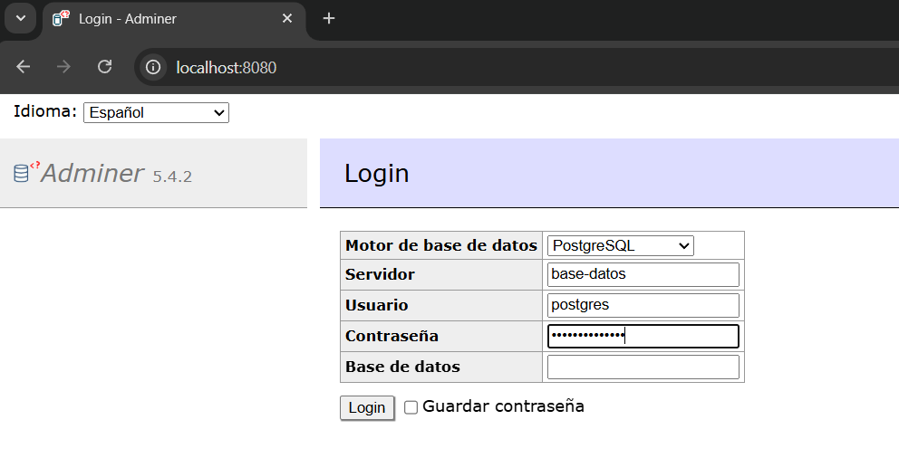

# Introducción a Docker Compose

Docker Compose es una herramienta para definir y ejecutar aplicaciones de múltiples contenedores. Con Compose, se utiliza un archivo YAML (`docker-compose.yml`) para configurar los servicios, redes y volúmenes necesarios.

Principales ventajas:
- Organizar los contenedores como un solo proyecto.
- Definir dependencias entre servicios.
- Iniciar, detener y escalar con comandos simples.

Ejemplo básico de uso:
1. Crear `docker-compose.yml`.
2. Ejecutar `docker compose up` para levantar todos los servicios.
3. Usar `docker compose down` para detener y eliminar los contenedores.

Docker Compose es ideal para entornos de desarrollo y pruebas donde se necesita levantar rápidamente una aplicación completa con varios contenedores.

Consejos rápidos:
- Usa `docker compose config` para validar y ver la configuración combinada.
- Añade `depends_on` para controlar el orden de inicio de los servicios.
- Usa volúmenes para persistir datos y evitar pérdida al recrear contenedores.
- Define puertos explícitos con `ports:` para evitar conflictos.
- Emplea perfiles (`profiles:`) para habilitar servicios solo en ciertos entornos.
- Usa `docker compose logs -f` para seguir los logs y depurar en vivo.
- Ejecuta comandos puntuales con `docker compose run --rm <servicio> <comando>`.

## EJERCICIO PRÁCTICO

+ Creamos el docker-compose.yml:  
```
version: '3.8'

services:
  # CONTENEDOR 1: La Base de Datos
  base-datos:
    image: postgres:alpine
    container_name: postgres-compose
    environment:
      POSTGRES_PASSWORD: miguel_secreta
    volumes:
      - mi-volumen-compose:/var/lib/postgresql
    ports:
      - "5432:5432"

  # CONTENEDOR 2: Un panel web para gestionar la Base de Datos (Adminer)
  panel-web:
    image: adminer:latest
    container_name: adminer-compose
    ports:
      - "80:8080" # la 80 de mi MV ubuntu vagrant por el 8080 del container adminer
    depends_on:
      - base-datos

volumes:
  mi-volumen-compose:
```
🔍 ¿Qué estamos definiendo aquí? (Explicación Express)
- services: Son los contenedores que queremos que vivan juntos.
- base-datos / panel-web: Son los nombres internos que usarán los contenedores para hablar entre ellos.
- depends_on: Esto es oro de DevOps. Le dice a Docker: "No arranques el panel web hasta que la base de datos esté completamente levantada y lista". No más fallos de sincronización.
- volumes (abajo del todo): Le dice a Compose que cree el volumen de producción automáticamente.

+ Arrancamos con: `vagrant@ubuntu-focal:~/imagenes/docker_compose$ docker compose up -d`  
```
[+] Running 18/18
 ✔ panel-web Pulled                                          13.3s 
[+] Running 4/4
 ✔ Network docker_compose_default              Created        0.2s 
 ✔ Volume "docker_compose_mi-volumen-compose"  Created        0.0s 
 ✔ Container postgres-compose                  Started        2.3s 
 ✔ Container adminer-compose                   Started        1.7s
```
+ Resultado: `http://localhost:8080/`  


> Adminer y Postgres se hablan por dentro usando el nombre del servicio gracias a la red interna de Docker Compose, y tú lo ves desde fuera porque has alineado los puertos como fichas de dominó: el puerto 8080 de tu Windows viaja al 80 de Ubuntu, y el 80 de Ubuntu viaja al 8080 de Adminer.  

### Comando más usados:  

1. Ver el estado de tu arquitectura: Quieres saber si tus contenedores del archivo siguen vivos, qué puertos tienen o cuánta memoria consumen.  
`docker compose ps`  

2. Ver los logs en tiempo real: Si la base de datos da un error de conexión con la web, necesitas ver las pantallas de ambos contenedores a la vez:
`docker compose logs -f`  
> El flag -f (follow) deja la pantalla "escuchando". Si refrescas el navegador en Windows, verás cómo se mueven las líneas de código en Ubuntu al instante. Para salir, pulsas Ctrl + C.

3. Apagar y LIMPIAR la mesa de trabajo: Cuando terminas tu jornada laboral o cambias de proyecto, no quieres dejar servicios consumiendo RAM en tu máquina.
`docker compose down`
> ⚠️ Detalle de nivel Senior: Este comando destruye los contenedores y la red virtual, pero no borra tu volumen. Los datos de tu Postgres siguen a salvo en el disco. Si mañana haces docker compose up -d, tu base de datos resucita con todo lo que creaste hoy.

4. Reiniciar los servicios tras un cambio menor: Si tocas algo del archivo de configuración y quieres aplicar los cambios reiniciando los procesos rápido:
`docker compose restart`  