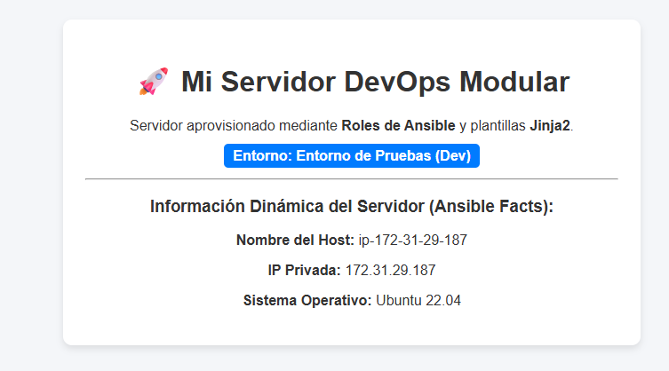
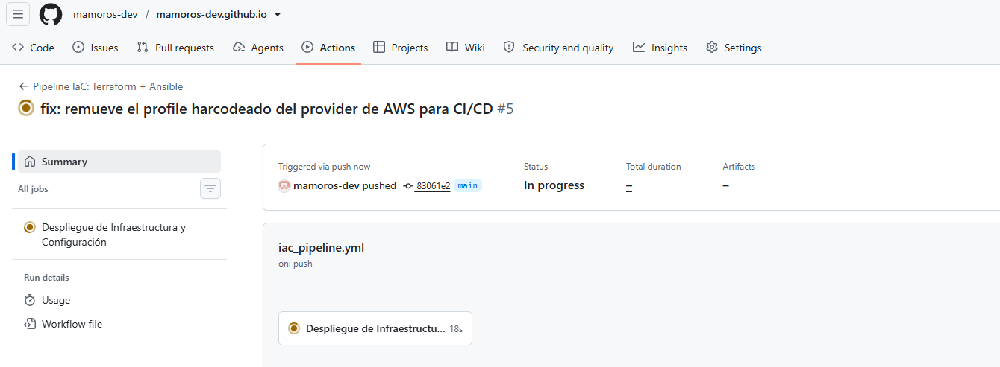

# ANSIBLE & TERRAFORM AVANZADO

🗺️ Roadmap Completo Cloud & DevOps Engineer (Vista Real)
```
 ┌────────────────────────────────────────────────────────┐
 │ 🟢 FASE 0: Cimientos de Sistemas y Automatización      │ 
 │   ➔ Linux avanzado (permisos, procesos, redes, SSH)    │
 │   ➔ Bash Scripting (automatización de tareas locales)  │
 │   ➔ Git & GitHub (control de versiones, flujo GitFlow) │
 └──────────────────────────┬─────────────────────────────┘
                            │
                            ▼
 ┌────────────────────────────────────────────────────────┐
 │ 🟡 FASE 1: Infraestructura como Código y Configuración │ 
 │   ➔ Terraform Básico (EC2, S3, Security Groups)        │
 │   ➔ Ansible Básico (Playbooks, módulos, inventarios)   │
 │   ➔ Integración Terraform + Ansible (Estático/Dinámico)│
 └──────────────────────────┬─────────────────────────────┘
                            │
                            ▼
 ┌────────────────────────────────────────────────────────┐
 │ ⚪ FASE 2: Patrones Profesionales de IaC y Redes Cloud │
 │   ➔ Redes en AWS con Terraform (VPC, Subnets, NAT)     │
 │   ➔ Ansible Avanzado (Roles, Handlers, Jinja2)        │
 │   ➔ Gestión de Secretos (Ansible Vault / AWS Parameter)│
 └──────────────────────────┬─────────────────────────────┘
                            │
                            ▼
 ┌────────────────────────────────────────────────────────┐
 │ ⚪ FASE 3: Contenedores y Orquestación                 │
 │   ➔ Docker & Docker Compose (creación de imágenes)    │
 │   ➔ Registros de Imágenes (AWS ECR / Docker Hub)       │
 │   ➔ Kubernetes (Pods, Services, Deployments en EKS)   │
 └──────────────────────────┬─────────────────────────────┘
                            │
                            ▼
 ┌────────────────────────────────────────────────────────┐
 │ ⚪ FASE 4: Automatización CI/CD y Pruebas              │
 │   ➔ GitHub Actions / GitLab CI                         │
 │   ➔ Pipelines automatizados de Despliegue (IaC + App)  │
 │   ➔ DevSecOps (Análisis estático de código y parches)  │
 └──────────────────────────┬─────────────────────────────┘
                            │
                            ▼
 ┌────────────────────────────────────────────────────────┐
 │ ⚪ FASE 5: Alta Disponibilidad, GitOps y Monitoreo    │
 │   ➔ AWS Avanzado (Load Balancers, Auto Scaling, RDS)   │
 │   ➔ GitOps (ArgoCD / Flux)                             │
 │   ➔ Monitoreo y Alertas (Prometheus + Grafana)         │
 └──────────────────────────┬─────────────────────────────┘
                            │
                            ▼
 ┌────────────────────────────────────────────────────────┐
 │ 🏆 FASE 6: Proyectos Capstone Integradores (Portafolio)│
 │   ➔ Proyecto 1: App Web Completa con CI/CD en AWS      │
 │   ➔ Proyecto 2: Cluster K8s Automatizado con GitOps    │
 └──────────────────────────┴─────────────────────────────┘
 ```

 ```
 [Fase 1: Fundamentos de Sistemas & Redes] ✅ (Completado)
   │
[Fase 2: Contenedores y Orquestación] ✅ (Docker / Docker Compose)
   │
[Fase 3: Infraestructura como Código (IaC) y Config Management] 👈 📍 ¡ESTAMOS AQUÍ!
   │  ├── 1. Integración Estática (Terraform + Ansible Básico) ✅
   │  ├── 2. Integración Dinámica (Plugin aws_ec2) ✅
   │  ├── 3. Patrones Avanzados:
   │  │    ├── Opción 1: Roles + Jinja2 ✅
   │  │    ├── Opción 2: Gestión de Secretos (Vault + AWS SSM) ✅
   │  │    └── Opción 3: Pipelines CI/CD de IaC 👈 🎯 (¡AHORA MISMO!)
   │
[Fase 4: Integración y Despliegue Continuo (CI/CD Avanzado)] 🔜
   │  ├── Workflows complejos, Testing de Infraestructura, Estrategias de Despliegue
   │
[Fase 5: Kubernetes & Cloud Native] 🔜
   │  ├── K8s, Helm, GitOps con ArgoCD / Flux
   │
[Fase 6: Observabilidad y Monitoreo] 🔜
      └── Prometheus, Grafana, OpenTelemetry, Log Management
 ```

## 📌 PRÁCTICA 1: Roles de Ansible (Estructura Profesional)
+ Retomando el hilo: veníamos de ver la Integración Estática (con local-exec y host.ini) y la Integración Dinámica (con el plugin aws_ec2). Para dar el salto definitivo de nivel junior a Senior/Professional DevOps, te presenté las 3 Opciones / Patrones Avanzados para evolucionar esta infraestructura.

+ Estas eran las 3 opciones profesionales que teníamos sobre la mesa:
- Opción 1: Arquitectura de Roles de Ansible + Jinja2 (Estructura Profesional y Modular)
    - El problema: Tener un playbook monolítico con tareas, archivos y variables mezcladas no escala.
    - La solución: Modularizar la configuración mediante Roles y usar plantillas Jinja2 para personalizar dinámicamente archivos (por ejemplo, inyectar el nombre de host, IP, o metabuscadores dentro del index.html del servidor Nginx).

- Opción 2: Gestión de Secretos y Parametrización Segura (Ansible Vault + AWS Parameter Store)
    - El problema: Subir claves SSH, tokens de API o contraseñas en texto plano a GitHub es el error número uno en auditorías de seguridad.
    - La solución: Cifrar variables sensibles con Ansible Vault o recuperarlas en tiempo de ejecución directamente desde la nube con AWS Systems Manager Parameter Store.

- Opción 3: Automatización CI/CD de Infraestructura (GitHub Actions / GitLab CI)
    - El problema: Ejecutar terraform apply y ansible-playbook a mano desde tu terminal WSL local no es reproducible en un equipo de trabajo.
    - La solución: Automatizar la validación, despliegue de IaC y aprovisionamiento mediante un Pipeline de CI/CD.

+ 🧭 ¿De dónde venimos y por qué el siguiente paso?
    - Lo que tenías en la Lección 2 (02_inventario_dinamico):
    - Tenías un solo archivo playbook.yml donde en un único bloque de código decías:
    1. Actualiza paquetes (apt).
    2. Instala Nginx.
    3. Copia un HTML metido en texto plano (hardcoded).
    4. Levanta el servicio.

+ El problema en una empresa real (Por qué evoluciona esto):
+ Si tu cliente o empresa te pide mañana instalar Nginx en un servidor web, Apache en otro, y configurar un motor de base de datos MySQL en un tercero, tu playbook.yml se convertirá en un monstruo de 2.000 líneas ilegible.
+ Además, si el archivo index.html necesita mostrar la IP del servidor o su hostname, el comando copy: con texto estático no sirve, porque cada servidor tiene datos diferentes.
+ Ahí es donde nacen los Roles de Ansible y las Plantillas Jinja2.

+ 🎯 El Objetivo de la Lección actual (Lección 3: Roles)
º- Vamos a transformar la estructura de tu proyecto para pasar de un archivo único a un diseño modular (Roles).
- En empresas reales, cuando buscas un rol de Ansible en la comunidad o en tu propia compañía, no ves playbooks gigantes; ves carpetas organizadas por función:
    - Un rol para instalar y configurar Nginx (roles/nginx_webserver).
    - Un rol para hardening de seguridad Linux (roles/security).
    - Un rol para instalar Docker (roles/docker).

### 🛠️ Paso 1: Entendiendo la herramienta ansible.cfg
+ Antes de escribir carpetas o crear roles, necesitamos entender cómo piensa Ansible cuando lo ejecutas en tu terminal WSL.
+ En la lección anterior te hablé de un archivo llamado ansible.cfg. Vamos a analizar qué es, de dónde sale en la documentación y por qué es indispensable.

1. ¿Qué es ansible.cfg y para qué sirve en la vida real?
+ Cuando escribes ansible-playbook ... en tu consola, Ansible necesita saber cosas como:
    + ¿Dónde está mi archivo de inventario?
    + ¿Debo comprobar la identidad del servidor SSH?
    + ¿Cuántos segundos debo esperar si un servidor no responde?

+ Si no creas un archivo ansible.cfg en tu carpeta del proyecto, Ansible usará sus valores por defecto a nivel del sistema operativo (/etc/ansible/ansible.cfg).

+ ¿Por qué en una empresa NUNCA usamos la configuración global del sistema?
    - Porque en una empresa trabajarás con decenas de repositorios de código distintos. Cada proyecto tiene sus propios servidores, sus propias claves SSH y sus propias reglas. Tener un archivo ansible.cfg dentro de la carpeta de tu proyecto hace que la configuración sea portable: cualquier compañero que clone tu repositorio usará exactamente las mismas reglas que tú.

2. Orden de lectura de Ansible (Documentación Oficial)
    - Según la documentación oficial de Ansible, la herramienta busca el archivo de configuración en este orden estricto de prioridad (de mayor a menor):
        - Variable de entorno ANSIBLE_CONFIG (si la defines en tu terminal).
        - ./ansible.cfg (un archivo ansible.cfg en el directorio actual donde ejecutas el comando). <-- ESTE ES EL QUE USAREMOS.
        - ~/.ansible.cfg (en el directorio home del usuario).
        - /etc/ansible/ansible.cfg (el valor por defecto del sistema Linux).
> Ansible elegirá el primer archivo que encuentre en esta lista e ignorará los demás.

+ Creamos el fichero `3_roles_ansible$ vi ansible.cfg`:
```bash
[defaults]
inventory = aws_ec2.yml
host_key_checking = False
timeout = 30

[inventory]
enable_plugins = aws_ec2
```
> [defaults]: Es la sección principal de configuración general de Ansible.  
> inventory = aws_ec2.yml: Le dice a Ansible que, si no le pasas el parámetro -i en la terminal, use este archivo como inventario por defecto. Evita tener que escribir -i aws_ec2.yml todo el tiempo.  
> host_key_checking = False: Por defecto, cuando te conectas a un servidor Linux por SSH por primera vez, SSH te pregunta: "¿Confías en la clave de este host? (yes/no)". En la nube, las máquinas EC2 se crean y destruyen constantemente. Si no pones esto en False, tus automatizaciones se quedarán colgadas esperando que un humano presione la tecla "Enter".  
> timeout = 30: Especifica que SSH esperará como máximo 30 segundos para conectar antes de dar un error de tiempo agotado (timeout).  
> [inventory]: Es la sección que configura cómo Ansible procesa los inventarios.  
> enable_plugins = aws_ec2: Por defecto, por razones de seguridad, Ansible deshabilita los plugins de inventario dinámico. Esta línea habilita explícitamente el plugin oficial de AWS para que pueda consultar la API de Amazon.  


### PASO 2:💡¿Qué es un Rol en Ansible y por qué se usa?
+ Un Rol es la forma estándar de empaquetar y estructurar el código en Ansible de forma modular, reutilizable y limpia.

+ En lugar de tener las tareas, las plantillas HTML, las variables y los servicios mezclados en un solo archivo .yml, un Rol divide las responsabilidades en carpetas estandarizadas:

```Plaintext
nombre_del_rol/
├── defaults/     <-- Variables por defecto (baja prioridad, modificables).
├── vars/         <-- Variables internas fijas (alta prioridad, no tocar).
├── tasks/        <-- La lista paso a paso de lo que Ansible debe EJECUTAR.
├── templates/    <-- Archivos con variables dinámicas Jinja2 (.j2).
├── files/        <-- Archivos estáticos que se copian tal cual (imágenes, scripts).
├── handlers/     <-- Tareas especiales que solo se ejecutan tras un cambio (ej. reiniciar Nginx).
└── meta/         <-- Metadatos del rol (autor, versión de Ansible requerida, dependencias).
```
> Ventaja principal: Ansible sabe automáticamente dónde buscar cada cosa. Si en la sección tasks usas una plantilla, Ansible irá solo a la carpeta templates/ sin necesidad de explicárselo.

+ Para no crear estas carpetas una a una con mkdir, Ansible incluye la herramienta oficial CLI llamada `ansible-galaxy`. se usa para dos cosas en el día a día DevOps:
    - Descargar roles creados por la comunidad desde el repositorio oficial (Ansible Galaxy).
    - Inicializar la estructura vacía de un rol propio siguiendo la convención estándar mediante el comando `ansible-galaxy role init <nombre>`.

+ Vamos a crear la carpeta roles/ y la estructura modular para nuestro servidor Nginx llamada nginx_webserver.
+ Ejecuta exactamente estos comandos en tu terminal WSL (asegúrate de estar dentro de 03_roles_ansible):
```bash
# 1. Creamos la carpeta donde Ansible buscará todos los roles del proyecto
mkdir -p roles

# 2. Entramos en la carpeta
cd roles

# 3. Inicializamos la estructura profesional del rol 'nginx_webserver'
ansible-galaxy role init nginx_webserver

# 4. Comprobamos
ls -la nginx_server/
total 44
drwxr-xr-x 10 miguel miguel 4096 Aug 13 22:07 .
drwxr-xr-x  3 miguel miguel 4096 Aug 13 22:07 ..
-rw-r--r--  1 miguel miguel 1328 Aug 13 22:07 README.md
drwxr-xr-x  2 miguel miguel 4096 Aug 13 22:07 defaults
drwxr-xr-x  2 miguel miguel 4096 Aug 13 22:07 files
drwxr-xr-x  2 miguel miguel 4096 Aug 13 22:07 handlers
drwxr-xr-x  2 miguel miguel 4096 Aug 13 22:07 meta
drwxr-xr-x  2 miguel miguel 4096 Aug 13 22:07 tasks
drwxr-xr-x  2 miguel miguel 4096 Aug 13 22:07 templates
drwxr-xr-x  2 miguel miguel 4096 Aug 13 22:07 tests
drwxr-xr-x  2 miguel miguel 4096 Aug 13 22:07 vars

# 4. Volvemos al directorio raíz del proyecto
cd ..
```

### Las Variables por Defecto (nombre_rol/defaults/main.yml)
+ En Ansible existen 22 niveles de prioridad de variables (documentación oficial: Ansible Variable Precedence).
+ La carpeta defaults/ alberga las variables de menor prioridad de todas (nivel 1).
+ Imagina que creas un rol reutilizable para instalar Nginx. En defaults/main.yml defines que el puerto sea el 80 y la página por defecto sea "Entorno Dev". Si un equipo de tu empresa quiere usar tu rol para Producción, no necesita modificar tu código: puede sobrescribir esa variable desde fuera pasándole un valor distinto (http_port: 443), y Ansible lo aceptará sin romper la configuración por defecto.

+ Creamos el fichero `vi roles/nginx_webserver/defaults/main.yml`:
```YAML
---
# Variables por defecto del rol nginx_webserver (fácilmente sobrescribibles)
http_port: 80
site_title: "Mi Servidor DevOps Modular"
environment_name: "Entorno de Pruebas (Dev)"
```

### El Motor de Plantillas Jinja2 (templates/index.html.j2)

+ En la lección anterior usamos el módulo copy de Ansible para enviar un archivo estático. Pero en producción, los archivos de configuración (como el nginx.conf, un archivo .ini o un HTML) necesitan adaptarle sus datos a cada servidor: la IP de la máquina, cuánta RAM tiene, o su hostname.
+ Ansible integra internamente Jinja2, un motor de plantillas creado para Python.
    - Por convención, todo archivo que use Jinja2 lleva la extensión .j2.
    - La sintaxis {{ nombre_variable }} le indica a Jinja2 que debe evaluar e inyectar el valor de esa variable antes de escribir el archivo en la máquina remota.

+ los Ansible Facts?
    - Cuando Ansible se conecta a un servidor Linux, ejecuta una fase automática llamada Gathering Facts (recolección de hechos). La máquina remota le devuelve a Ansible un diccionario con sus datos reales de hardware y red.
        - ansible_hostname: Nombre de la máquina Linux.
        - ansible_default_ipv4.address: Dirección IP privada actual.
        - ansible_distribution: Nombre de la distribución (Ubuntu, Debian, RHEL).
> En nuestra plantilla inyectaremos tanto nuestras variables (site_title) como datos del sistema extraídos dinámicamente (ansible_hostname).

+ Creamos fichero en `roles/nginx_webserver/templates/index.html.j2`:
```HTML
<!DOCTYPE html>
<html lang="es">
<head>
    <meta charset="UTF-8">
    <title>{{ site_title }}</title>
    <style>
        body { font-family: Arial, sans-serif; background-color: #f4f6f9; color: #333; text-align: center; padding-top: 50px; }
        .card { background: white; max-width: 600px; margin: 0 auto; padding: 25px; border-radius: 10px; box-shadow: 0 4px 8px rgba(0,0,0,0.1); }
        .badge { background-color: #007bff; color: white; padding: 5px 10px; border-radius: 5px; font-weight: bold; }
    </style>
</head>
<body>
    <div class="card">
        <h1>🚀 {{ site_title }}</h1>
        <p>Servidor aprovisionado mediante <strong>Roles de Ansible</strong> y plantillas <strong>Jinja2</strong>.</p>
        <p><span class="badge">Entorno: {{ environment_name }}</span></p>
        <hr>
        <h3>Información Dinámica del Servidor (Ansible Facts):</h3>
        <p><strong>Nombre del Host:</strong> {{ ansible_hostname }}</p>
        <p><strong>IP Privada:</strong> {{ ansible_default_ipv4.address }}</p>
        <p><strong>Sistema Operativo:</strong> {{ ansible_distribution }} {{ ansible_distribution_version }}</p>
    </div>
</body>
</html>
```

### Las Tareas del Rol (tasks/main.yml) y el Módulo template
+ Ahora vamos a escribir la lista de instrucciones que ejecutará el rol en `roles/nginx_webserver/tasks/main.yml`:
```YAML
---
- name: Actualizar la lista de paquetes (APT)
  apt:
    update_cache: yes
    cache_valid_time: 3600

- name: Instalar el servidor Nginx
  apt:
    name: nginx
    state: present

- name: Desplegar el archivo HTML procesando la plantilla Jinja2
  template:
    src: index.html.j2
    dest: /var/www/html/index.html
    owner: www-data
    group: www-data
    mode: '0644'

- name: Asegurar que Nginx esté iniciado y habilitado
  service:
    name: nginx
    state: started
    enabled: yes
```
> cache_valid_time: 3600: Buenas prácticas en empresas. Evita que Ansible ejecute apt-get update si ya se actualizó en la última hora (3600 segundos). Ahorra ancho de banda y varios minutos de ejecución.  
> src: Ansible busca por defecto de forma explícita en la carpeta templates/ del rol el archivo .j2. No hace falta poner rutas relativas largas.  
> dest: Ruta absoluta donde se escribirá el archivo procesado en la máquina destino.  
> owner / group: Asigna como propietario del archivo a www-data (el usuario por defecto del servidor web Nginx en Debian/Ubuntu por seguridad).  
> mode: '0644': Otorga permisos de lectura y escritura al propietario, y solo lectura para el resto.  

### EXPLICACIONES

```bash
❓ Respuestas a tus 3 Preguntas de Evaluación
1. ¿Por qué ponemos valores por defecto en defaults/ y no "fijos" en el código?
En el código (fijos / hardcoded): Si escribes port: 80 directamente dentro de tasks/main.yml, estás obligando a que siempre se use ese valor. Si mañana otro proyecto necesita ejecutar Nginx en el puerto 8080, tendría que modificar tu código original o duplicar el rol.

En defaults/main.yml: Las variables definidas en defaults/ tienen la prioridad más baja de todo Ansible (nivel 1 de 22). Sirven como "red de seguridad": si el usuario no especifica nada, el rol funciona solo. Pero si el usuario quiere cambiar un parámetro en su playbook principal (http_port: 8080), Ansible sobrescribirá el valor por defecto sin tocar una sola línea de la estructura interna del rol.

En empresas reales: Esto permite reutilizar el mismo rol nginx_webserver en Desarrollo (puerto 80), Staging (puerto 8080) y Producción (puerto 443) simplemente pasando variables distintas desde fuera.

2. ¿Qué diferencia hay entre usar el módulo copy y el módulo template?
copy (Estático): Toma un archivo local en tu máquina WSL y lo deposita en la máquina remota tal cual, byte por byte. Si tu archivo contiene {{ site_title }}, el servidor destino guardará literalmente ese texto sin procesar.

template (Dinámico / Jinja2): Antes de enviar el archivo, Ansible lo pasa por el motor de evaluación Jinja2 en tu máquina local. Busca cualquier etiqueta {{ ... }}, reemplaza esas variables por su valor real en ese momento (un nombre, una IP, el número de CPUs) y envía al servidor destino el archivo ya transformado y personalizado.

3. ¿De dónde salen variables como ansible_hostname o ansible_default_ipv4?
Salen de la fase llamada Gathering Facts (recolección de hechos).

Cada vez que un playbook arranca contra un servidor objetivo, Ansible ejecuta en segundo plano un módulo ligero en Python (llamado setup).

Este módulo escanea el sistema operativo objetivo en tiempo real (lee /proc, interfaces de red, hostname, memoria RAM, versión del kernel Linux) y crea un gran diccionario en memoria con todas esas variables prefijadas con ansible_.

Por eso tú no necesitas definir ansible_hostname en ningún lado: Ansible lo descubre solo al conectarse al servidor.
```

### DESPLIEGUE: Playbook Orquestador + AWS
+ Necesitamos 3 archivos finales en el directorio raíz de 03_roles_ansible:
    - El archivo de Terraform (main.tf) para levantar la instancia EC2.
    - El archivo de inventario dinámico (aws_ec2.yml) para que Ansible busque la EC2 sola.
    - El Playbook principal (site.yml) que invocará a nuestro Rol.
    ```bash
    ---
    - name: Aprovisionamiento de Servidores Web en Producción
    # 'tag_Role_webservers' es el grupo dinámico creado por aws_ec2.yml 
    # a partir de la etiqueta 'Role = webservers' definida en Terraform.
    hosts: tag_webservers
    
    # Elevamos privilegios a root (sudo) para instalar software
    become: true

    # Indicamos la lista de roles que debe ejecutar Ansible en estas máquinas
    roles:
        - nginx_webserver
    ```
> hosts: tag_Role_webservers: Gracias al plugin aws_ec2, Ansible lee las etiquetas de AWS y agrupa automáticamente las IPs. No ponemos IPs fijas a mano.  
> become: true: Ejecuta las tareas usando sudo, necesario para instalar paquetes con apt y modificar /var/www/html.  
> roles:: Lista de nombres de carpetas almacenadas dentro del directorio roles/ que deben ejecutarse.  

+ Diferencia con el ejemplo anterior `hosts: aws_ec2`:
    - ¿Qué hace?: aws_ec2 es el nombre del grupo global que crea por defecto el plugin de inventario dinámico de AWS.
    - El problema en producción: Si en tu cuenta de AWS tienes 10 servidores EC2 (por ejemplo: 3 servidores Web, 2 bases de datos MySQL, 2 balanceadores de carga y 3 servidores de CI/CD), el grupo aws_ec2 incluye a TODAS las 10 máquinas.
    - Consecuencia: Si ejecutas ese playbook, Ansible intentará instalar Nginx y modificar la web en absolutamente todos tus servidores de AWS, incluyendo tus bases de datos. Un desastre en un entorno real.

+ Desplegamos:
```bash
terraform init
terraform apply -auto-approve

Apply complete! Resources: 3 added, 0 changed, 0 destroyed.

Outputs:

ip_publica_servidor = "3.91.27.253"
```

+ Verificar que el Inventario Dinámico localiza la EC2. Probremos si Ansible encuentra la máquina de AWS sin necesidad de escribir su IP:
```Bash
ansible-inventory --graph
```

+ aprovisionamiento con ansible cogiendo las variables, tasks del rol y la info de ec2-aws:
```bash
miguel@DESKTOP-G47I0DM:03_roles_ansible$ ansible-playbook site.yml
[WARNING]: Deprecation warnings can be disabled by setting `deprecation_warnings=False` in ansible.cfg.
[DEPRECATION WARNING]: Importing 'to_text' from 'ansible.module_utils._text' is deprecated. This feature will be removed from ansible-core version 2.24. Use ansible.module_utils.common.text.converters instead.
[DEPRECATION WARNING]: Importing 'to_native' from 'ansible.module_utils._text' is deprecated. This feature will be removed from ansible-core version 2.24. Use ansible.module_utils.common.text.converters instead.
[DEPRECATION WARNING]: Passing `disable_lookups` to `template` is deprecated. This feature will be removed from ansible-core version 2.23.

PLAY [Aprovisionamiento de Servidores Web en Producción] *********************************************************************************************************************************************************
[WARNING]: Found variable using reserved name 'tags'.
Origin: <unknown>

tags


TASK [Gathering Facts] ****************************************************************************************************************************************************************************************
ok: [3.91.27.253]

TASK [nginx_webserver : Actualizar la lista de paquetes (APT)] ***************************************************************************************************************************************************
changed: [3.91.27.253]

TASK [nginx_webserver : Instalar el servidor Nginx] **************************************************************************************************************************************************************
changed: [3.91.27.253]

TASK [nginx_webserver : Desplegar el archivo HTML procesando la plantilla Jinja2] ********************************************************************************************************************************
Origin: /home/miguel/projects/devops/mamoros-dev.github.io/casos-reales/04_Infraestructura_como_Codigo_IaC/Terraform-Ansible/03_roles_ansible/roles/nginx_webserver/templates/index.html.j2

Use `ansible_facts["fact_name"]` (no `ansible_` prefix) instead.

changed: [3.91.27.253]

TASK [nginx_webserver : Asegurar que Nginx esté iniciado y habilitado] *******************************************************************************************************************************************
ok: [3.91.27.253]

PLAY RECAP ****************************************************************************************************************************************************************************************
3.91.27.253                : ok=5    changed=3    unreachable=0    failed=0    skipped=0    rescued=0    ignored=0   
```

  
> Jinja2 ha leído las variables por defecto (site_title y environment_name).  
> Ha extraído en tiempo real los Ansible Facts del servidor en AWS: Hostname (ip-172-31-29-187), IP Privada (172.31.29.187) y SO (Ubuntu 22.04).  
> El archivo site.yml actuó como el orquestador. (roles: - nginx_webserver)  
> Ansible interpretó: "Voy a entrar en la carpeta roles/nginx_webserver/ y voy a ejecutar ordenadamente todo lo que haya dentro de tasks/main.yml, utilizando las plantillas de templates/ y las variables de defaults/".

+ Limpieza `terraform destroy -auto-approve`


## 📌 PRÁCTICA 2: Ansible Vault (Cifrado local de variables)
+ Es una funcionalidad nativa de Ansible (no hay que instalar nada extra) que permite cifrar archivos completos o variables individuales usando cifrado simétrico AES-256.
+ El archivo se guarda en Git cifrado (parece texto ininteligible), y solo quien posea la contraseña maestra (Vault Password) podrá desencriptarlo al ejecutar el playbook.

+ Estructura carpetas:
```bash
# Creamos la carpeta de la Lección 4
mkdir -p 04_gestion_secretos

# Copiamos la estructura base de la lección 3
cp -r 03_roles_ansible/* 04_gestion_secretos/

# Entramos en la nueva carpeta
cd 04_gestion_secretos
```

### La estructura de variables en un Rol (vars/ vs defaults/)
+ Recuerda que en la lección anterior usamos defaults/main.yml (baja prioridad). Para datos sensibles usamos la carpeta vars/main.yml.
+ En la jerarquía de Ansible, las variables en vars/ tienen una prioridad muy alta (nivel 15 de 22) y están diseñadas para datos internos del rol que no deben ser sobrescritos fácilmente desde fuera.

+ Editamos fichero `roles/nginx_webserver/vars/main.yml`:
```YAML
---
# Variables confidenciales / sensibles
db_user: "admin_db"
db_password: "SuperPasswordUltraSecreto2026!"
api_key_servicio: "xxxxxx>"
```

+ Cifrar el archivo con `ansible-vault`. Ahora vamos a usar el comando oficial de la CLI `ansible-vault encrypt`.
```bash
ansible-vault encrypt roles/nginx_webserver/vars/main.yml

New Vault password: 
Confirm New Vault password: 
Encryption successful
```
> Verás un bloque de texto ilegible que empieza por $ANSIBLE_VAULT;1.1;AES256.  
> Si no tienes la contraseña o una copia de seguridad en texto plano en un lugar seguro (como un gestor de contraseñas de equipo tipo 1Password, Bitwarden o Keepass), el contenido es irrecuperable.  
> Es 100% seguro: Aunque el repositorio de Git sea público en GitHub, nadie puede romper la encriptación AES-256 por fuerza bruta en miles de años.

### Usar un archivo de contraseña y conectar las variables cifradas
+ Vamos a implementar el patrón profesional con .vault_password y a inyectar las variables cifradas dentro de la plantilla Jinja2.

+ Crea el archivo .vault_password en la raíz de 04_gestion_secretos guardando la contraseña que pusiste antes
```bash
echo "passwordquepusimos" > .vault_password
Protege el archivo cambiando sus permisos en Linux para que solo tu usuario pueda leerlo:
chmod 600 .vault_password
```
> Crea o edita el archivo .gitignore para no subir jamás esta clave: echo ".vault_password" >> .gitignore  

+ Indicar a Ansible que use ese archivo por defecto. Abre tu archivo de configuración `ansible.cfg`:
```bash
[defaults]
inventory = aws_ec2.yml
host_key_checking = False
timeout = 30
# Le decimos a Ansible dónde buscar la clave maestra para desencriptar en vuelo
vault_password_file = .vault_password

[inventory]
enable_plugins = aws_ec2
```

+ Ahora vamos a hacer que la página web muestre (a modo de prueba) que las variables cifradas en vars/main.yml han sido desencriptadas con éxito por Ansible en tiempo de ejecución.:
`vi roles/nginx_webserver/templates/index.html.j2` 
```
<hr>
        <h3>🔐 Secretos Desencriptados con Ansible Vault:</h3>
        <p><strong>Usuario DB:</strong> {{ db_user }}</p>
        <p><strong>Password DB:</strong> {{ db_password }}</p>
        <p><strong>API Key:</strong> {{ api_key_servicio }}</p>
```

+ Probar la desencriptación local sin desplegar todavía.
    - Ansible nos da un comando fantástico para probar si es capaz de leer las variables cifradas usando nuestro .vault_password sin tocar AWS.
    - Ejecuta el modo de visualización de variables (ansible-vault view): `ansible-vault view roles/nginx_webserver/vars/main.yml` 
> Como ansible.cfg ya sabe dónde está .vault_password, verás el contenido en texto plano en tu pantalla sin que te pida contraseña.


### PARTE 2: AWS Systems Manager Parameter Store (SSM)
+ En arquitecturas de nube reales, no siempre quieres que los secretos vivan en archivos dentro de Git, ni siquiera cifrados.
+ magina que la contraseña de la Base de Datos la gestiona el equipo de Seguridad o de DBA (Database Administrators). Ellos no tocan tu código de Ansible; ellos guardan la clave de producción directamente en la consola de AWS de forma centralizada.
+ Tu playbook de Ansible, cuando se ejecuta, se conecta mediante API a AWS, lee la clave en tiempo real, la inyecta en la memoria RAM del proceso y la aplica en la EC2. La clave jamás toca un disco duro ni un archivo .yml en tu máquina.

+ AWS Parameter Store? Es un servicio nativo de AWS (parte de AWS Systems Manager) que funciona como un almacén de pares Clave-Valor.
    - Ofrece tres tipos de parámetros:
        - String: Texto plano (ej. URLs de APIs, nombres de usuario).
        - StringList: Lista de valores separados por comas.
        - SecureString: Datos cifrados en reposo utilizando AWS KMS (Key Management Service). <-- ESTE ES EL QUE USAREMOS.

+ Crear el secreto en AWS usando Terraform (`main.tf`):
    - Para seguir la filosofía de Infraestructura como Código (IaC), no crearemos el parámetro a mano en la web de AWS. Dejaremos que Terraform lo gestione.
```bash
# Creamos un secreto seguro en AWS Systems Manager Parameter Store
resource "aws_ssm_parameter" "token_terceros" {
  name        = "/produccion/servicios/token_api"
  description = "Token de API de terceros gestionado desde AWS SSM"
  type        = "SecureString"
  value       = "token_aws_ssm_super_secreto_2026_xyz"

  tags = {
    Environment = "Produccion"
  }
}
```
> Añade este recurso de Terraform al final del archivo.
> name: La ruta jerárquica del parámetro. Usar rutas tipo /entorno/servicio/parametro es el estándar en AWS.  
> type = "SecureString": Le indica a AWS que cifre este valor de inmediato en sus discos duros usando la clave KMS por defecto de tu cuenta.  
> value: El contenido confidencial.

+ Levantar el secreto en AWS:
```bash
terraform init
terraform apply -auto-approve
```

+ Leer el secreto de AWS desde Ansible mediante un Lookup Plugin.
    - Ansible tiene la capacidad de conectarse a múltiples servicios de nube durante la ejecución usando los llamados Lookup Plugins.
    - Para leer el secreto de AWS desde Ansible, usamos la sintaxis: `{{ lookup('amazon.aws.aws_ssm', '/produccion/servicios/token_api', decrypt=True) }}`
        - amazon.aws.aws_ssm: Es el plugin oficial de Ansible para hablar con AWS Parameter Store.
        - '/produccion/servicios/token_api': La ruta exacta que definimos en Terraform.
        - decrypt=True: Le pide a AWS que nos entregue el valor desencriptado (usando tus credenciales de la AWS CLI).

+ Actualizar la plantilla Jinja2 para mostrar ambos secretos:
```HTML
<hr>
        <h3>🔐 Secretos de Ansible Vault (Local Cifrado):</h3>
        <p><strong>Usuario DB:</strong> {{ db_user }}</p>
        <p><strong>Password DB:</strong> {{ db_password }}</p>

        <hr>
        <h3>☁️ Secretos de AWS Parameter Store (SSM Cloud):</h3>
        <p><strong>Token AWS SSM:</strong> {{ lookup('amazon.aws.aws_ssm', '/produccion/servicios/token_api', decrypt=True, region='us-east-1') }}</p>
    </div>
</body>
</html>
```
> Indicamos region en el lookup para que no falle y lo haga donde estamos trabajando.

+ Desplegar con Ansible para ver en la IP publica, ambos tipos de secretos en la web: `ansible-playbook site.yml` 


+ Explicaciones:
```bash
Lo verdaderamente potente de lo que has hecho NO es cómo se creó el secreto en Terraform, sino cómo lo consume Ansible:

Ansible no tiene el secreto en su código: Si miras el archivo site.yml o el rol nginx_webserver, en ningún sitio aparece la palabra "token_aws_ssm_super_secreto_2026_xyz".

Desacoplamiento total: Tu código de Ansible está 100% libre de datos sensibles. Puedes subir toda tu carpeta roles/ a un repositorio público de GitHub sin ningún riesgo.

Centralización en la nube: Si el equipo de Seguridad cambia mañana el token en AWS Parameter Store, no tienes que tocar ni una sola línea de código en Git. La próxima vez que ejecutes ansible-playbook site.yml, Ansible leerá automáticamente el nuevo valor actualizado directo de la API de AWS.

Con Terraform/AWS creaste la caja fuerte en la nube; con Ansible aprendiste a pedirle la llave a AWS en tiempo real sin guardar jamás la contraseña dentro de tus playbooks.

En nuestra práctica escribimos value = "token_aws_ssm_super_secreto_2026_xyz" directamente en el main.tf únicamente porque estábamos simulando el aprovisionamiento inicial de la infraestructura desde cero. En real sería:

# main.tf
resource "aws_ssm_parameter" "token_terceros" {
  name  = "/produccion/servicios/token_api"
  type  = "SecureString"
  value = var.token_secret # <-- NO hay texto plano. Es una variable.
}
Se inyecta desde una variable de entorno secreta en el servidor de CI/CD (GitHub Actions / GitLab CI) durante el despliegue.

O bien, el equipo de Seguridad entra a la consola web de AWS (o ejecuta un comando de AWS CLI) una sola vez para crear el parámetro, y Terraform ni siquiera toca ese recurso.
```

## 📌 PRÁCTICA 3: Automatización CI/CD de Infraestructura (GitHub Actions)

+ Hasta ahora, para crear infraestructura y aprovisionarla ejecutabas en tu WSL:
    - terraform apply
    - ansible-playbook site.yml

+ Por qué esto NUNCA se hace así en una empresa:
    - Efecto "En mi máquina funciona": Dependes de la versión exacta de Terraform, Ansible o Python que tengas en tu terminal local.
    - Falta de auditoría y trazabilidad: Si cambias algo desde tu máquina, tus compañeros no saben quién desplegó, cuándo se ejecutó ni qué falló.
    - Riesgo de seguridad: Significa que cada desarrollador o sysadmin tiene que tener las claves maestras de AWS guardadas en su máquina personal.

+ La Solución Profesional: GitOps / Pipelines de CI/CD:
    - El despliegue de infraestructura se delega a un robot (un Runner de CI/CD como GitHub Actions).
    - El Flujo de Trabajo (Workflow) en Producción:
        - Tú escribes código de Terraform/Ansible en tu máquina y haces un git push a GitHub.
        - GitHub Actions detecta el cambio y arranca un contenedor aislado en la nube (el Runner).
        - El Runner descarga tu código, autentica con AWS de forma segura, ejecuta terraform apply y luego lanza ansible-playbook.
        - Recibes en GitHub la confirmación de si el despliegue fue un éxito o si hubo errores.

### Construyendo el Pipeline de CI/CD

+ Copiamos el contenido del `cp -r 04_gestion_secretos/* 05_pipine_cicd/`

+ GitHub Actions busca obligatoriamente sus flujos de trabajo (workflows) dentro de una carpeta oculta en la raíz de tu repositorio Git llamada `.github/workflows/`
```bash
miguel@DESKTOP-G47I0DM:mamoros-dev.github.io$ pwd
/home/miguel/projects/devops/mamoros-dev.github.io

miguel@DESKTOP-G47I0DM:mamoros-dev.github.io$ mkdir -p .github/workflows
```
+ Los workflows se escriben en archivos YAML:
    - name: El nombre visible del pipeline en la consola web de GitHub.
    - on: El evento que dispara la ejecución (ej: hacer un push a la rama main o un pull_request).
    - jobs: El conjunto de tareas que se ejecutarán en una máquina virtual temporal (por ejemplo, ubuntu-latest).
    - steps: La lista secuencial de comandos Bash o acciones preparadas que ejecutará el job.

+ Configurar los Secretos en GitHub (GitHub Secrets)
    - Para que el robot de GitHub Actions pueda crear infraestructura en AWS y desencriptar tu Vault local, nunca debes poner tus credenciales directamente en el archivo .yml.
    - Los GitHub Secrets almacenan variables encriptadas en los servidores de GitHub que solo el Runner puede leer en memoria durante la ejecución del pipeline.
```bash
# En interfaz web de github

# Por comando (miguel@DESKTOP-G47I0DM:mamoros-dev.github.io$ cat ~/.aws/credentials)
gh secret set AWS_ACCESS_KEY_ID --body "TU_ACCESS_KEY"
gh secret set AWS_SECRET_ACCESS_KEY --body "TU_SECRET_KEY"
gh secret set ANSIBLE_VAULT_PASSWORD --body "TU_ACCESS_MASTER_KEY"

miguel@DESKTOP-G47I0DM:mamoros-dev.github.io$ gh secret list
NAME                    UPDATED               
ANSIBLE_VAULT_PASSWORD  less than a minute ago
AWS_ACCESS_KEY_ID       less than a minute ago
AWS_SECRET_ACCESS_KEY   less than a minute ago
```
+ ¿Cómo se conecta todo entonces? El flujo seguro funciona así:
    - Las claves viven únicamente dentro de la "caja fuerte" de GitHub Secrets.
    - Cuando se ejecuta el pipeline, la acción aws-actions/configure-aws-credentials las lee de la caja fuerte y las inyecta en la memoria RAM del contenedor efímero de GitHub como variables de entorno del sistema (AWS_ACCESS_KEY_ID y AWS_SECRET_ACCESS_KEY).
    - Cuando ejecutas terraform init o ansible-playbook, ambas herramientas detectan automáticamente esas variables de entorno de la RAM para autenticarse con AWS sin necesidad de escribirlas en ningún archivo .tf ni .yml.

+ Creamos en `.github/workflows/iac_pipeine.yml`:
```YAML
name: "Pipeline IaC: Terraform + Ansible"

on:
  push:
    branches:
      - main
    paths:
      - 'casos-reales/04_Infraestructura_como_Codigo_IaC/Terraform-Ansible/05_pipeline_cicd/**'
  workflow_dispatch:

jobs:
  deploy_iac:
    name: "Despliegue de Infraestructura y Configuración"
    runs-on: ubuntu-latest

    defaults:
      run:
        working-directory: ./casos-reales/04_Infraestructura_como_Codigo_IaC/Terraform-Ansible/05_pipeline_cicd

    steps:
      - name: Checkout del código
        uses: actions/checkout@v4

      - name: Configurar credenciales de AWS
        uses: aws-actions/configure-aws-credentials@v4
        with:
          aws-access-key-id: ${{ secrets.AWS_ACCESS_KEY_ID }}
          aws-secret-access-key: ${{ secrets.AWS_SECRET_ACCESS_KEY }}
          aws-region: us-east-1

      - name: Configurar Terraform
        uses: hashicorp/setup-terraform@v3

      - name: Instalar Ansible y dependencias de Python
        run: |
          python -m pip install --upgrade pip
          pip install ansible boto3 botocore
          ansible-galaxy collection install amazon.aws

      # PASO NUEVO: Crea las claves SSH que necesita main.tf en el runner
      - name: Generar clave SSH temporal para AWS
        run: |
          mkdir -p ~/.ssh
          ssh-keygen -t rsa -b 2048 -f ~/.ssh/aws_ansible_key -N ""
          chmod 600 ~/.ssh/aws_ansible_key
          chmod 644 ~/.ssh/aws_ansible_key.pub

      - name: Terraform Init
        run: terraform init

      - name: Terraform Apply
        run: terraform apply -auto-approve

      - name: Crear archivo .vault_password
        run: echo "${{ secrets.ANSIBLE_VAULT_PASSWORD }}" > .vault_password

      - name: Ejecutar Ansible Playbook
        run: ansible-playbook site.yml
```
> on.push.paths: El pipeline solo se ejecutará cuando hagas cambios dentro de la carpeta 05_pipeline_cicd, evitando ejecuciones innecesarias si tocas otros archivos del repositorio.  
> actions/checkout@v4: Acción oficial que clona tu repositorio dentro de la máquina virtual temporal de GitHub.  
> aws-actions/configure-aws-credentials@v4: Inyecta las claves de AWS de forma transparente en las variables de entorno del sistema (AWS_ACCESS_KEY_ID y AWS_SECRET_ACCESS_KEY).  
> echo "${{ secrets.ANSIBLE_VAULT_PASSWORD }}" > .vault_password: Recrea el archivo .vault_password en la máquina efímera para que Ansible pueda desencriptar tus variables locales sin subir nunca la contraseña a Git.  

+ Lanzar el pipeline:
```bash
git add .
git commit -m "feat: añade pipeline CI/CD para IaC con Terraform y Ansible"
git push origin main
```
  
  
  


### EXPLICACIONES

+ Ver ese check verde en GitHub Actions significa que acabas de construir un pipeline de infraestructura de nivel profesional.

+ El Cambio de Paradigma: De Cocinero a Diseñador de Menús
    - Antes (En tu máquina local): Tú eras el cocinero. Abrías la terminal, picabas el código, metías tus llaves de AWS a mano y ejecutabas los comandos uno por uno desde tu portátil. Si tu ordenador se apaga o te vas de vacaciones, nadie puede desplegar la web.
    - Ahora (Con GitHub Actions): Tú eres el diseñador del menú. Escribes la receta en un archivo YAML y la subes a GitHub. GitHub contrata a un robot (Runner) en la nube, le da tu receta, y ese robot hace todo el trabajo sucio en una cocina ultra limpia y temporal.

+ Paso a Paso de lo que hizo el Robot en 1m 48s:
    - Checkout del código: El robot alquila una máquina virtual Ubuntu vacía en la nube de GitHub y descarga tu repositorio.
    - Credenciales y Herramientas: Abre la "caja fuerte" (GitHub Secrets) para coger tus claves de AWS y la contraseña de Ansible Vault sin que nadie las vea. Luego se instala Terraform, Python, Ansible y el plugin de AWS.
    - Terraform Apply (Construir la casa): El robot le dice a AWS: "Créame una máquina EC2 y un parámetro de seguridad en Parameter Store".
    - Ansible Playbook (Amueblar la casa): El robot busca solo la IP de la nueva EC2 mediante el inventario dinámico, usa la contraseña de Vault para descifrar las variables, lee el parámetro de AWS SSM y le instala Nginx con la página web personalizada.
    - Autodestrucción limpia: El robot termina la tarea y destruye la máquina virtual donde trabajó. Toda la infraestructura en AWS queda levantada y funcionando en la nube.
> El Gran Aprendizaje DevOps: Tu código ya no depende de tu portátil WSL. Cada vez que tú o tu equipo hagáis un git push con mejoras a main, el robot se activará solo y desplegará todo de forma 100% idéntica, auditable y segura.

### DETRUIR

+ Fichero `iac_pipeline_destroy.yml`:
```YAML
name: "Pipeline IaC: Destroy Infrastructure"

on:
  # Solo se dispara cuando TÚ le das al botón manual en la web de GitHub
  workflow_dispatch:

jobs:
  destroy_iac:
    name: "Destrucción de Infraestructura en AWS"
    runs-on: ubuntu-latest

    defaults:
      run:
        working-directory: ./iac

    steps:
      - name: Checkout del código
        uses: actions/checkout@v4

      - name: Configurar credenciales de AWS
        uses: aws-actions/configure-aws-credentials@v4
        with:
          aws-access-key-id: ${{ secrets.AWS_ACCESS_KEY_ID }}
          aws-secret-access-key: ${{ secrets.AWS_SECRET_ACCESS_KEY }}
          aws-region: us-east-1

      - name: Configurar Terraform
        uses: hashicorp/setup-terraform@v3

      - name: Terraform Init
        run: terraform init

      - name: Terraform Destroy
        run: terraform destroy -auto-approve
```

+ Crear una rama de trabajo local (Feature Branch)
    - Nunca trabajamos directamente en main. Creamos una rama llamada feature/gitops-setup:
    - Creamos la rama y nos cambiamos a ella
```bash
git checkout -b feature/gitops-setup
git add .
git commit -m "feat: reestructura proyecto a carpeta iac y añade pipeline de destruccion"
git push origin feature/gitops-setup
```
> Nota: Como el filtro del workflow iac_pipeline.yml está configurado para escuchar solo en branches: - main, el pipeline de despliegue AÚN NO se ejecutará (que es exactamente lo que queremos hasta revisar el código).

+ Crear la Pull Request (PR) en GitHub
    - Entra a tu repositorio en la web de GitHub: [https://github.com/mamoros-dev/aws-ansible-gitops-pipeline](https://github.com/mamoros-dev/aws-ansible-gitops-pipeline).
    - Verás un cartel amarillo arriba que dice: "feature/gitops-setup had recent pushes". Haz clic en el botón verde Compare & pull request.
    - Escribe un título descriptivo (ej: feat: implementación de arquitectura IaC con GitOps y Ansible).
    - Haz clic en Create pull request.

+ Hacer el Merge a main (El Disparador)
    - Una vez creada la PR: Haz clic en el botón verde Merge pull request y luego en Confirm merge.
    - ¡AQUÍ SUCEDE LA MAGIA! Al fusionar el código en main, GitHub Actions detecta los cambios dentro de la carpeta iac/ y dispara el flujo iac_pipeline.yml.

+ Ver la infraestructura desplegada en vivo
    - En la web de GitHub, ve a la pestaña Actions.
    - Verás la ejecución en progreso del workflow "Pipeline IaC: Terraform + Ansible".
    - Haz clic en el job y observa cómo ejecuta terraform apply y el playbook de Ansible.
    - Cuando termine con el check verde ✓, abre tu navegador y entra a la IP pública de la EC2 para verificar que Nginx responde correctamente.

+ Destruir la Infraestructura a demanda
    - Cuando hayas tomado tus capturas para el README y comprobado que todo funciona:
    - Permanece en la pestaña Actions de GitHub.
    - En el menú de la izquierda, selecciona el workflow "Pipeline IaC: Destroy Infrastructure".
    - Haz clic en el botón Run workflow > botón verde Run workflow.
    - Observa cómo el runner independiente se conecta a tu cuenta de AWS, ejecuta terraform destroy -auto-approve y deja la cuenta limpia sin haber tocado tu terminal local.