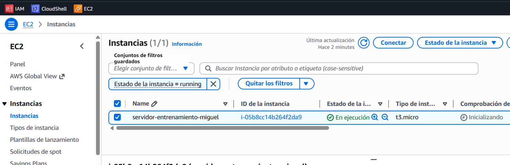
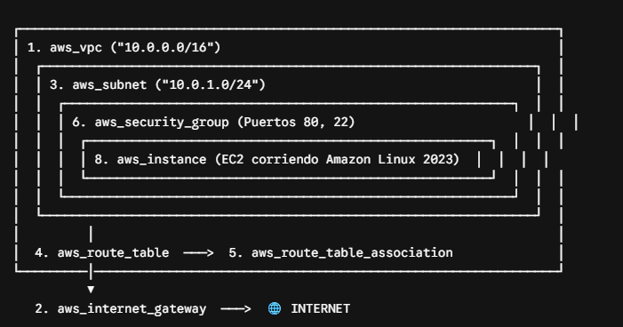

# Introducción a Terraform

Terraform es una herramienta de código abierto que permite definir, provisionar y gestionar infraestructura de forma declarativa mediante archivos de configuración.

## ¿Qué es Terraform?

Terraform utiliza el lenguaje HCL (HashiCorp Configuration Language) para describir la infraestructura deseada de manera reproducible y versionable. Permite trabajar con múltiples proveedores de nube como AWS, Azure, GCP, entre otros.

## Características principales

- **Declarativo**: Especificas el estado deseado de la infraestructura
- **Reproducible**: La misma configuración produce los mismos resultados
- **Versionable**: Las configuraciones pueden controlarse con sistemas como Git
- **Modular**: Permite crear componentes reutilizables
- **Multi-cloud**: Soporta múltiples proveedores

## Conceptos básicos

### Recursos
Los recursos son los componentes fundamentales de Terraform, representan objetos de infraestructura como instancias, bases de datos, etc.

### Estado
Terraform mantiene un archivo de estado que registra la infraestructura desplegada y permite detectar cambios.

### Módulos
Los módulos son contenedores de múltiples recursos que pueden reutilizarse en diferentes configuraciones.

### Proveedores
Los proveedores son plugins que Terraform utiliza para interactuar con APIs de diferentes plataformas.

## INSTALACIÓN TERRAFORM:

+ Instala las claves de seguridad de HashiCorp para que Ubuntu confíe en ellos:  
`wget -O- https://apt.releases.hashicorp.com/gpg | sudo gpg --dearmor -o /usr/share/keyrings/hashicorp-archive-keyring.gpg`  

+ Añade el repositorio oficial de Terraform a tu lista de fuentes de Ubuntu:
`echo "deb [signed-by=/usr/share/keyrings/hashicorp-archive-keyring.gpg] https://apt.releases.hashicorp.com $(lsb_release -cs) main" | sudo tee /etc/apt/sources.list.d/hashicorp.list`  

+ Actualiza el sistema operativo e instala Terraform:
`sudo apt update && sudo apt install -y terraform`  

+ Si no funciona por la versión, podemos descargar directamente:  
    1. Descarga el paquete oficial de Terraform (versión 1.5.7, una de las más estables y utilizadas):
    `wget https://releases.hashicorp.com/terraform/1.5.7/terraform_1.5.7_linux_amd64.zip` 
    2. Descomprime el archivo y muévelo a la carpeta de comandos del sistema operativo:  
    `sudo apt install -y unzip && unzip terraform_1.5.7_linux_amd64.zip` 
    `sudo mv terraform /usr/local/bin/` 

+ La prueba del algodón (Comprobar la versión):
`terraform -version` 
```
vagrant@ubuntu-focal:~/infraestructura/terraform$ terraform --version
Terraform v1.5.7
on linux_amd64

Your version of Terraform is out of date! The latest version
is 1.15.5. You can update by downloading from https://www.terraform.io/downloads.html
```


## COMANDOS:🔄 El Ciclo de Vida de Terraform  

Cualquier proyecto de Terraform en cualquier empresa del mundo (ya sea para levantar 2 servidores o para gestionar toda la infraestructura de Netflix) se basa en 4 comandos. No necesitas aprender más que estos cuatro pasos para dominar el ciclo de vida:

**1. terraform init (El apretón de manos)**  
Cuando creas una carpeta nueva para tu proyecto, está vacía. Al ejecutar terraform init, Terraform lee tu código, mira qué proveedor vas a usar (AWS, Azure, Docker...) y se descarga de internet los plugins necesarios para poder hablar con esa nube. Es el comando que prepara el laboratorio.

**2. terraform plan (El borrador/La auditoría)**  
Este comando es el seguro de vida del DevOps. Antes de tocar nada en la nube real, ejecutas terraform plan. Terraform compara tu código con la realidad del servidor y te saca un informe detallado en la pantalla:

+ Lo que va a crear.

+ Lo que va a modificar.

+ Lo que va a destruir.

No aplica ningún cambio, solo te dice: "Oye Miguel, si le das al play, esto es exactamente lo que voy a hacer. ¿Te parece bien?".

**3. terraform apply (La hora de la verdad)**  
Si el plan te gusta, ejecutas terraform apply. Terraform se conecta a la API de la nube (o de tu entorno) y se lía a martillazos a construir la infraestructura real hasta que coincide al 100% con tu código. Al terminar, es cuando genera el archivo sagrado: el terraform.tfstate (el mapa del estado real).

**4. terraform destroy (La demolición)**  
Imagina que el proyecto ha terminado o que quieres apagar las máquinas de pruebas el viernes por la tarde para que la empresa no gaste dinero el fin de semana. Ejecutas terraform destroy y Terraform, de forma ordenada y limpia, borra absolutamente todo lo que creó con ese código, dejando la nube impecable.

## OPENTOFU  

+ Usamos la v1.5.7 por una razón estratégica del mundo DevOps actual: OpenTofu.

+ Cuando HashiCorp cerró el código abierto en la versión 1.6, la comunidad DevOps mundial (incluidas empresas gigantes como Linux Foundation, Oracle o Suse) se enfadó. Dijeron: "La infraestructura como código debe ser libre".

+ Así que cogieron la última versión libre que existía (la 1.5.7, justo la que tú tienes instalada ahora mismo), hicieron una copia exacta y crearon un proyecto alternativo, 100% gratuito y comunitario, llamado OpenTofu. 

+ Te vas a encontrar dos escenarios idénticos en el día a día:

1. Empresas que siguen con Terraform (versiones modernas 1.10+): El código que vamos a aprender tú y yo se escribe exactamente igual en la versión 1.5.7 que en la versión más moderna de hoy en día. La sintaxis, los bloques, el lenguaje HCL y los comandos (init, plan, apply) no han cambiado en lo básico. Lo que aprendas aquí te sirve perfectamente allí.

2. Empresas que se han mudado a OpenTofu: Muchas empresas tecnológicas se están pasando a OpenTofu por filosofía o para evitar problemas legales futuros. ¿Y sabes qué es lo mejor? Que como OpenTofu nació de la versión 1.5.7, el código es 100% compatible. El comando en vez de ser terraform apply es tofu apply. Todo lo demás es idéntico.  
> ENTREVISTA: En mi laboratorio utilizo la versión 1.5.7 porque es la última versión con licencia open-source pura, lo que me permite entender la base nativa común tanto de las versiones comerciales modernas de Terraform como del ecosistema actual de OpenTofu, manteniendo mi código compatible con ambas ramas de la industria.  

## PRIMER PRÁCTICA CON AWS: crear una instancia en aws

+ Tenemos que tener instalado la CLI de AWS dentro de la MV linux. Luego, con nuestra cuenta de AWS, tenemos que crear unas llaves de credenciales del usuario para que pueda vincularse la cli con aws. Eso sí, ese usuario tiene que tener directivas para poder tratar los servicios que queremos tocar.

+ AWS CLI en linux:
```
curl "https://awscli.amazonaws.com/awscli-exe-linux-x86_64.zip" -o "awscliv2.zip"

unzip awscliv2.zip

sudo ./aws/install

aws --version

rm -rf awscliv2.zip aws/
```

+ Después creamos las credenciales de claves de acceso para vincularlo con `aws configure`

+ Una vez vinculado, Creamos dentro de la MV de vagrant el primer código de la infraestructura que queremos desplegar en aws:
```
# 1. Configuramos el proveedor de AWS y la región donde queremos trabajar
provider "aws" {
  region = "us-east-1" # Región de Virginia (la más barata y estándar de AWS)
}

# 2. Definimos la máquina virtual (Instancia EC2)
resource "aws_instance" "mi_primer_servidor" {
  ami           = "ami-0c7217cdde317cfec" # ID de la imagen de Ubuntu 22.04 LTS en us-east-1
  instance_type = "t3.micro"             # Tipo de máquina elegible en la Capa Gratuita (Free Tier)

  tags = {
    Name = "servidor-entrenamiento-miguel"
  }
}
```

+ Terraform necesita descargar el "traductor" oficial de Amazon para poder entenderse con sus servidores. Iniciamos con:
`terraform init` 
> Terraform has been successfully initialized!  

+ Ahora lanzamos un simulacro de lo que haría con el comando `terraform plan`:
```
Plan: 1 to add, 0 to change, 0 to destroy.

Esto es un éxito rotundo. Significa varias cosas muy potentes a nivel de ingeniería:
- Tu código en formato HCL está perfectamente escrito y no tiene errores de sintaxis.
- Tu instalación de la AWS CLI v2 en Linux funciona de diez y Terraform ha cogido las credenciales del sistema de forma automática.
- AWS ha validado que tus claves tienen permisos suficientes para mirar en la sección de EC2.
```

+ Si está todo OK, ya podemos lanzar `terraform apply` para que comience a crear y desplegar la infraestructura.
> Cuando lo lances, Terraform volverá a hacer un chequeo rápido del plan y se parará en seco haciéndote una pregunta interactiva: Enter a value:  Te está pidiendo una confirmación humana de seguridad para que no cometas errores. Tienes que escribir yes con todas sus letras y pulsar Enter.

+ Resultados:
```
Do you want to perform these actions?
  Terraform will perform the actions described above.        
  Only 'yes' will be accepted to approve.

  Enter a value: yes

aws_instance.mi_primer_servidor: Creating...
aws_instance.mi_primer_servidor: Still creating... [10s elapsed]
aws_instance.mi_primer_servidor: Creation complete after 15s [id=i-05b8cc14b264f2da9]

Apply complete! Resources: 1 added, 0 changed, 0 destroyed.
```
  

+ Verás que ha aparecido un archivo nuevo llamado `terraform.tfstate`. Este archivo es sagrado. Es la "base de datos" en formato JSON donde Terraform apunta todo lo que sabe de la máquina real (su IP pública, su ID de AWS, la hora a la que nació...). Gracias a este archivo, Terraform sabe qué hay en la nube sin tener que estar adivinándolo. Si borras este archivo por error, Terraform "perderá la memoria" y no sabrá qué ha creado.  
```
-rw-rw-r-- 1 vagrant vagrant 5253 Jun  4 22:43 terraform.tfstate
-rw-rw-r-- 1 vagrant vagrant  180 Jun  4 22:43 terraform.tfstate.backup
```

+ Para borrar todo lo creado, utilizamos el comando `terraform destroy`. También nos pedirá otra confirmación de poner YES.
```
Plan: 0 to add, 0 to change, 1 to destroy.

Do you really want to destroy all resources?
  Terraform will destroy all your managed infrastructure, as shown above.
  There is no undo. Only 'yes' will be accepted to confirm.

  Enter a value: yes

  Destroy complete! Resources: 1 destroyed.
```

## SEGUNDA PRÁCTICA CON AWS: crear instancia en aws con server nginx

+ En lugar de crear una máquina vacía, vamos a programar Terraform para que, en cuanto el servidor nazca en AWS, ejecute un script de Linux interno (User Data) que actualice el sistema, instale el servidor web Nginx y publique una página web con tu nombre. ¡Automatización real de extremo a extremo!

+ Creamos otro fichero `main.tf`:
```
# 1. Indicamos el proveedor y la región de AWS (Virginia)
provider "aws" {
  region = "us-east-1"
}

# 2. Definimos el servidor EC2 con el script de automatización
resource "aws_instance" "mi_servidor_web" {
  ami           = "ami-0c7217cdde317cfec" # ID de Ubuntu 22.04 LTS en us-east-1
  instance_type = "t3.micro"             # Tipo de instancia seguro dentro de tus créditos/capa gratuita

  # 🚀 Script automático de Bash al arrancar la máquina
  user_data = <<-EOF
              #!/bin/bash
              sudo apt-get update -y
              sudo apt-get install -y nginx
              sudo systemctl start nginx
              sudo systemctl enable nginx
              echo "<h1>¡Servidor de Miguel levantado con Terraform con éxito!</h1>" | sudo tee /var/www/html/index.html
              EOF

  tags = {
    Name = "servidor-web-nginx-miguel"
  }
}
```
> Esto significa que tu servidor real t3.micro ya ha nacido en la infraestructura física de AWS en Virginia (us-east-1) con el identificador único i-00884b146c7eabe8e. Además, por debajo de la mesa y de manera invisible, el sistema operativo de esa máquina en la nube acaba de ejecutar tu script de Linux (user_data), instalando Nginx y creando tu archivo index.html.

+ Con comandos de `AWS CLI` podemos revisar también la IP de nuestra instancia:
`aws ec2 describe-instances --filters "Name=tag:Name,Values=servidor-web-nginx-miguel" --query "Reservations[*].Instances[*].PublicIpAddress" --output text` --> 100.26.43.84
> Con esto nos saldrá la web. si no sale, es que tenemos que abrir el puerto HTTP 80 en el security group de AWS de la instancia.


## TERCERA PRÁCTICA: crear instancia en aws con Variables y Outputs

+ Hasta ahora hemos escrito todo en un único archivo (main.tf). Si querías cambiar el tipo de máquina o la región, tenías que entrar a editar el código principal. Eso en producción es peligroso.

+ Hoy vamos a romper ese archivo en tres piezas para trabajar como profesionales:
  - main.tf: El motor (los recursos puros, pero sin datos fijos).
  - variables.tf: Los mandos a distancia (donde definimos qué cosas se pueden cambiar).
  - outputs.tf: El chivato (le pediremos a Terraform que nos pinte la IP pública en la pantalla automáticamente al terminar, sin tener que usar comandos de AWS CLI).

### 🛠️ Paso 1: Crear el archivo de Variables (variables.tf)
+ Vamos a definir las variables que usaremos. Abre un archivo nuevo con nano:
```
nano variables.tf
```
+ Pega este código dentro. Aquí definimos tres variables con sus valores por defecto (así, si no le decimos nada, usará estos valores seguros):
```
variable "region_aws" {
  description = "Región de AWS donde desplegaremos la infraestructura"
  type        = string
  default     = "eu-west-1"
}

variable "tipo_instancia" {
  description = "Tamaño de la máquina virtual EC2"
  type        = string
  default     = "t3.micro"
}

variable "nombre_servidor" {
  description = "Etiqueta Name para identificar nuestro servidor web"
  type        = string
  default     = "servidor-variables-miguel"
}

variable "ami_id" {
  description = "AMI Amazon Linux 2023 en eu-west-1"
  type        = string
  default     = "ami-062a8901a5ddcf280"
}
```

### 🛠️ Paso 2: Crear el archivo de Salidas (outputs.tf)
+ Queremos que Terraform nos diga la IP en cuanto acabe. Crea este archivo:
```
nano outputs.tf
```
+ Pega lo siguiente:
```
output "ip_publica_servidor" {
  description = "La dirección IP pública de nuestro nuevo servidor web"
  value       = aws_instance.mi_servidor_web.public_ip
}
```

### 🛠️ Paso 3: Modificar el motor (main.tf)
+ Ahora vamos a limpiar tu main.tf. Primero, abre el archivo:
```
nano main.tf
```
+ Borra todo lo que tengas dentro y reemplázalo por este código. Fíjate cómo ahora, en lugar de poner "us-east-1" o "t3.micro", hacemos referencia a las variables usando la sintaxis var.nombre_de_la_variable:
```
provider "aws" {
  region = var.region_aws
}

resource "aws_instance" "mi_servidor_web" {
  ami           = var.ami_id
  instance_type = var.tipo_instancia

  user_data = <<-EOF
              #!/bin/bash
              sudo apt-get update -y
              sudo apt-get install -y nginx
              sudo systemctl start nginx
              sudo systemctl enable nginx
              echo "<meta charset='utf-8'><h1>¡Servidor parametrizado de Miguel con éxito!</h1>" | sudo tee /var/www/html/index.html
              EOF

  tags = {
    Name = var.nombre_servidor
  }
}
```

### 🚀 Paso 4: El Momento de la Verdad
+ Ahora tienes tres archivos en tu carpeta (main.tf, variables.tf, outputs.tf). Cuando ejecutes Terraform, él va a leer todos los archivos .tf de la carpeta y los unirá mágicamente.

+ Como hemos añadido archivos nuevos, ejecuta el simulacro de seguridad:
```
terraform fmt
terraform validate
terraform plan
terraform apply
```

### 🧙‍♂️ El Gran Truco DevOps: Sobrescribir variables sin tocar el código
+ Ahora viene la razón por la que hemos hecho todo este trabajo de romper el código en tres archivos (main.tf, variables.tf, outputs.tf).

+ Imagina que tu jefe te dice: "Oye Miguel, el servidor en Irlanda está genial, pero necesito probarlo con otro nombre o con una máquina más grande (t3.small) sin modificar los archivos de configuración".

+ En Terraform no necesitas editar variables.tf para cambiar el valor de una variable. Puedes pasarle los valores "al vuelo" desde la terminal usando el parámetro -var.
`
terraform plan -var="nombre_servidor=servidor-super-miguel"
terraform apply -var="nombre_servidor=servidor-super-miguel"

o

# 1. Guardamos el plan en un archivo llamado "mi_plan.tfplan"
terraform plan -var="nombre_servidor=servidor-super-miguel" -out=mi_plan.tfplan

# 2. Aplicamos ese archivo exacto (no te pedirá confirmación "yes" porque ya está aprobado)
terraform apply mi_plan.tfplan
`
> Terraform lee tus archivos. Ve que en variables.tf el valor por defecto era servidor-variables-miguel. Pero como se lo has pasado por línea de comandos, lo sobrescribe en el acto y te muestra en el plan que va a actualizar la etiqueta Name a servidor-super-miguel.

## CUARTA PRÁCTICA: Caso de Uso Empresarial: Despliegue de Arquitectura Web (VPC + EC2 + Security Groups)

+ Imagina que tu empresa te da este ticket de JIRA:
```
[TICKET-101] "Crear la infraestructura base para un entorno web en la región de Irlanda (eu-west-1). Requerimos una VPC propia aislada (10.0.0.0/16), una Subred Pública (10.0.1.0/24), un Internet Gateway para dar salida a internet, una Tabla de Enrutamiento configurada y un Security Group que autorice tráfico SSH (puerto 22) e HTTP (puerto 80). Desplegar una instancia de Amazon Linux 2023 ejecutando un servicio Web dinámico que muestre la metainformación del servidor (IPs, zona de disponibilidad y estado)."
```

+ Variables.tf:
```
variable "region_aws" {
  description = "Región de AWS donde desplegaremos la infraestructura"
  type        = string
  default     = "eu-west-1"
}

variable "tipo_instancia" {
  description = "Tamaño de la máquina virtual EC2"
  type        = string
  default     = "t3.micro"
}

variable "cidr_vpc" {
  description = "Bloque CIDR para la VPC"
  type        = string
  default     = "10.0.0.0/16"
}

variable "cidr_subred_publica" {
  description = "Bloque CIDR para la subred pública"
  type        = string
  default     = "10.0.1.0/24"
}

variable "entorno" {
  description = "Etiqueta del entorno"
  type        = string
  default     = "Produccion"
}
```

+ Main.tf:
```
provider "aws" {
  region  = var.region_aws
  profile = "personal"
}

# 1️⃣ CREACIÓN DE LA VPC (Nuestra red aislada en la nube)
resource "aws_vpc" "vpc_produccion" {
  cidr_block           = var.cidr_vpc
  enable_dns_hostnames = true
  enable_dns_support   = true

  tags = {
    Name    = "vpc-miguel-${var.entorno}"
    Env     = var.entorno
  }
}

# 2️⃣ INTERNET GATEWAY (La puerta para que la VPC se comunique con Internet)
resource "aws_internet_gateway" "igw_produccion" {
  vpc_id = aws_vpc.vpc_produccion.id

  tags = {
    Name = "igw-miguel-${var.entorno}"
  }
}

# 3️⃣ SUBRED PÚBLICA (Donde residirán nuestros servidores accesibles desde fuera)
resource "aws_subnet" "subred_publica" {
  vpc_id                  = aws_vpc.vpc_produccion.id
  cidr_block              = var.cidr_subred_publica
  map_public_ip_on_launch = true # Asigna IP pública automáticamente a las máquinas

  tags = {
    Name = "subred-publica-miguel"
  }
}

# 4️⃣ TABLA DE ENRUTAMIENTO (Define que todo el tráfico 0.0.0.0/0 vaya al Internet Gateway)
resource "aws_route_table" "tabla_rutas_publica" {
  vpc_id = aws_vpc.vpc_produccion.id

  route {
    cidr_block = "0.0.0.0/0"
    gateway_id = aws_internet_gateway.igw_produccion.id
  }

  tags = {
    Name = "rt-publica-miguel"
  }
}

# 5️⃣ ASOCIACIÓN (Conecta la subred pública con la tabla de enrutamiento)
resource "aws_route_table_association" "asociacion_publica" {
  subnet_id      = aws_subnet.subred_publica.id
  route_table_id = aws_route_table.tabla_rutas_publica.id
}

# 6️⃣ SECURITY GROUP (El Firewall a nivel de instancia: abre los puertos 80 y 22)
resource "aws_security_group" "sg_web" {
  name        = "sg_servidor_web_miguel"
  description = "Permitir trafico HTTP y SSH de entrada"
  vpc_id      = aws_vpc.vpc_produccion.id

  # Regla de Entrada: HTTP (Puerto 80) desde cualquier lugar
  ingress {
    description = "HTTP desde cualquier lugar"
    from_port   = 80
    to_port     = 80
    protocol    = "tcp"
    cidr_blocks = ["0.0.0.0/0"]
  }

  # Regla de Entrada: SSH (Puerto 22) para administración
  ingress {
    description = "SSH de administracion"
    from_port   = 22
    to_port     = 22
    protocol    = "tcp"
    cidr_blocks = ["0.0.0.0/0"]
  }

  # Regla de Salida: Permitir todo el tráfico de salida a Internet
  egress {
    from_port   = 0
    to_port     = 0
    protocol    = "-1"
    cidr_blocks = ["0.0.0.0/0"]
  }

  tags = {
    Name = "sg-web-miguel"
  }
}

# 7️⃣ BUSCADOR DINÁMICO DE AMI (Amazon Linux 2023)
data "aws_ami" "amazon_linux_2023" {
  most_recent = true
  owners      = ["amazon"]

  filter {
    name   = "name"
    values = ["al2023-ami-2023.*-x86_64"]
  }
}

# 8️⃣ INSTANCIA EC2 (El servidor web real montado DENTRO de nuestra VPC y Subred)
resource "aws_instance" "servidor_web_app" {
  ami                    = data.aws_ami.amazon_linux_2023.id
  instance_type          = var.tipo_instancia
  subnet_id              = aws_subnet.subred_publica.id
  vpc_security_group_ids = [aws_security_group.sg_web.id]

  # User data para crear una aplicación Dashboard en tiempo de inicio
  user_data = <<-EOF
              #!/bin/bash
              dnf update -y
              dnf install -y nginx
              systemctl start nginx
              systemctl enable nginx

              # Capturamos metadatos de la instancia mediante IMDSv2
              TOKEN=$(curl -s -X PUT "http://169.254.169.254/latest/api/token" -H "X-aws-ec2-metadata-token-ttl-seconds: 21600")
              INSTANCE_ID=$(curl -s -H "X-aws-ec2-metadata-token-ttl-sec: $TOKEN" http://169.254.169.254/latest/meta-data/instance-id)
              AVAIL_ZONE=$(curl -s -H "X-aws-ec2-metadata-token-ttl-sec: $TOKEN" http://169.254.169.254/latest/meta-data/placement/availability-zone)

              # Creamos una landing page visual profesional
              cat <<HTML > /usr/share/nginx/html/index.html
              <!DOCTYPE html>
              <html>
              <head>
                <style>
                  body { font-family: Arial, sans-serif; background-color: #f4f6f9; color: #333; text-align: center; padding-top: 50px; }
                  .card { background: white; max-width: 600px; margin: 0 auto; padding: 30px; border-radius: 12px; box-shadow: 0 4px 15px rgba(0,0,0,0.1); }
                  h1 { color: #ff9900; }
                  .badge { background: #232f3e; color: #fff; padding: 6px 12px; border-radius: 4px; font-weight: bold; }
                  .info { text-align: left; margin-top: 20px; font-size: 16px; line-height: 1.6; }
                </style>
              </head>
              <body>
                <div class="card">
                  <h1>🚀 AWS Production Workload</h1>
                  <p>Infraestructura desplegada dinámicamente con <strong>Terraform</strong> por Miguel.</p>
                  <hr>
                  <div class="info">
                    <p><strong>Estado del Servicio:</strong> <span class="badge" style="background:#28a745;">ONLINE</span></p>
                    <p><strong>VPC ID:</strong> <code>10.0.0.0/16 (Custom VPC)</code></p>
                    <p><strong>Instance ID:</strong> <code>'$INSTANCE_ID'</code></p>
                    <p><strong>Zona de Disponibilidad:</strong> <code>'$AVAIL_ZONE'</code></p>
                  </div>
                </div>
              </body>
              </html>
              HTML
              EOF

  tags = {
    Name = "servidor-app-${var.entorno}"
  }
}
```

+ Outputs.tf:
```
output "url_servidor_web" {
  description = "Dirección URL para acceder a la aplicación desde el navegador"
  value       = "http://${aws_instance.servidor_web_app.public_ip}"
}

output "vpc_id_creada" {
  description = "ID de la VPC propia creada en AWS"
  value       = aws_vpc.vpc_produccion.id
}

output "security_group_id" {
  description = "ID del Security Group asociado"
  value       = aws_security_group.sg_web.id
}
```

+ Diagrama:
  

1. aws_vpc (La Red Privada): Define tu parcela aislada en la nube de AWS. El CIDR 10.0.0.0/16 asigna un rango de 65.536 IP privadas para tu empresa.

2. aws_internet_gateway (El Router a Internet): Es el componente físico/virtual que conecta tu red aislada con el mundo exterior. Sin esto, la VPC no tiene acceso a Internet.

3. aws_subnet (La Subred Pública): Un subdivisión de la VPC (10.0.1.0/24 = 256 IPs). Al marcar map_public_ip_on_launch = true, cualquier máquina que nazca en esta subred recibirá una IP pública automáticamente.

4. aws_route_table (La Tabla de Enrutamiento): Es el mapa de tráfico. Le dice a la subred: "Todo el tráfico que busque salir a Internet (0.0.0.0/0), envíalo a través del Internet Gateway".

5. aws_route_table_association (El Enlace): Une la Subred Pública con la Tabla de Enrutamiento. Sin esta asociación, la subred no sabe qué tabla de rutas debe seguir.

6. aws_security_group (El Firewall Virtual): Protege la interfaz de red de la máquina. ingress define lo que entra (puerto 80 para web, puerto 22 para SSH) y egress define lo que sale (-1 significa todo tipo de tráfico permitido para descargar actualizaciones).

7. aws_instance (La Máquina EC2): El servidor virtual. En lugar de estar flotando en la red por defecto de AWS, la colocamos explícitamente dentro de nuestra subred (subnet_id) y le aplicamos nuestro cortafuegos (vpc_security_group_ids).

+ Las Reglas de Sintaxis en HCL (HashiCorp Configuration Language):
  - Comillas "texto" (Strings): Se usan siempre para valores literales de texto, como nombres, IDs estáticos, bloques CIDR ("10.0.0.0/16") o puertos en formato texto.
  - Corchetes [...] (Listas o Arrays): Se usan cuando un atributo admite múltiples valores, aunque solo le pases uno.
    - Ejemplo: cidr_blocks = ["0.0.0.0/16"] lleva corchetes porque podrías pasarle varias redes separadas por comas.
    - Ejemplo: vpc_security_group_ids = [aws_security_group.sg_web.id] lleva corchetes porque una instancia EC2 puede tener asignados varios Security Groups a la vez.
  - Sin comillas (Booleanos, Números y Referencias):
    - Números y booleanos: from_port = 80, enable_dns_hostnames = true.
    - Referencias cruzadas entre recursos: vpc_id = aws_vpc.vpc_produccion.id. Nunca se ponen comillas aquí, porque si pones comillas Terraform pensaría que es texto literal y no el ID real generado por AWS.
  - La sintaxis del punto recurso.nombre_local.atributo:
    - Para conectar dos recursos, usas la fórmula: tipo_de_recurso + . + nombre_que_tú_le_diste + . + atributo_que_quieres_extraer.
    - Ejemplo: aws_vpc.vpc_produccion.id significa "ve al recurso aws_vpc llamado vpc_produccion y extrae su atributo id".

+ Resultado:
```
terraform plan

terraform apply

Apply complete! Resources: 7 added, 0 changed, 0 destroyed.

Outputs:

security_group_id = "sg-0e3f99821da5f196e"
url_servidor_web = "http://54.74.243.105"
vpc_id_creada = "vpc-022e2ffa57d3a69e0"
```
> con la direccion http://54.74.243.105 vemos la web dinámica con ip publica que hemos creado en una instancia ec2.

+ Finalizamos con `terraform destroy`.

### EXPLICACIÓN

+ Imagina que AWS es un polígono industrial gigantesco en Irlanda y tú acabas de comprar una parcela para montar tu empresa.
1. La VPC (aws_vpc): Es la valla exterior de tu parcela. Antes estabas compartiendo terreno con todo el mundo; ahora tienes un recinto privado de 65.536 metros cuadrados (IPs) donde nadie entra sin tu permiso.

2. El Internet Gateway (aws_internet_gateway): Es la puerta principal con barrera de tu polígono. Es la única forma de que entren clientes o paquetes desde la calle (Internet) a tu parcela.

3. La Subred Pública (aws_subnet): Es una sección delimitada dentro de tu parcela (con espacio para 256 naves). Le hemos puesto un cartel que dice: "Toda nave que se construya aquí tiene dirección postal pública visible desde la calle".

4. La Tabla de Rutas (aws_route_table + association): Es el cartel de señalización en el suelo. Le dice al tráfico: "Si quieres ir a la calle (Internet, 0.0.0.0/0), camina en dirección a la puerta principal (Internet Gateway)".

5. El Security Group (aws_security_group): Es el segurata de la puerta de la nave. Revisa las visitas una a una. En su libreta pone:
  - Entrada: Solo pasan los que vienen a pedir la página web (Puerto 80 HTTP) o el técnico de mantenimiento (Puerto 22 SSH). El resto de puertos (443, 3306, 8080...) están bloqueados.
  - Salida: Los trabajadores de la nave pueden salir a la calle a comprar lo que quieran (actualizaciones del sistema).

6. La Instancia EC2 (aws_instance): Es la nave/servidor real. La hemos metido dentro de tu subred, protegida por tu segurata, corriendo Linux y un servicio Nginx que te saluda con tus datos.

+  El Flujo de Trabajo (Qué pasa cuando pones la IP en el navegador):
  1. Escribes [http://54.74.243.105](http://54.74.243.105) en Chrome.
  2. Tu petición viaja por la red global y llega al Internet Gateway de tu VPC en Irlanda.
  3. El Gateway consulta la Tabla de Rutas y redirige el tráfico hacia la Subred Pública.
  4. La petición llega a la nave, pero antes de entrar, el Security Group comprueba el puerto. Ve que pides el puerto 80 (HTTP) $\rightarrow$ ¡Permiso concedido!
  5. El servidor Nginx procesa tu petición, genera la página HTML del Dashboard y te la devuelve por el mismo camino.

+ Mejoras:
❌ 1. Inseguridad en el acceso SSH (Puerto 22)
  - El fallo: Abrimos el puerto 22 a todo el planeta (0.0.0.0/0). Cualquier hacker o bot chino está ahora mismo intentando adivinar contraseñas en esa IP.
  - La solución en producción: Abrir el puerto 22 solo a tu IP pública de casa (ej. 83.45.12.1/32), o mejor aún, no abrir el puerto 22 y acceder mediante AWS Systems Manager (SSM) Session Manager, que no requiere abrir ningún puerto en el Firewall.

❌ 2. Arquitectura de una sola capa (Single Tier)
  - El fallo: La máquina está expuesta directamente a la calle. Si alguien hackea el servidor Nginx, está metido dentro de tu VPC.
  - La solución en producción (3-Tier Architecture):
    - Capa 1: Balanceador de Carga (ALB) en Subred Pública.
    - Capa 2: Servidores Web/App en Subred Privada (sin IP pública).
    - Capa 3: Base de Datos (RDS) en otra Subred Privada aislada.

❌ 3. Tráfico HTTP en texto plano
  - El fallo: Usamos HTTP (puerto 80). Todo viaja sin encriptar.
  - La solución: Usar HTTPS (puerto 443) con un certificado SSL/TLS (usando AWS Certificate Manager o Let's Encrypt).