# IaC Linting & Security Scanning (DevSecOps)

+ El objetivo de esta subfase es aplicar la filosofía Shift-Left: detectar errores de sintaxis, violaciones de buenas prácticas y fallos de seguridad en el código de Terraform y Ansible antes de ejecutar un terraform plan o un ansible-playbook.

## Auditoría de Seguridad y Calidad Local (CLI)

+ tflint (El Corrector Gramatical):
    - ¿Qué hace? Se asegura de que tu código de Terraform no tenga errores de sintaxis ni de estructura.
    - Ejemplo: Te avisa si pones una regla de AWS que ya no existe o un tipo de instancia EC2 inválido (como escribir t3.microo por error).

+ ansible-lint (El Guía de Buenas Prácticas):
    - ¿Qué hace? Revisa que tus Playbooks de Ansible estén ordenados, limpios y sigan los estándares de la industria.
    - Ejemplo: Te avisa si no le pones nombre a una tarea o si usas comandos manuales (shell) en lugar de los módulos oficiales de Ansible.

+ checkov (El Inspector de Seguridad / DevSecOps):
    - ¿Qué hace? Busca vulnerabilidades de seguridad en tus archivos de Terraform antes de enviarlos a AWS.
    - Ejemplo: Cuando te dio el error CKV_AWS_103, te estaba diciendo: "Oye, tu balanceador de carga no usa cifrado moderno (TLS 1.2). Si alguien intercepta el tráfico, podría leer los datos".

+ Instalación de herramientas en WSL2:
```bash
# 1. TFLint (Linter para Terraform)
curl -s https://raw.githubusercontent.com/terraform-linters/tflint/master/install_linux.sh | bash

# 2. Checkov (Escaner de Seguridad SAST para IaC)
pip3 install checkov

# 3. Ansible-Lint (Buenas prácticas para Ansible)
pip3 install ansible-lint
```

+ Si da error es error ocurre debido a PEP 668, una protección introducida en las distribuciones recientes de Linux (Ubuntu/Debian) para evitar que pip instale paquetes de Python directamente en el sistema global y rompa dependencias del sistema operativo.
    - Para CLI herramientas globales de Python como checkov o ansible-lint, la solución recomendada oficialmente por Debian/Ubuntu es utilizar pipx. pipx crea e aísla automáticamente un entorno virtual (venv) para cada aplicación en binarios globales accesibles desde tu $PATH.

```bash
# 1. Instalar pipx y asegurar el PATH
sudo apt update && sudo apt install -y pipx
pipx ensurepath

# 2. Reiniciar la sesión de terminal o recargar el entorno
source ~/.bashrc

# 3. Instalar Checkov y Ansible-Lint con pipx
pipx install checkov
pipx install ansible-lint
```

+ Una vez completada la instalación por cualquiera de los dos métodos, comprueba las versiones para confirmar que están disponibles globalmente:
```bash
miguel@DESKTOP-G47I0DM:aws-3-tier-terraform$ tflint --version
TFLint version 0.64.0
+ ruleset.terraform (0.15.0-bundled)

miguel@DESKTOP-G47I0DM:aws-3-tier-terraform$ checkov --version
3.3.11

miguel@DESKTOP-G47I0DM:aws-3-tier-terraform$ ansible-lint --version
ansible-lint 26.8.0 using ansible-core:2.21.3 ansible-compat:26.8.0 ruamel-yaml:0.19.1 ruamel-yaml-clib:None
```

+ Ejecución y diagnóstico
    - Navega a tu directorio local donde tengas el código de Terraform (aws-3-tier-terraform o la carpeta correspondiente dentro de 04_Infraestructura_como_Codigo_IaC/Terraform-Ansible) y ejecuta los siguientes escaneos:

    - TFLint (Inicialización y análisis):
    ```Bash
    tflint --init
    tflint
    ```
    - Checkov (Escaneo de seguridad):
    ```Bash
    checkov -d . --framework terraform
    ```

+ Resultados:
```bash
miguel@DESKTOP-G47I0DM:aws-3-tier-terraform$ tflint
miguel@DESKTOP-G47I0DM:aws-3-tier-terraform$ checkov -d . --framework terraform
Passed checks: 89, Failed checks: 29, Skipped checks: 0
```
> TFLint (Sintaxis y mejores prácticas): tflint no ha devuelto ningún error. Esto significa que la sintaxis de HCL, la resolución de variables y la estructura de bloques de Terraform son totalmente válidas.  
> Checkov (Seguridad y Cumplimiento): Para ver en detalle cuáles son las 29 violaciones y priorizarlas, puedes filtrar el output de Checkov para mostrar únicamente los fallos: checkov -d . --framework terraform --compact

+ `checkov -d . --framework terraform --compact`

+ Por qué hacemos esto en local y luego en GitHub Actions?
    - En Local (Tu WSL2): Para que tú, mientras programas en VS Code, ejecutes un comando rápido y sepas si tu código está bien antes de subirlo a Git.
    - En GitHub Actions (CI/CD): Para poner un "control de acceso" automático. Si trabajas en un equipo de 20 ingenieros, el pipeline ejecutará estas herramientas en la nube. Si alguien intenta subir un código inseguro, GitHub frenará el despliegue automáticamente.
> Esto en la industria se llama Shift-Left Security: mover la seguridad a la izquierda (al principio del proceso), detectando fallos en segundos en lugar de descubrirlos cuando ya hay un problema en producción.

### INTEGRACIÓN EN PROYECTO AWS 3 TIER TERRAFORM

+ Crear la configuración de TFLint: Crea el archivo `.tflint.hcl` en la raíz de tu proyecto local (aws-3-tier-terraform/):
```Bash
config {
  module = true
  force  = false
}

plugin "aws" {
  enabled = true
  version = "0.28.0"
  source  = "github.com/terraform-linters/tflint-ruleset-aws"
}
```

+ Crear el nuevo workflow en `.github/workflows/security-quality.yml`
```YAML
name: "Security & Quality Gate (DevSecOps)"

on:
  push:
    branches: [ "main" ]
  pull_request:
    branches: [ "main" ]
  workflow_dispatch: # Permite ejecutarlo manualmente desde la interfaz de GitHub

jobs:
  iac-security-scan:
    name: "TFLint & Checkov Scan"
    runs-on: ubuntu-latest
    defaults:
      run:
        working-directory: ./infra

    steps:
      - name: Checkout del código
        uses: actions/checkout@v4

      # 1. Análisis de mejores prácticas con TFLint
      - name: Setup TFLint
        uses: terraform-linters/setup-tflint@v4
        with:
          tflint_version: v0.50.0

      - name: Ejecutar TFLint
        run: |
          tflint --init
          tflint -f compact

      # 2. Análisis de Seguridad SAST con Checkov
      - name: Configurar Python
        uses: actions/setup-python@v5
        with:
          python-version: '3.11'

      - name: Instalar Checkov
        run: pip install checkov

      - name: Ejecutar Checkov en ./infra
        run: |
          checkov -d . --framework terraform --soft-fail
```

+ Por qué funciona así y qué significa:
    + Sin --soft-fail (Modo Estricto / Bloqueante): Si Checkov encuentra un solo fallo, devuelve un código de error (exit code 1). GitHub Actions detecta ese código, marca la tarea en rojo ($\mathbf{\times}$) y bloquea el Pull Request impidiendo el merge.  
    + Con --soft-fail (Modo Auditoría / Informativo): Checkov analiza todo, imprime el reporte completo de fallos en los logs para que puedas revisarlos, pero devuelve un código de éxito (exit code 0). Para GitHub Actions la tarea se completó sin colgarse, por eso marca todo en verde ($\checkmark$).  

+ Cuándo usar cada enfoque en un entorno profesional:
    - Modo Auditoría (--soft-fail): Ideal cuando integras seguridad en un proyecto antiguo que ya tiene decenas de fallos conocidos. Te permite visibilizar los problemas sin congelar el trabajo diario del equipo mientras los arreglas progresivamente.
    - Modo Bloqueante (Sin --soft-fail): Estándar de producción estricto (Quality Gate). Si hay vulnerabilidades, el pipeline se rompe y nadie puede desplegar hasta corregirlas.
> Si quieres que GitHub Actions bloquee los Pull Requests cuando existan fallos de seguridad, solo debes quitar el flag --soft-fail de tu workflow.  

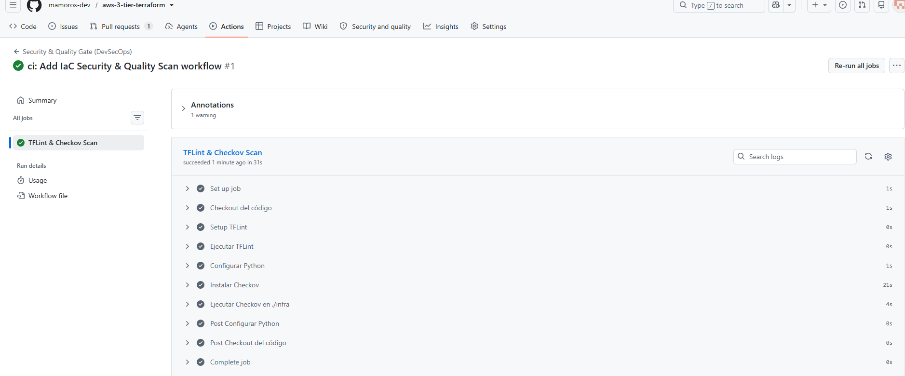  

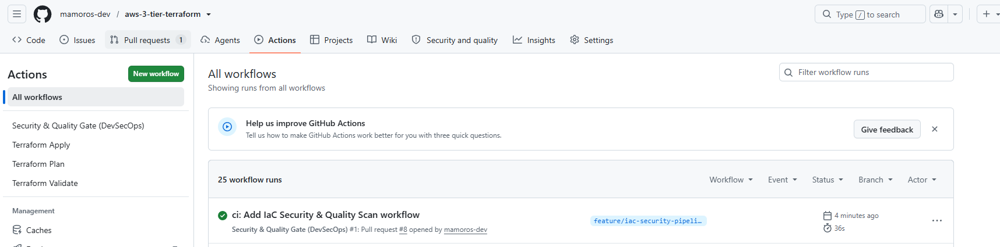  

## Estrategias de Despliegue CI/CD (Zero-Downtime)

+ En este nuevo bloque vas a aprender cómo actualizar aplicaciones en producción sin interrumpir el servicio a los usuarios (Zero-Downtime Deployments).

+ Conceptos clave explicados fácil
    - Recreate (Con corte de servicio): Se apaga la versión antigua (v1) y luego se enciende la nueva (v2). Durante unos segundos/minutos los usuarios ven un error. (Lo que queramos evitar en producción).
    - Rolling Update (Actualización Progresiva): Va sustituyendo instancias o contenedores uno a uno. Si tienes 4 servidores, apaga uno, pone el nuevo con v2, y repite hasta tener los 4 en v2.
    - Blue/Green Deployment (Despliegue Azul/Verde): Tienes dos entornos idénticos. El entorno Blue tiene la versión actual recibiendo tráfico. Despliegas la v2 en el entorno Green (aislado). Compruebas que Green funciona y, con un simple cambio en el Load Balancer, conmutas el 100% del tráfico a Green instantáneamente.
    - Canary Deployment (Despliegue Canario): Envías solo a un 10% de los usuarios a la nueva versión v2. Si no hay errores en los métricas durante 15 minutos, rediriges gradualmente al resto (25%, 50%, 100%).

### PRÁCTICA GRACEFUL RELOAD: aws-ansible-gitops-pipeline
+ aws-ansible-gitops-pipeline:
> Tener presente que en ese repo tenemos 1 sola EC2 (sin Load Balancer) nos evita cometer el error de intentar hacer un Rolling Update de primeras. Si solo hay un servidor, un Rolling Update tradicional no es posible porque no hay más instancias donde repartir la carga.

+ ¿Cómo aplicamos Zero-Downtime con 1 sola EC2?
    - Cuando trabajas con un solo servidor y Nginx, la estrategia para lograr Zero-Downtime se basa en la recarga suave de servicios (Graceful Reload):
        - Downtime clásico (systemctl restart nginx): Apaga el proceso por completo, mata las conexiones activas de los usuarios en ese segundo y luego enciende el proceso nuevo.
        - Zero-Downtime (systemctl reload nginx): Nginx arranca nuevos procesos worker con la nueva configuración/código mientras los workers antiguos terminan de atender a los usuarios conectados. Cero paquetes perdidos.

+ Implementando Graceful Reloads y Healthchecks con Ansible
    - Vamos a modificar tu Playbook para que cualquier despliegue de nueva versión web sea transparente para el usuario y valide que el sitio responde correctamente antes de dar la tarea por finalizada.

1. Modificar el Role de Ansible para la estrategia Zero-Downtime.  
    - Para implementar este flujo profesional, añadiremos un Handler con accionamiento mediante notify. Así, Ansible solo recargará Nginx si y solo si el archivo HTML/template sufre un cambio.
    - Abre el archivo roles/nginx_webserver/tasks/main.yml y actualízalo:
```YAML
---
- name: Actualizar la lista de paquetes (APT)
  apt:
    update_cache: yes
    cache_valid_time: 3600

- name: Instalar el servidor Nginx
  apt:
    name: nginx
    state: present

- name: Desplegar la plantilla HTML procesando Jinja2
  template:
    src: index.html.j2
    dest: /var/www/html/index.html
    owner: www-data
    group: www-data
    mode: '0644'
  # Notifica al handler solo si la plantilla cambia de versión
  notify: Validar y Recargar Nginx

- name: Asegurar que Nginx esté iniciado y habilitado
  service:
    name: nginx
    state: started
    enabled: yes
```

2. Paso 2: Crear el Handler para la recarga sin interrupciones
    - Crea o edita el archivo roles/nginx_webserver/handlers/main.yml:
```YAML
---
---
- name: Validar y Recargar Nginx
  service:
    name: nginx
    state: reloaded
```

3. Hacemos los cambios a github para desplegar la IAC que teníamos:
```bash
# 1. Crear rama de trabajo
git checkout main
git pull origin main
git checkout -b feature/zero-downtime-handler

# 2. Guardar los cambios (tasks/main.yml y handlers/main.yml)
git add iac/roles/nginx_webserver/
git commit -m "feat: add graceful reload handler for nginx zero-downtime"

# 3. Subir la rama
git push -u origin feature/zero-downtime-handler

# 4. Crear el PR con GitHub CLI
gh pr create \
  --title "feat: Add Nginx Graceful Reload handler" \
  --body "Añadido handler con nginx -t y service reload para zero-downtime deployments." \
  --base main

gh pr merge --merge --delete-branch
```
> Como tu pipeline escucha en los push a la rama main sobre la carpeta iac/, en cuanto hagas el merge:  
    - GitHub Actions ejecutará terraform apply y creará la instancia EC2.  
    - El inventario dinámico encontrará la máquina levantada.  
    - Ansible ejecutará las tareas, aplicando la plantilla y registrando el nuevo Handler.  

4. La Prueba Real de Zero-Downtime (Graceful Reload)
+ Ahora que la infraestructura ya existe y su estado está guardado en S3, probaremos la actualización en caliente:
```bash
git checkout main
git pull origin main
git checkout -b feature/test-zero-downtime

Modificar el texto en iac/roles/nginx_webserver/templates/index.html.j2
Edita el archivo y pon un texto visible diferente (por ejemplo: <h1>¡Versión 2.0 - Actualizado sin caída de servicio!</h1>)

git add iac/roles/nginx_webserver/templates/index.html.j2
git commit -m "feat: update HTML content to v2"
git push -u origin feature/test-zero-downtime
gh pr create --title "feat: Update web content to v2" --body "Prueba de recarga Nginx en caliente." --base main
gh pr merge --merge --delete-branch
```

+ El momento clave: Plantilla y Handler (Graceful Reload)
```bash
TASK [nginx_webserver : Desplegar la plantilla HTML procesando Jinja2] *********
changed: [3.227.241.62]

RUNNING HANDLER [nginx_webserver : Validar y Recargar Nginx] *******************
changed: [3.227.241.62]
```
> Plantilla Jinja2: Ansible copió tu HTML actualizado a /var/www/html/index.html. Al detectar que el archivo había cambiado, la tarea devolvió estado changed.  
> Notificación de Handler: Al cambiar la plantilla, Ansible activó automáticamente el Handler.  
> Graceful Reload: Ejecutó el comando de prueba (nginx -t) y luego recargó el servicio (systemctl reload nginx) en caliente sin tirar el servidor.  

+ Resultados:
    - A partir de este momento, las claves SSH son fijas y el estado de Terraform está guardado en S3.
    - Si realizas un nuevo cambio en el HTML y haces un push a main:
        - Terraform dirá: 0 to add, 0 to change, 0 to destroy (¡No destruirá la EC2!).
        - Ansible dirá: Se conectará a la misma IP (3.227.241.62), cambiará el HTML y ejecutará únicamente el Graceful Reload sin recrear nada.

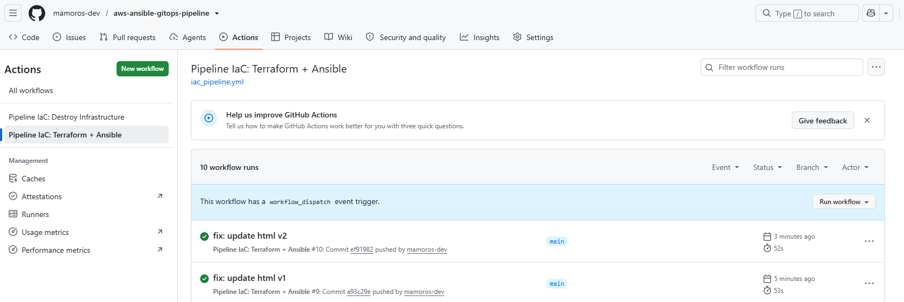  
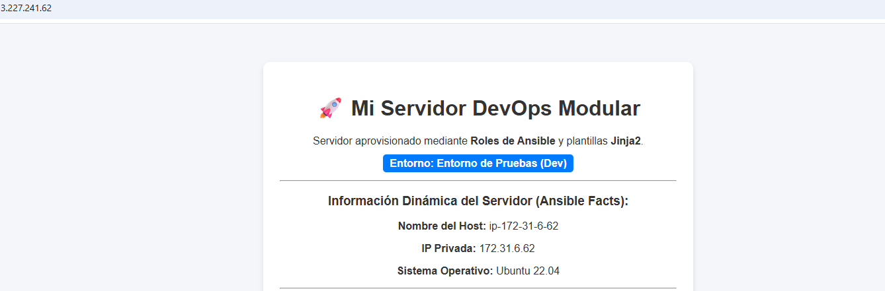  
  
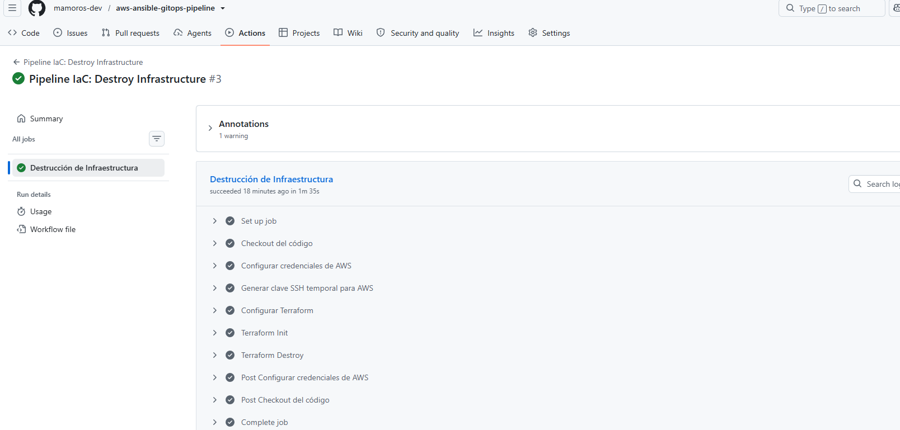  

### PRÁCTICA ZERO-DOWNTIME: aws-ansible-gitops-pipeline V2

+ 🛠️ Novedades Técnicas que integraremos en esta v2
  - Infraestructura con Terraform:
    - Multi-AZ VPC: Subredes públicas para el ALB y subredes privadas para las instancias EC2.
    - Application Load Balancer (ALB): Con su Target Group y Health Checks activos.
    - Launch Template + Auto Scaling Group (ASG): Mínimo 2 instancias distribuidas en diferentes Zonas de Disponibilidad.
    - Security Groups encadenados: El ALB solo acepta tráfico en el puerto 80/443, y las EC2 solo aceptan tráfico proveniente del Security Group del ALB.
  - Aprovisionamiento con Ansible:
    - Inventario Dinámico Avanzado: Filtrado de IPs por etiquetas del ASG (Role=webservers, Env=production).
    - Rolling Updates en Ansible (serial: 1 / max_fail_percentage):
      - Desenganchar la instancia del Target Group del ALB.
      - Aplicar la actualización/plantilla de Nginx.
      - Validar sintaxis y hacer reload.
      - Esperar a que el Health Check del ALB vuelva a dar healthy.
      - Pasar a la siguiente instancia. ¡Despliegue 100% Zero Downtime!
  - Pipeline GitOps en GitHub Actions:
      - Control completo de despliegue en clúster.

+ Estructura:
```
┌────────────────────────────────────────────────────────────────────────┐
│                        Application Load Balancer                       │
│                               (aws_lb)                                 │
└───────────────────────────────────┬────────────────────────────────────┘
                                    │
                                    ▼
┌────────────────────────────────────────────────────────────────────────┐
│                      aws_lb_listener (Puerto 80)                       │
│              Redirige todo el tráfico al Target Group                  │
└───────────────────────────────────┬────────────────────────────────────┘
                                    │
                                    ▼
┌────────────────────────────────────────────────────────────────────────┐
│                   aws_lb_target_group ("web_tg")                       │
│         Lista dinámica de IPs/Instancias sanas (Health Check /)        │
└───────────────────────────────────▲────────────────────────────────────┘
                                    │
           El ASG registra/desregistra instancias automáticamente
                                    │
┌────────────────────────────────────────────────────────────────────────┐
│                   aws_autoscaling_group ("web_asg")                    │
│    Mantiene 2 instancias vivas (min_size = 2) basándose en el Launch   │
│                 Template ("web_template") y el Health Check            │
└────────────────────────────────────────────────────────────────────────┘
```

+ fichero `iac/variables.tf`:
```bash
variable "aws_region" {
  description = "Región de AWS"
  type        = string
  default     = "us-east-1"
}

variable "environment" {
  description = "Entorno de despliegue"
  type        = string
  default     = "production"
}

variable "ssh_public_key" {
  description = "Clave pública SSH para las instancias EC2"
  type        = string
}

variable "vault_password" {
  description = "Contraseña de Ansible Vault para SSM"
  type        = string
  sensitive   = true
}
```

+ fichero `iac/main.tf`:
```bash
terraform {
  required_version = ">= 1.5.0"
  required_providers {
    aws = {
      source  = "hashicorp/aws"
      version = "~> 5.0"
    }
  }
  # Configuración del Backend remoto en S3
  backend "s3" {
    bucket         = "miguel-terraform-state-proyecto2"
    key            = "ha-cluster-v2/terraform.tfstate"
    region         = "eu-west-1"
    dynamodb_table = "terraform-locks-proyecto2"
    encrypt        = true
  }
}

provider "aws" {
  region = var.aws_region
  default_tags {
    tags = {
      Project     = "aws-ansible-gitops-ha-v2"
      Environment = var.environment
      ManagedBy   = "Terraform"
    }
  }
}

# --- 1. RED (VPC Default o Custom) ---
# Usamos la VPC por defecto para mantener simplicidad y agilidad
data "aws_vpc" "default" {
  default = true
}

data "aws_subnets" "default" {
  filter {
    name   = "vpc-id"
    values = [data.aws_vpc.default.id]
  }
}

# --- 2. KEY PAIR ---
resource "aws_key_pair" "ha_key" {
  key_name   = "ha-cluster-ssh-key"
  public_key = var.ssh_public_key
}

# --- 3. SECURITY GROUPS ---
# Security Group del ALB (Abierto a Internet)
resource "aws_security_group" "alb_sg" {
  name        = "ha-alb-sg"
  description = "Permite acceso HTTP publico al Load Balancer"
  vpc_id      = data.aws_vpc.default.id

  ingress {
    from_port   = 80
    to_port     = 80
    protocol    = "tcp"
    cidr_blocks = ["0.0.0.0/0"]
  }

  egress {
    from_port   = 0
    to_port     = 0
    protocol    = "-1"
    cidr_blocks = ["0.0.0.0/0"]
  }
}

# Security Group de las EC2 (Solo acepta trafico del ALB y SSH)
resource "aws_security_group" "ec2_sg" {
  name        = "ha-ec2-sg"
  description = "Permite trafico HTTP solo desde el ALB y SSH"
  vpc_id      = data.aws_vpc.default.id

  ingress {
    from_port       = 80
    to_port         = 80
    protocol        = "tcp"
    security_groups = [aws_security_group.alb_sg.id] # Encadenamiento seguro
  }

  ingress {
    from_port   = 22
    to_port     = 22
    protocol    = "tcp"
    cidr_blocks = ["0.0.0.0/0"] # O tu IP para gestion
  }

  egress {
    from_port   = 0
    to_port     = 0
    protocol    = "-1"
    cidr_blocks = ["0.0.0.0/0"]
  }
}

# --- 4. APPLICATION LOAD BALANCER (ALB) ---
resource "aws_lb" "main_alb" {
  name               = "ha-cluster-alb"
  internal           = false
  load_balancer_type = "application"
  security_groups    = [aws_security_group.alb_sg.id]
  subnets            = data.aws_subnets.default.ids
}

# Target Group (Donde se enganchan las instancias EC2)
resource "aws_lb_target_group" "web_tg" {
  name     = "ha-cluster-tg"
  port     = 80
  protocol = "HTTP"
  vpc_id   = data.aws_vpc.default.id

  health_check {
    path                = "/"
    protocol            = "HTTP"
    matcher             = "200"
    interval            = 15
    timeout             = 5
    healthy_threshold   = 2
    unhealthy_threshold = 2
  }
}

# Listener HTTP del ALB
resource "aws_lb_listener" "http_listener" {
  load_balancer_arn = aws_lb.main_alb.arn
  port              = "80"
  protocol          = "HTTP"

  default_action {
    type             = "forward"
    target_group_arn = aws_lb_target_group.web_tg.arn
  }
}

# --- 5. LAUNCH TEMPLATE ---
data "aws_ami" "ubuntu" {
  most_recent = true
  owners      = ["099720109477"] # Canonical (Ubuntu)

  filter {
    name   = "name"
    values = ["ubuntu/images/hvm-ssd/ubuntu-jammy-22.04-amd64-server-*"]
  }
}

resource "aws_launch_template" "web_template" {
  name_prefix   = "ha-web-template-"
  image_id      = data.aws_ami.ubuntu.id
  instance_type = "t3.micro"
  key_name      = aws_key_pair.ha_key.key_name

  network_interfaces {
    associate_public_ip_address = true
    security_groups             = [aws_security_group.ec2_sg.id]
  }

  tag_specifications {
    resource_type = "instance"
    tags = {
      Name        = "ha-web-server"
      Role        = "webservers"
      Environment = var.environment
    }
  }

  lifecycle {
    create_before_destroy = true
  }
}

# --- 6. AUTO SCALING GROUP (ASG) ---
resource "aws_autoscaling_group" "web_asg" {
  name_prefix         = "ha-asg-"
  vpc_zone_identifier = data.aws_subnets.default.ids
  target_group_arns   = [aws_lb_target_group.web_tg.arn]

  min_size         = 2
  max_size         = 4
  desired_capacity = 2

  launch_template {
    id      = aws_launch_template.web_template.id
    version = "$Latest"
  }

  health_check_type         = "ELB" # El ASG se apoya en los Health Checks del Load Balancer
  health_check_grace_period = 300

  lifecycle {
    create_before_destroy = true
  }
}

# Parametro SSM de prueba
resource "aws_ssm_parameter" "token_api" {
  name        = "/produccion/servicios/token_api"
  description = "Token de API seguro en SSM"
  type        = "SecureString"
  value       = "secret_token_ha_cluster_v2_2026"
}
```
+ Explicaciones:
  - `resource "aws_autoscaling_group" "web_asg"`: 
    - Le dice al servicio de Auto Scaling de AWS: "Cada vez que arranques una nueva instancia EC2 en este grupo, no la dejes aislada; regístrala automáticamente dentro del Target Group del ALB".
    - Cero intervención manual: Si el ASG crea una tercera instancia por un pico de carga o destruye una porque falló, el propio ASG la añade o elimina del Target Group sin que tengamos que tocar Nginx ni modificar archivos de configuración.
  - `health_check_type = "ELB"`: 
    - un ASG básico solo revisa si la máquina virtual está encendida a nivel de hipervisor (Health Check de EC2). Pero una instancia puede estar "encendida" y al mismo tiempo tener Nginx colgado respondiendo 500 Internal Server Error.
    - El ALB hace peticiones HTTP / periódicas a cada EC2 (definido en el bloque health_check de aws_lb_target_group). Como el ASG está escuchando los cheques de salud del ELB, detecta que la instancia cayó, la destruye automáticamente y lanza una totalmente nueva para reemplazarla.
  - `lifecycle { create_before_destroy = true }`:
    - Tanto en el aws_launch_template como en el aws_autoscaling_group incluimos este bloque
    - Por qué es crítico: Cuando actualicemos la AMI o la configuración del Launch Template con Terraform, AWS primero creará la nueva versión/recurso y esperará a que esté lista antes de destruir la versión antigua. Esto evita que te quedes con 0 instancias durante la actualización.
  - `resource "aws_security_group" "ec2_sg"`:
    - Seguridad por Aislamiento (Security Group Chaining)
    - Las EC2 no están expuestas a Internet directamente en el puerto 80.
    - El Security Group de las EC2 exige que las peticiones vengan exclusivamente desde el Security Group del ALB (aws_security_group.alb_sg.id). Si alguien intenta acceder a la IP pública de la EC2 en el puerto 80 desde fuera, el tráfico es descartado.


+ fichero `iac/outputs`:
```bash
output "alb_dns_name" {
  description = "DNS publica del Application Load Balancer"
  value       = aws_lb.main_alb.dns_name
}

output "target_group_arn" {
  description = "ARN del Target Group para Ansible"
  value       = aws_lb_target_group.web_tg.arn
}
```

+ ANSIBLE estructura:
```bash
ansible/
├── ansible.cfg
├── inventories/
│   └── aws_ec2.yml
├── site.yml
└── roles/
    └── nginx_webserver/
        ├── tasks/
        │   └── main.yml
        └── templates/
            └── index.html.j2
```

+ Crear fichero `ansible/ansible.cfg`:
```bash
[defaults]
# Ruta por defecto al inventario (así no hace falta escribir -i en cada comando)
inventory = inventories/aws_ec2.yml

# Desactiva la verificación de la huella SSH (Fingerprint). 
# Necesario en entornos dinámicos donde las instancias se crean y destruyen automáticamente.
host_key_checking = False

# Usuario SSH por defecto en Ubuntu AMI
remote_user = ubuntu

# Tiempo de espera para conexiones SSH (en segundos)
timeout = 30

[inventory]
# Habilita explícitamente el plugin de AWS EC2 para inventarios dinámicos
enable_plugins = amazon.aws.aws_ec2, host_list, script, auto, yaml, ini
```

+ Inventario Dinámico con el plugin aws_ec2: Crea el archivo ansible/inventories/aws_ec2.yml
  - En lugar de IPs fijas, usamos el plugin de AWS para consultar en tiempo real las instancias activas filtrando por tags.
```YAML
# Especifica qué plugin de Ansible procesará este archivo
plugin: amazon.aws.aws_ec2

# Región de AWS donde buscar las instancias
regions:
  - us-east-1

# Filtros para traer ÚNICAMENTE las instancias del clúster actual
filters:
  instance-state-name: running          # Solo máquinas encendidas
  tag:Role: webservers                  # Creadas por nuestro Launch Template
  tag:Project: aws-ansible-gitops-ha-v2 # De este proyecto específico

# Propiedad de la EC2 que usaremos como nombre de host para conectar por SSH
hostnames:
  - ip-address

# Crea grupos dinámicos en Ansible basándose en las etiquetas (Tags) de AWS
keyed_groups:
  - key: tags.Role
    prefix: role   # Creará el grupo 'role_webservers'
  - key: tags.Environment
    prefix: env    # Creará el grupo 'env_production'
```
> Nota: Para probar este inventario localmente o en el pipeline ejecutaremos: `ansible-inventory -i ansible/inventories/aws_ec2.yml --graph`

+ Crear Plantilla Jinja2 `ansible/roles/nginx_webserver/templates/index.html.j2`. Utilizamos una plantilla de Jinja2 (.j2) en lugar de un HTML plano para inyectar variables dinámicas en tiempo de ejecución.
```HTML
<!DOCTYPE html>
<html lang="es">
<head>
  <meta charset="UTF-8">
  <title>HA Cluster v2 - Zero Downtime</title>
  <style>
    body { font-family: Arial, sans-serif; text-align: center; margin-top: 50px; background-color: #f4f4f9; }
    .card { background: white; padding: 25px; display: inline-block; border-radius: 8px; box-shadow: 0 4px 6px rgba(0,0,0,0.1); }
    h1 { color: #2c3e50; margin-bottom: 10px; }
    .status { color: #27ae60; font-weight: bold; }
    .host { background: #eef2f5; padding: 5px 10px; border-radius: 4px; font-family: monospace; }
  </style>
</head>
<body>
  <div class="card">
    <h1>🚀 Desplegado con Ansible Roles & GitOps v2</h1>
    <p>Atendido desde el servidor: <span class="host">{{ ansible_hostname }}</span></p>
    <p>Dirección IP Privada: <span class="host">{{ ansible_default_ipv4.address }}</span></p>
    <p>Estado del Clúster: <span class="status">OK (Zero Downtime)</span></p>
  </div>
</body>
</html>
```
> {{ ansible_hostname }} y {{ ansible_default_ipv4.address }}: Son facts (variables automáticas) recolectadas por Ansible. Al recargar la página detrás del ALB, verás cómo cambia la IP/hostname según la instancia que responda a la petición HTTP.

+ Crear Tareas del Rol `ansible/roles/nginx_webserver/tasks/main.yml`. Aquí reside la lógica de instalación y la verificación de salud de la instancia individual.
```YAML
---
# 1. Actualiza el índice de paquetes apt (equivalente a sudo apt update)
- name: Actualizar la caché del gestor de paquetes apt
  apt:
    update_cache: yes
    cache_valid_time: 3600 # No vuelve a actualizar si se ejecutó hace menos de 1 hora

# 2. Instala el servidor web Nginx
- name: Instalar el paquete Nginx
  apt:
    name: nginx
    state: present

# 3. Copia y procesa la plantilla Jinja2 hacia el directorio de Nginx
- name: Desplegar la página HTML personalizada desde plantilla Jinja2
  template:
    src: index.html.j2
    dest: /var/www/html/index.html
    owner: www-data
    group: www-data
    mode: '0644'

# 4. Inicia el servicio y asegura que arranque automáticamente al reiniciar el sistema
- name: Asegurar que el servicio Nginx esté iniciado y habilitado
  service:
    name: nginx
    state: started
    enabled: true

# 5. Verificación de Salud Local (Self-Check)
- name: Validar que Nginx responde correctamente de forma local (HTTP 200)
  uri:
    url: http://localhost/
    status_code: 200
  register: result
  until: result.status == 200
  retries: 5
  delay: 3

# 6. Pausa estratégica para la sincronización con el Load Balancer de AWS
- name: Esperar la propagación de salud en el Target Group del ALB
  pause:
    seconds: 10
```

+ Crear Playbook Principal `ansible/site.yml`. El playbook principal actúa como orquestador. Aquí es donde aplicamos el patrón Rolling Update usando serial: 1.
```YAML
---
- name: Configurar e Instalar Servidores Web en Alta Disponibilidad
  # Apunta al grupo dinámico creado por el plugin aws_ec2 basado en la etiqueta Role=webservers
  hosts: role_webservers
  become: true # Ejecuta con privilegios de superusuario (sudo)

  # --- ESTRATEGIA ZERO DOWNTIME ---
  # 'serial: 1' obliga a Ansible a procesar las instancias DE UNA EN UNA.
  # No pasa a la siguiente máquina hasta que el rol termine con éxito en la actual.
  serial: 1

  # Si 1 sola máquina falla en el despliegue, aborta la ejecución inmediatamente
  # para evitar romper el resto del clúster.
  max_fail_percentage: 0

  roles:
    # Invoca las tareas definidas dentro del rol nginx_webserver
    - role: nginx_webserver
```
+ 🧠 Explicación Detallada: ¿Por qué esta estructura es Zero Downtime?
  - Invocación en Secuencia (serial: 1): Si tu Auto Scaling Group tiene 2 instancias (EC2-1 y EC2-2), Ansible toma la EC2-1, instala Nginx, actualiza el HTML y verifica localmente que responde HTTP 200.
  - El ALB protege al usuario: Durante los segundos en los que Nginx se configura en la EC2-1, la EC2-2 sigue completamente intacta recibiendo y sirviendo todo el tráfico de los usuarios.
  - Pausa de Estabilización (pause: 10s): Le da tiempo al Target Group de AWS para realizar su propio Health Check y confirmar que EC2-1 está saludable antes de que Ansible salte a tocar la EC2-2.

+ Credenciales de AWS (Para el Inventario Dinámico aws_ec2.yml)
  - El plugin de Ansible amazon.aws.aws_ec2 necesita consultar la API de AWS para listar las instancias en tiempo real. Para ello, utiliza el SDK de AWS en Python (boto3), el cual busca credenciales mediante las variables de entorno estándar.
  - configurar los siguientes GitHub Secrets en tu repositorio:
    - AWS_ACCESS_KEY_ID: Tu Access Key de AWS.
    - AWS_SECRET_ACCESS_KEY: Tu Secret Access Key de AWS.
    - AWS_REGION: La región donde tienes desplegada la infraestructura (ej. us-east-1).
    - SSH_PRIVATE_KEY: La necesita Ansible (en el runner de GitHub Actions). Ansible usará esa clave privada para cifrar la conexión SSH y demostrarle a la instancia EC2 que posee la contraparte de la clave pública.
    - SSH_PUBLIC_KEY: La necesita Terraform. Terraform la lee para enviar su contenido a la API de AWS y crear el recurso aws_key_pair. AWS inserta esa clave pública en el archivo ~/.ssh/authorized_keys de las instancias EC2 cuando se crean.
> `gh secret set NAME_VARIABLE --body "XXXXXXXXXXX"`

+ Conexiones SSH: En Paralelo vs. En Serie (serial: 1):
1. PARALELO:
  - Por defecto, Ansible intenta ser lo más rápido posible. Utiliza un parámetro interno llamado forks (por defecto 5).
  - Si tienes 2 servidores en tu clúster (EC2-A y EC2-B), en una ejecución normal ocurre esto:
  ```bash
  [Ansible Control Node]
     │
     ├─── (Conexión SSH en paralelo) ───► [EC2-A] ──► (Instala Nginx / Reinicia servicio)
     │
     └─── (Conexión SSH en paralelo) ───► [EC2-B] ──► (Instala Nginx / Reinicia servicio)
  ```
  > El problema: Ambas máquinas reciben las órdenes a la vez. En el momento en que la tarea ejecuta systemctl restart nginx, ambas EC2 dejan de responder peticiones HTTP al mismo tiempo. El Application Load Balancer (ALB) no tiene ningún servidor sano al que enviar a los usuarios y la página web muestra un error 502 Bad Gateway o 504 Gateway Timeout.

2. EN SERIE:
  - Cuando añadimos serial: 1 en la cabecera del playbook, modificamos por completo el flujo de ejecución. Ansible divide la lista de hosts en "lotes" de 1 en 1. Ocurre este flujo secuencial:
  ```bash
    ======================= LOTE 1 (Solo EC2-A) =======================
  [Ansible Control Node] ──── SSH ────► [EC2-A]
                                          ├── 1. Instala/Actualiza Nginx
                                          ├── 2. Valida HTTP 200 (localhost)
                                          └── 3. Pausa 10s (Target Group OK)

  * NOTA: Durante todo el Lote 1, [EC2-B] NO SE TOCA y recibe el 100% del tráfico de los usuarios.

  ======================= LOTE 2 (Solo EC2-B) =======================
  [Ansible Control Node] ──── SSH ────► [EC2-B]
                                          ├── 1. Instala/Actualiza Nginx
                                          ├── 2. Valida HTTP 200 (localhost)
                                          └── 3. Pausa 10s (Target Group OK)

  * NOTA: Durante todo el Lote 2, [EC2-A] ya está actualizada y sana, recibiendo el 100% del tráfico.
  ```

3. La Red de Seguridad Adicional: max_fail_percentage: 0
  - Junto a serial: 1, configuramos max_fail_percentage: 0.
  - Si al actualizar EC2-A la validación de Nginx falla (por ejemplo, por un error de sintaxis en una plantilla Jinja2):
    - Ansible marca EC2-A como fallida.
    - Al evaluar max_fail_percentage: 0, Ansible detecta que el porcentaje de fallos tolerados es cero y aborta el playbook inmediatamente sin llegar a conectarse por SSH a EC2-B.
    - Resultado: Tu clúster sigue funcionando al 50% de capacidad sirviendo tráfico desde EC2-B, en lugar de romper el 100% de la infraestructura.

+ Crear fichero workflow `.github/workflows/deploy.yml`:
  - Aquí tienes el workflow actualizado que añade la fase de Planificación y Comentarios automáticos en las Pull Requests, además del apply en main:
  - Unificado en 1 archivo, la que te acabo de dar: Es la más limpia para proyectos medianos/avanzados. Un solo pipeline que usa triggers inteligentes (on: pull_request vs on: push). El propio archivo sabe si debe quedarse en el plan (si es PR) o si debe llegar hasta el apply y Ansible (si es merge a main).
```YAML
name: "DevOps HA Cluster v2 — Terraform & Ansible GitOps"

# Triggers: 
# 1. En Pull Request a main: Solo ejecuta validación y terraform plan.
# 2. En Push a main (Merge): Ejecuta terraform apply y el despliegue con Ansible.
on:
  pull_request:
    branches:
      - main
    paths:
      - 'iac/**'
      - 'ansible/**'
  push:
    branches:
      - main
    paths:
      - 'iac/**'
      - 'ansible/**'
  workflow_dispatch: # Ejecución manual

jobs:
  # ==========================================
  # JOB 1: TERRAFORM (Plan & Apply)
  # ==========================================
  terraform:
    name: "1. Terraform — Provisioning IaaS"
    runs-on: ubuntu-latest

    defaults:
      run:
        working-directory: ./iac

    steps:
      # 1. Clona el código
      - name: Checkout del código
        uses: actions/checkout@v4

      # 2. Credenciales de AWS
      - name: Configurar credenciales de AWS
        uses: aws-actions/configure-aws-credentials@v4
        with:
          aws-access-key-id: ${{ secrets.AWS_ACCESS_KEY_ID }}
          aws-secret-access-key: ${{ secrets.AWS_SECRET_ACCESS_KEY }}
          aws-region: us-east-1

      # 3. Instalación de Terraform
      - name: Setup Terraform
        uses: hashicorp/setup-terraform@v3
        with:
          terraform_version: 1.5.7

      # 4. Inicialización
      - name: Terraform Init
        run: terraform init

      # 5. Formato y Validación de sintaxis
      - name: Terraform Format Check
        run: terraform fmt -check

      - name: Terraform Validate
        run: terraform validate

      # 6. PLAN: Se ejecuta SIEMPRE (tanto en PR como en Push a main)
      - name: Terraform Plan
        id: plan
        run: |
          terraform plan -no-color \
            -var="ssh_public_key=${{ secrets.SSH_PUBLIC_KEY }}" \
            -var="vault_password=${{ secrets.ANSIBLE_VAULT_PASSWORD }}"
        continue-on-error: true

      # 7. Publicar la salida del Plan en el comentario de la Pull Request
      - name: Comentar Plan en la Pull Request
        uses: actions/github-script@v7
        if: github.event_name == 'pull_request'
        with:
          script: |
            const output = `#### Terraform Format and Style 🖌\`${{ steps.fmt.outcome }}\`
            #### Terraform Initialization ⚙️\`${{ steps.init.outcome }}\`
            #### Terraform Validation 🤖\`${{ steps.validate.outcome }}\`
            #### Terraform Plan 📖\`${{ steps.plan.outcome }}\`

            <details><summary>Mostrar detalle del Plan</summary>

            \`\`\`hcl
            ${process.env.PLAN}
            \`\`\`

            </details>`;

            github.rest.issues.createComment({
              issue_number: context.issue.number,
              owner: context.repo.owner,
              repo: context.repo.repo,
              body: output
            })
        env:
          PLAN: "${{ steps.plan.outputs.stdout }}"

      # Fail en caso de error en el plan
      - name: Validar resultado del Plan
        if: steps.plan.outcome == 'failure'
        run: exit 1

      # 8. APPLY: Solo se ejecuta si estamos haciendo un PUSH/MERGE a la rama 'main'
      - name: Terraform Apply
        if: github.ref == 'refs/heads/main' && github.event_name == 'push'
        run: |
          terraform apply -auto-approve \
            -var="ssh_public_key=${{ secrets.SSH_PUBLIC_KEY }}" \
            -var="vault_password=${{ secrets.ANSIBLE_VAULT_PASSWORD }}"

  # ==========================================
  # JOB 2: ANSIBLE (Despliegue HA)
  # ==========================================
  ansible:
    name: "2. Ansible — Zero-Downtime Deployment"
    needs: terraform
    # Solo se ejecuta si estamos en la rama main (no en Pull Requests)
    if: github.ref == 'refs/heads/main' && github.event_name == 'push'
    runs-on: ubuntu-latest

    defaults:
      run:
        working-directory: ./ansible

    steps:
      - name: Checkout del código
        uses: actions/checkout@v4

      - name: Configurar credenciales de AWS
        uses: aws-actions/configure-aws-credentials@v4
        with:
          aws-access-key-id: ${{ secrets.AWS_ACCESS_KEY_ID }}
          aws-secret-access-key: ${{ secrets.AWS_SECRET_ACCESS_KEY }}
          aws-region: us-east-1

      - name: Configurar Python e instalar Ansible + Boto3
        uses: actions/setup-python@v5
        with:
          python-version: '3.10'

      - name: Instalar dependencias
        run: |
          python -m pip install --upgrade pip
          pip install ansible boto3 botocore
          ansible-galaxy collection install amazon.aws

      - name: Configurar Clave Privada SSH
        run: |
          mkdir -p ~/.ssh
          echo "${{ secrets.SSH_PRIVATE_KEY }}" > ~/.ssh/id_rsa
          chmod 600 ~/.ssh/id_rsa

      - name: Esperar inicialización de instancias
        run: sleep 30

      - name: Verificar Inventario Dinámico AWS EC2
        run: ansible-inventory -i inventories/aws_ec2.yml --graph

      - name: Ejecutar Ansible Playbook (Zero Downtime)
        run: ansible-playbook -i inventories/aws_ec2.yml site.yml
        env:
          ANSIBLE_HOST_KEY_CHECKING: 'False'
```
> Gracias a las condiciones de control (if), el comportamiento es completamente limpio y predecible:
> + En una Pull Request (sin merge):  
    - Terraform ejecuta init, validate y plan.  
    - Publica el resultado del plan en un comentario de la PR.  
    - Al llegar al paso de Terraform Apply, evalúa la condición if: github.ref == 'refs/heads/main' && github.event_name == 'push'.  
    - Como estás en una PR (y no en un push a main), salta (skipped) el Apply.  
    - Pasa al Job de Ansible, evalúa la misma condición y salta (skipped) Ansible.  
    - Resultado: El workflow finaliza con éxito en verde (solo ejecutó hasta el plan).  
> + Cuando apruebas y haces Merge a main:  
    - Se dispara una nueva ejecución del workflow (esta vez con evento push en main).  
    - Corre init, plan, ejecuta el apply y finalmente el Job de Ansible. 

+ Crear el fichero Workflow de Destrucción Manual: `.github/workflows/destroy.yml`.
  - Para completar tu suite de automatización sin riesgos, crea este archivo separado para cuando quieras apagar todo el clúster al finalizar tus pruebas:
```YAML
name: "DevOps HA Cluster v2 — Destroy Infrastructure"

# Solo se activa de forma manual haciendo clic en la pestaña Actions de GitHub
on:
  workflow_dispatch:

jobs:
  destroy:
    name: "Terraform Destroy"
    runs-on: ubuntu-latest
    defaults:
      run:
        working-directory: ./iac

    steps:
      - name: Checkout del código
        uses: actions/checkout@v4

      - name: Configurar credenciales de AWS
        uses: aws-actions/configure-aws-credentials@v4
        with:
          aws-access-key-id: ${{ secrets.AWS_ACCESS_KEY_ID }}
          aws-secret-access-key: ${{ secrets.AWS_SECRET_ACCESS_KEY }}
          aws-region: us-east-1

      - name: Setup Terraform
        uses: hashicorp/setup-terraform@v3
        with:
          terraform_version: 1.5.7

      - name: Terraform Init
        run: terraform init

      - name: Terraform Destroy
        run: |
          terraform destroy -auto-approve \
            -var="ssh_public_key=${{ secrets.SSH_PUBLIC_KEY }}" \
            -var="vault_password=${{ secrets.ANSIBLE_VAULT_PASSWORD }}" 
```

+ Estructura CHECK:
```bash
aws-ansible-gitops-ha-v2/
├── .github/
│   └── workflows/
│       ├── deploy.yml            # Pipeline CI/CD (PR -> Plan | Merge -> Apply + Ansible)
│       └── destroy.yml           # Destrucción manual con workflow_dispatch
│
├── iac/                          # Infraestructura como Código (Terraform)
│   ├── main.tf                   # VPC, Security Groups, ALB, Launch Template y ASG
│   ├── variables.tf              # Declaración de variables (región, ssh_public_key, etc.)
│   └── outputs.tf                # DNS del ALB y ARN del Target Group
│
└── ansible/                      # Aprovisionamiento y GitOps (Ansible)
    ├── ansible.cfg               # Configuración global e inventarios
    ├── site.yml                  # Playbook principal orchestrator con serial: 1
    ├── inventories/
    │   └── aws_ec2.yml           # Plugin de inventario dinámico AWS EC2 por Tags
    └── roles/
        └── nginx_webserver/      # Rol modular para Nginx
            ├── tasks/
            │   └── main.yml      # Instalación, configuración y health checks locales
            └── templates/
                └── index.html.j2 # Plantilla HTML dinámica con variables Jinja2
```

+ Comandos para el primer Push:
```bash
# 1. Comprobar el estado de los archivos agregados
git status

# 2. Añadir todos los archivos al staging area
git add .

# 3. Crear el commit inicial
git commit -m "feat: inicializacion de arquitectura HA con ALB, ASG y Ansible Zero-Downtime"

# 4. Vincular con tu repositorio remoto de GitHub y subir
git remote add origin https://github.com/TU_USUARIO/aws-ansible-gitops-ha-v2.git
git branch -M main
git push -u origin main


# 5. Subir tu rama secundaria a GitHub
git checkout -b feature/infra-alb-zero

# 6. Agrega los cambios y haz el commit
git add .
git commit -m "feat: configuracion de infraestructura HA y ansible zero-downtime"

# 7. Sube la rama a GitHub
git push -u origin feature/infra-alb-zero

# 8. Hacer el Pull Request
gh pr create --title "feat: configuracion de infraestructura HA y ansible zero-downtime" --body "Se despliega con terraform una infra HA con ALB y dos instances con nginx server, aprovisionada con Ansible y con zero down time" --base main
```

+ Vemos el workflow:
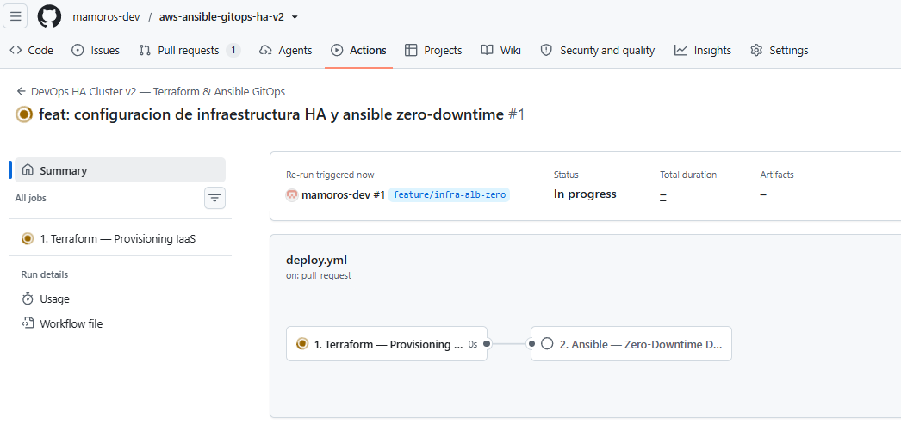  
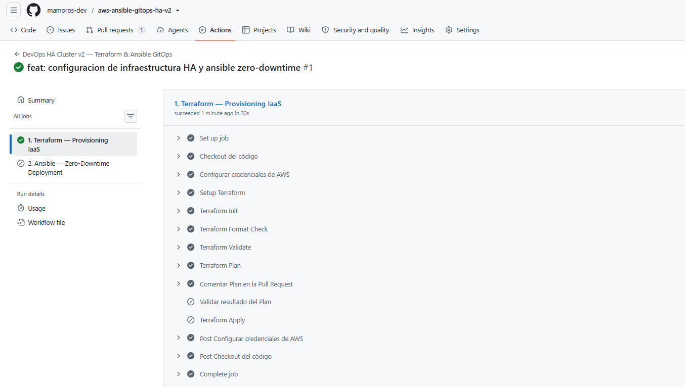  
> Validar resultado del Plan (Skipped): Este paso solo se ejecuta si el Terraform Plan falla (if: steps.plan.outcome == 'failure'). Como tu plan fue exitoso, no hizo falta activar este freno de mano.  
> Terraform Apply (Skipped): Este paso tiene la regla if: github.ref == 'refs/heads/main' && github.event_name == 'push'. Como sigues en la Pull Request #1 y todavía no se ha fusionado el código, el pipeline se detiene preventivamente para no crear nada en AWS hasta tu aprobación.  
> 2. Ansible — Zero-Downtime Deployment (Skipped): Depende de que Terraform Apply se ejecute primero en la rama main.  

+ Hacemos el merge y se lanza el workflow deploy con el apply: `miguel@DESKTOP-G47I0DM:aws-ansible-gitops-ha-v2$ gh pr merge --squash --delete-branch`  
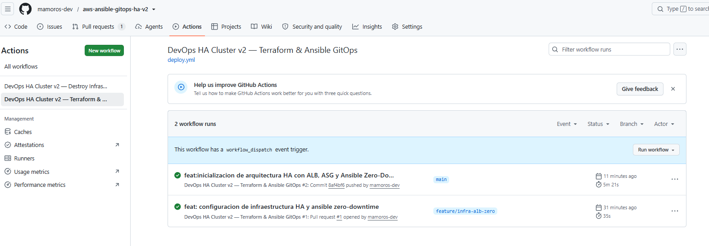  
> El evento workflow_dispatch le indica a GitHub Actions que ponga a tu disposición el botón manual "Run workflow" que ves a la derecha. Sirve para que puedas reejecutar el pipeline en cualquier momento sin necesidad de hacer un push. Si quitas esa línea del archivo YAML, el mensaje y el botón desaparecerán, pero perderás la opción de lanzarlo manualmente.

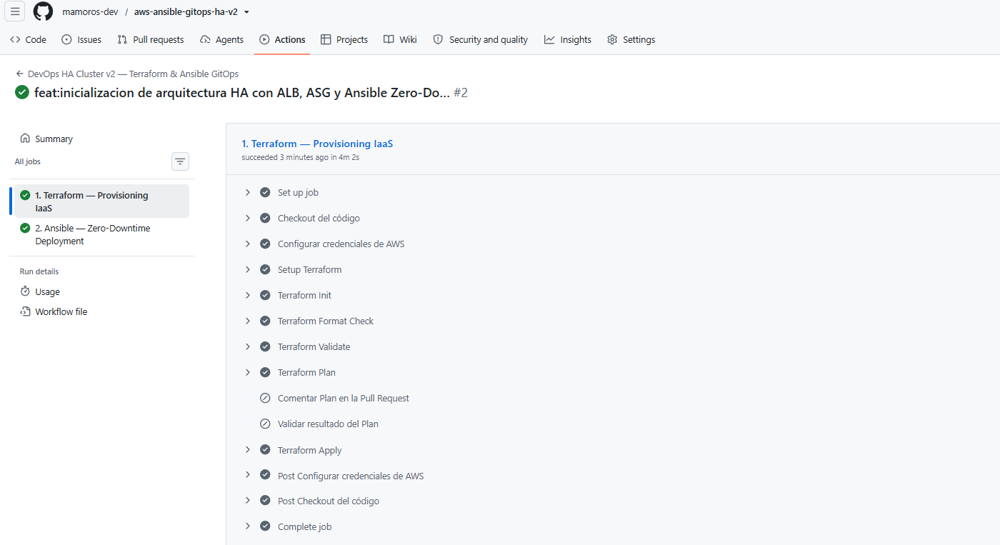  
> El check verde en 1. Terraform y 2. Ansible significa que la infraestructura se ha desplegado en AWS y las instancias han sido aprovisionadas en serie sin errores.  
> El comportamiento es 100% correcto debido a las condiciones de control que le pusimos al workflow:  
>  - Comentar Plan en la Pull Request (Skipped): Este paso solo se activa cuando el evento es una Pull Request (if: github.event_name == 'pull_request'). Como ahora estás ejecutando el pipeline directamente en main tras hacer el Merge, no hay ninguna Pull Request donde comentar, por lo que se omite automáticamente.  
>  - Validar resultado del Plan (Skipped): Solo se activa si el paso anterior de Terraform Plan falla (if: steps.plan.outcome == 'failure'). Como tu plan fue exitoso, no hace falta lanzar la excepción.  
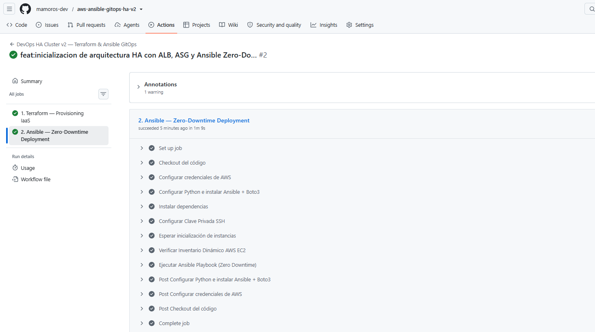  

+ PRUEBAS:
Vamos a realizar 3 pruebas clave para validar la Alta Disponibilidad, el Balanceo de Carga y la configuración realizada por Ansible:

  + **🧪 Prueba 1: Obtener la URL del Load Balancer y probar el balanceo**
    - Ve a la consola de AWS ➔ EC2 ➔ Load Balancers (o entra al log del paso 1. Terraform en GitHub Actions para buscar el output alb_dns_name).
    - Copia la DNS pública del ALB: `http://ha-cluster-alb-394794650.us-east-1.elb.amazonaws.com/`
    - Abre una pestaña en tu navegador, pega la URL y presiona Enter.
    - Prueba el balanceo: Refresca la página varias veces (F5 o Ctrl + R).
      - Verás la página web que desplegó Ansible.
      - Fíjate en los campos "Servidor" e "IP Privada": irán cambiando alternativamente entre las dos instancias EC2 que creó el Auto Scaling Group. Esto demuestra que el ALB está repartiendo el tráfico en tiempo real.
      
    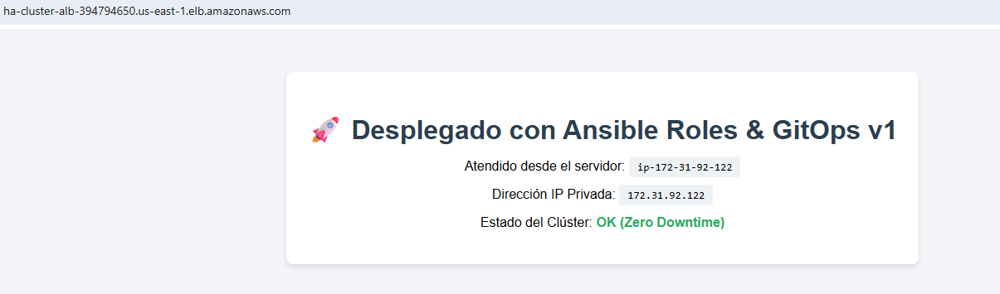  

  + **🧪 Prueba 2: Validar el estado del Target Group en AWS**
    - En la consola de AWS, ve a EC2 ➔ Target Groups y selecciona ha-cluster-tg.
    - Ve a la pestaña Targets.
    - Deberías ver 2 instancias EC2 registradas con el estado en verde: Healthy.
      

  + **🧪 Prueba 3: Test de Auto-recuperación (Resiliencia HA)**
    - Paso A: Modificar el texto y ver el despliegue Zero-Downtime
      - Abre ansible/roles/nginx_webserver/templates/index.html.j2.
      - Modifica el título o añade un texto (ej: v2.1 - Test de Alta Disponibilidad Exitoso).
      - Guarda, haz commit y push a main.
      - Espera a que termine el pipeline y refresca la web en el navegador: verás el nuevo texto cargando en ambos servidores.
      
      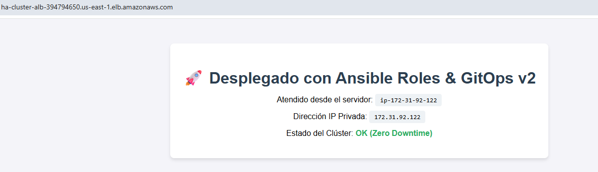  
        

    - Paso B: Probar la Auto-recuperación (Kill Test)
      - Ve a la consola de AWS ➔ EC2 ➔ Instances.
      - Selecciona una de las dos instancias y haz clic en Terminate instance (Terminar).
      - Entra a la URL del ALB en el navegador y refresca continuamente:
        - Comprobación: La página seguirá respondiendo siempre desde la IP de la máquina superviviente.
          
        > en este caso solo se mantiene la de esta IP
      - Ve a EC2 ➔ Auto Scaling Groups: verás que el ASG detecta la baja y lanza una nueva instancia reemplazo.
      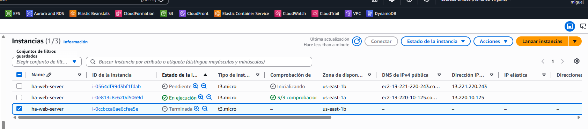  
        
      - Cuando la nueva instancia esté en estado running, ve a GitHub Actions y haz clic en Run workflow (o haz un pequeñísimo cambio en el código) para lanzar Ansible.
      - Al finalizar el job, refresca la web: ¡el tráfico volverá a balancearse entre dos IPs automáticamente!
      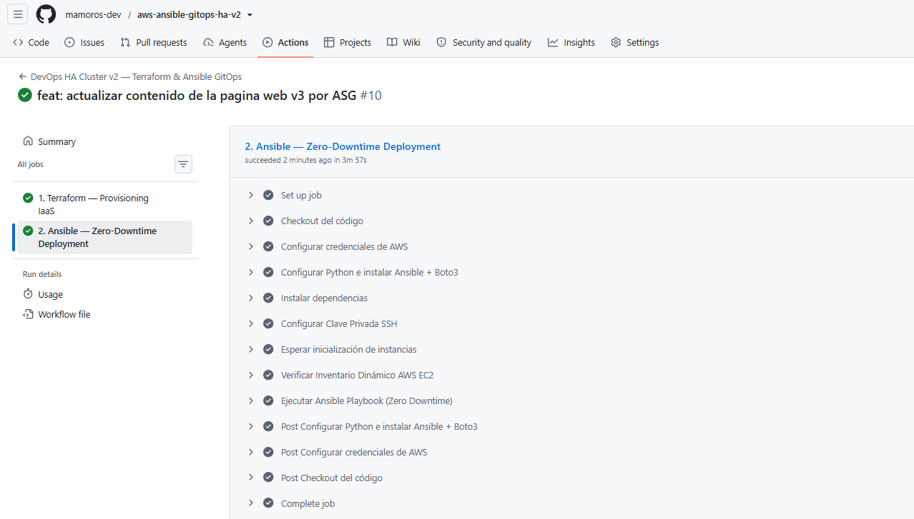  
      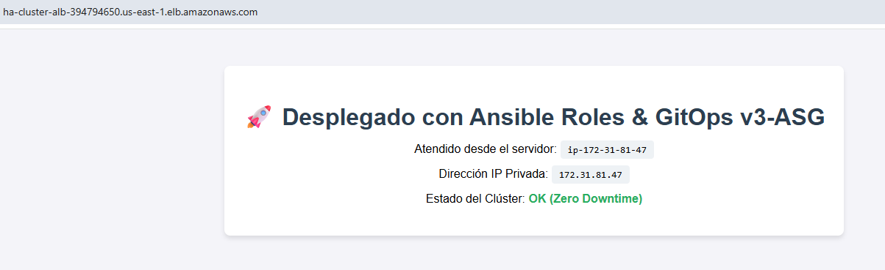  
        
      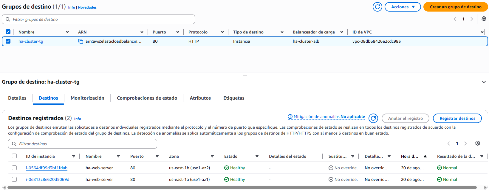  


+ El fichero workflow destroy:
```bash
name: "DevOps HA Cluster v2 — Destroy Infrastructure"

# Solo se activa de forma manual haciendo clic en la pestaña Actions de GitHub
on:
  workflow_dispatch:

jobs:
  destroy:
    name: "Terraform Destroy"
    runs-on: ubuntu-latest
    defaults:
      run:
        working-directory: ./iac

    steps:
      - name: Checkout del código
        uses: actions/checkout@v4

      - name: Configurar credenciales de AWS
        uses: aws-actions/configure-aws-credentials@v4
        with:
          aws-access-key-id: ${{ secrets.AWS_ACCESS_KEY_ID }}
          aws-secret-access-key: ${{ secrets.AWS_SECRET_ACCESS_KEY }}
          aws-region: us-east-1

      - name: Setup Terraform
        uses: hashicorp/setup-terraform@v3
        with:
          terraform_version: 1.5.7

      - name: Terraform Init
        run: terraform init

      - name: Terraform Destroy
        run: |
          terraform destroy -auto-approve \
            -var="ssh_public_key=${{ secrets.SSH_PUBLIC_KEY }}" \
            -var="vault_password=${{ secrets.ANSIBLE_VAULT_PASSWORD }}"
```

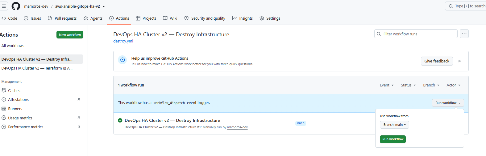  
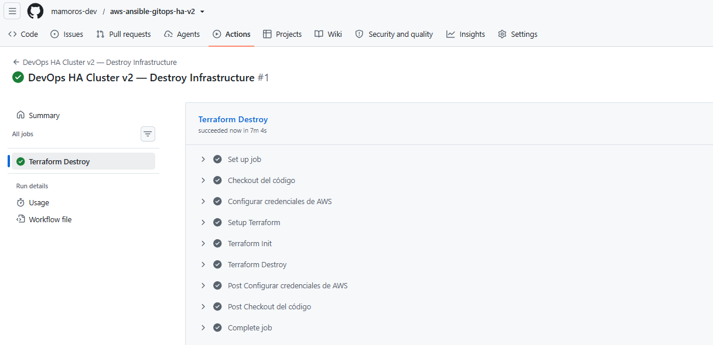  

+ 🗣️ MEJORAS: ¿Qué responder en una entrevista técnica?
Si te preguntan "¿Qué pasa si el ASG recrea una máquina vacía a las 3 AM?", esta es la respuesta estructurada perfecta:
  - Punto de partida (Tu proyecto actual):
    - "En nuestra arquitectura actual de GitOps, Ansible es el único Orquestador de Configuración. Si cae una máquina, el ASG levanta una nueva y nuestro pipeline de GitHub Actions la aprovisiona con Zero-Downtime."
  - La solución inmediata (Opción A - Gratis):
    - "Para un Failover 100% autónomo sin coste adicional, añadimos un script user_data en el Launch Template. Este script instala Nginx y despliega la plantilla con las variables del sistema en el primer arranque, permitiendo que la máquina pase a Healthy en el Target Group en menos de 45 segundos."
  - La solución de Producción / Enterprise (Packer AMIs):
    - "Para entornos de producción con alto tráfico, la buena práctica es utilizar Packer de HashiCorp para pre-crear una AMI 'Golden Image' con Nginx y el código compilado. Así, cuando el ASG escala o reemplaza nodos, la máquina nace lista para recibir tráfico en menos de 10 segundos y sin depender de repositorios externos de paquetes (apt)."