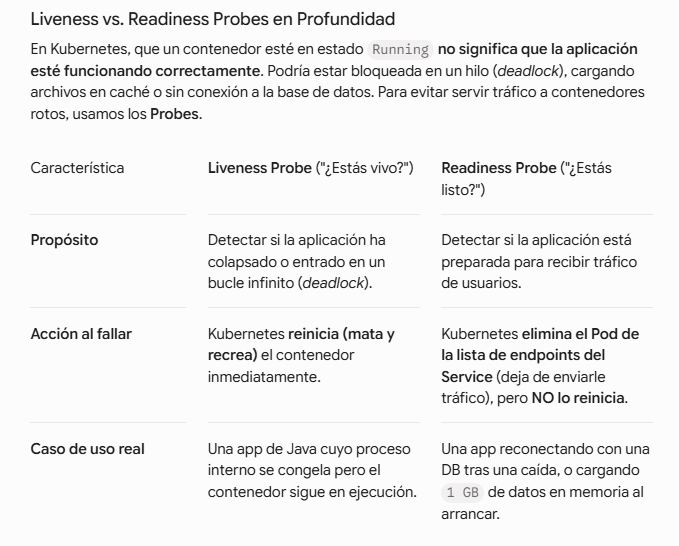
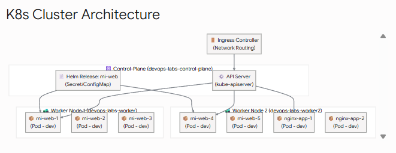
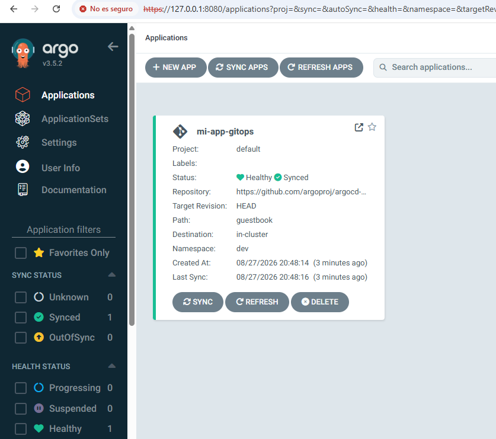
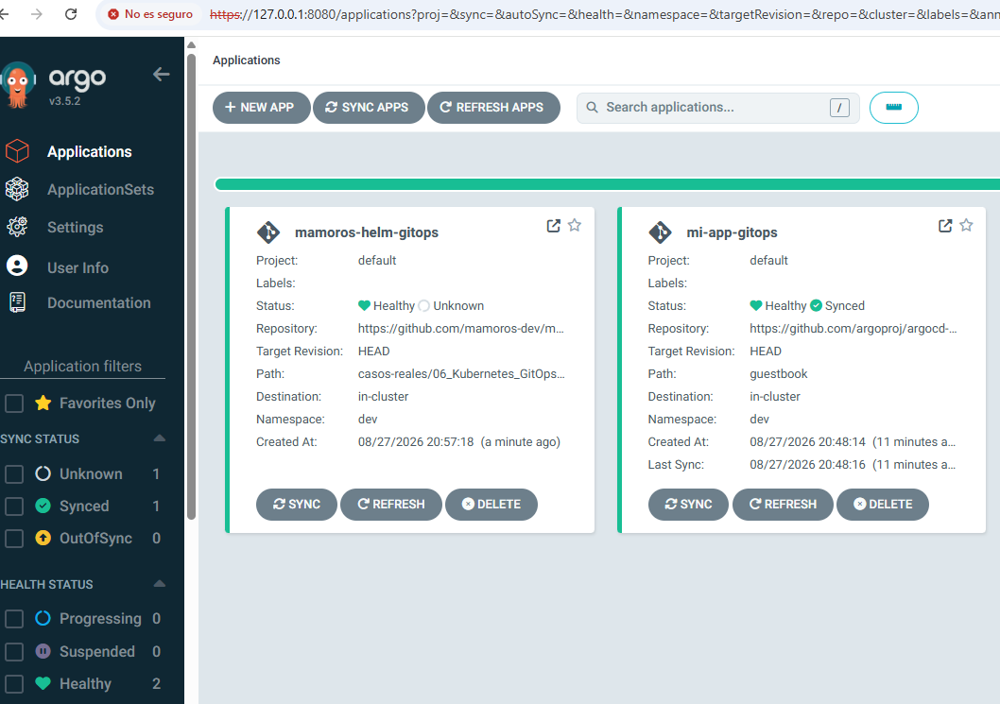
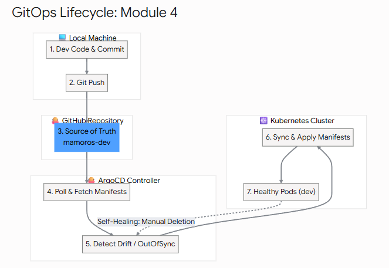
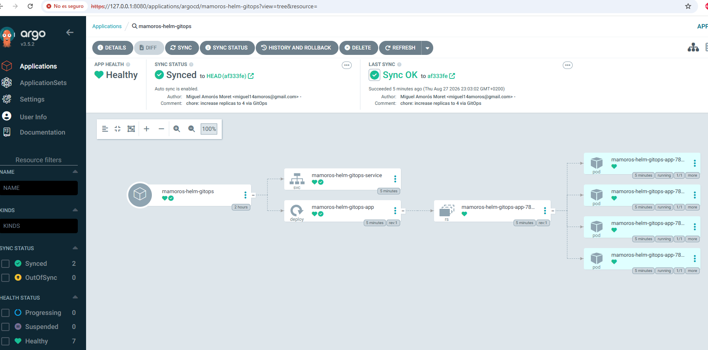
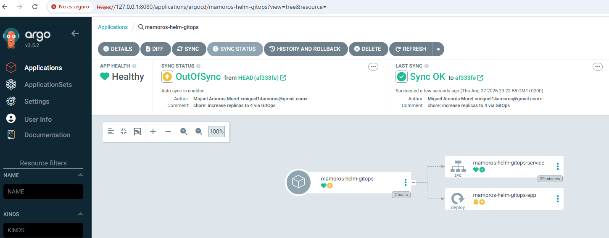
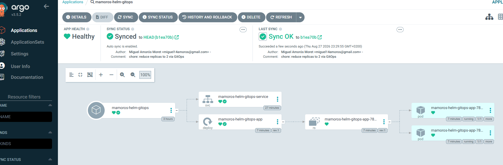
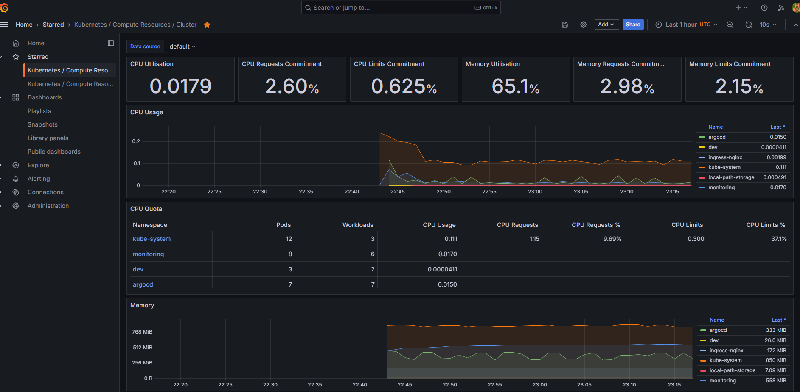
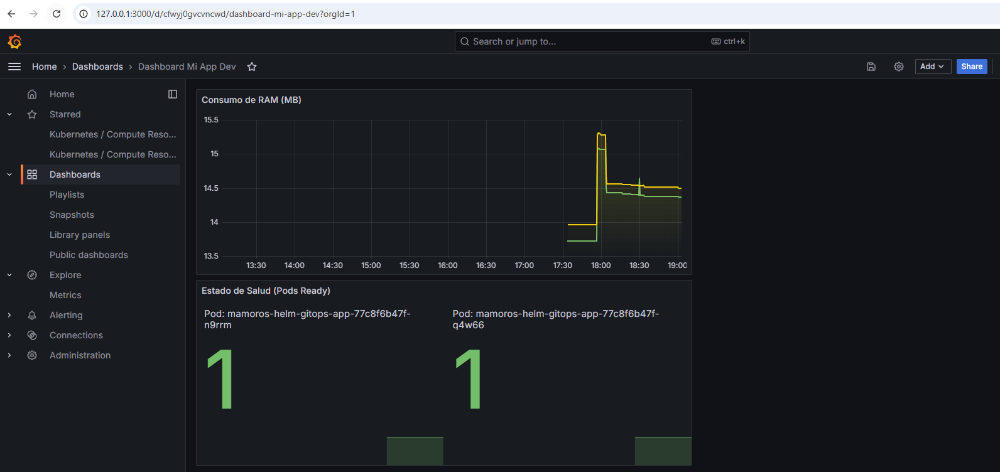

# KUBERNETES

+ DIAGRAMA BLOQUE:
```bash
Módulo 1: Fundamentos de K8s y Arquitectura Local (kind)

    Instalación de herramientas (kubectl, kind, helm).

    Creación del clúster local multinodo con mapeo de puertos Ingress.

    Objetos core: Pods, Deployments, ReplicaSets, Namespaces y Probes (Liveness/Readiness).

Módulo 2: Networking y Configuración

    Servicios (ClusterIP, NodePort, LoadBalancer).

    Ingress Controller (NGINX) y enrutamiento por host/path.

    Gestión de estado y secrets (ConfigMap, Secret).

Módulo 3: Empaquetado con Helm

    Estructura de un Helm Chart desde cero.

    Parametrización con values.yaml y plantillado Go.

    Repositorio de Charts y despliegue de dependencias.

Módulo 4: GitOps con ArgoCD

    Instalación y arquitectura de ArgoCD.

    Patrón Declarative Application (App-of-Apps).

    Sincronización automática, reconciliación y despliegue Zero-Downtime desde GitHub.

Módulo 5: Observabilidad (Kube-Prometheus-Stack)

    Despliegue de Prometheus, Alertmanager y Grafana mediante Helm.

    Dashboards de clúster y métricas de aplicaciones (ServiceMonitor).
```

# Módulo 1: Fundamentos de K8s y Arquitectura Local

## INSTALACIÓN
# 1. Crear la estructura de carpetas en tu repo de apuntes
cd ~/projects/devops/mamoros-dev.github.io/casos-reales
mkdir -p 06_Kubernetes_GitOps && cd 06_Kubernetes_GitOps

# 2. Instalar kubectl (v1.30)
curl -LO "https://dl.k8s.io/release/$(curl -L -s https://dl.k8s.io/release/stable.txt)/bin/linux/amd64/kubectl"
chmod +x kubectl
sudo mv kubectl /usr/local/bin/

# 3. Instalar kind
curl -Lo ./kind https://kind.sigs.k8s.io/dl/v0.23.0/kind-linux-amd64
chmod +x ./kind
sudo mv ./kind /usr/local/bin/

# 4. Verificar instalaciones
kubectl version --client
kind --version

## Crear el Clúster Multinodo con Ingress habilitado

+ Crea un archivo de configuración para kind que despliegue 1 nodo Control-Plane y 2 nodos Worker, mapeando los puertos 80 y 443 de tu WSL2 al clúster:

+ Fichero `kind-config.yaml`:
```bash
kind: Cluster
apiVersion: kind.x-k8s.io/v1alpha4
nodes:
- role: control-plane
  kubeadmConfigPatches:
  - |
    apiVersion: kubeadm.k8s.io/v1beta3
    kind: ClusterConfiguration
    metadata:
      name: config
    apiServer:
      extraArgs:
        cert-sans: "127.0.0.1"
  extraPortMappings:
  - containerPort: 80
    hostPort: 80
    protocol: TCP
  - containerPort: 443
    hostPort: 443
    protocol: TCP
- role: worker
- role: worker
```

+ Comandos de KIND:
```bash
# 1. Ver qué clústeres tienes creados actualmente
kind get clusters

# 2. Ver detalles del clúster actual
kubectl cluster-info --context kind-<nombre-de-tu-cluster>

# 3. Eliminar un clúster si se queda colgado o bloqueado
kind delete cluster --name devops-labs

# 4. Asegurar que apuntas al clúster que funciona
kubectl config use-context kind-proyecto5-local

# 5. Ver info de nodos en Kubernetes
kubectl get nodes -o wide

# 6. Ver los logs del contenedor Docker que hace de nodo (si falla al arrancar)
docker ps -a
docker logs <id_o_nombre_del_contenedor_control_plane>
```

+ Crear el clúster: `kind create cluster --name devops-labs --config kind-config.yaml`  
```YAML
kind: Cluster
apiVersion: kind.x-k8s.io/v1alpha4
nodes:
- role: control-plane
  kubeadmConfigPatches:
  - |
    apiVersion: kubeadm.k8s.io/v1beta3
    kind: InitConfiguration
    nodeRegistration:
      kubeletExtraArgs:
        node-labels: "ingress-ready=true"
  extraPortMappings:
  - containerPort: 80
    hostPort: 80
    protocol: TCP
  - containerPort: 443
    hostPort: 443
    protocol: TCP
- role: worker
- role: worker
```
> Qué hace: Le indica a kind que defina un clúster personalizado en lugar de la configuración por defecto de 1 solo nodo.  

> El concepto clave: kubeadm es la herramienta estándar que Kubernetes usa para inicializar un clúster. Aquí estamos inyectando una "etiqueta" (label) al nodo control-plane: ingress-ready=true.  

> Por qué es necesario: Más adelante, cuando despleguemos el NGINX Ingress Controller, este buscará específicamente un nodo con esta etiqueta para saber dónde engancharse y recibir el tráfico web.  

> Mapeo de puertos (igual que en Docker). Por qué es necesario: Si abres en el navegador de tu Windows http://localhost:80, la petición entra a tu máquina host, baja a WSL2, entra al contenedor Docker del control-plane por el puerto 80, y desde ahí Kubernetes la enruta hacia el Pod correspondiente. Sin estas líneas, tu clúster estaría 100% aislado y no podrías abrir en tu navegador local las webs, ArgoCD o Grafana.  

> ROLE: Define 2 nodos adicionales dedicados exclusivamente a ejecutar aplicaciones (Worker Nodes). Por qué es necesario: En Kubernetes de producción, el control-plane gestiona el estado del clúster (API Server, etcd, Scheduler) y NUNCA ejecuta aplicaciones de usuario. Los workers son los que asumen la carga de trabajo real. Al tener 2 workers, podemos practicar estrategias como Anti-Affinity (asegurar que 2 replicas de una app no caigan en la misma máquina) y Zero-Downtime deployments.  

+ Resultado:
```bash
miguel@DESKTOP-G47I0DM:06_Kubernetes_GitOps$ docker ps
CONTAINER ID   IMAGE                  COMMAND                  CREATED              STATUS              PORTS                                                                 NAMES
1e0ac9dae10e   kindest/node:v1.30.0   "/usr/local/bin/entr…"   About a minute ago   Up About a minute                                                                         devops-labs-worker2
f0a67bde88f6   kindest/node:v1.30.0   "/usr/local/bin/entr…"   About a minute ago   Up About a minute                                                                         devops-labs-worker
5f039920d81b   kindest/node:v1.30.0   "/usr/local/bin/entr…"   About a minute ago   Up About a minute   0.0.0.0:80->80/tcp, 0.0.0.0:443->443/tcp, 127.0.0.1:41105->6443/tcp   devops-labs-control-plane

miguel@DESKTOP-G47I0DM:06_Kubernetes_GitOps$ kind get clusters
devops-labs

miguel@DESKTOP-G47I0DM:06_Kubernetes_GitOps$ kubectl get nodes -o wide
NAME                        STATUS   ROLES           AGE    VERSION   INTERNAL-IP   EXTERNAL-IP   OS-IMAGE                         KERNEL-VERSION                      CONTAINER-RUNTIME
devops-labs-control-plane   Ready    control-plane   112s   v1.30.0   172.18.0.2    <none>        Debian GNU/Linux 12 (bookworm)   6.6.114.1-microsoft-standard-WSL2   containerd://1.7.15
devops-labs-worker          Ready    <none>          91s    v1.30.0   172.18.0.3    <none>        Debian GNU/Linux 12 (bookworm)   6.6.114.1-microsoft-standard-WSL2   containerd://1.7.15
devops-labs-worker2         Ready    <none>          89s    v1.30.0   172.18.0.4    <none>        Debian GNU/Linux 12 (bookworm)   6.6.114.1-microsoft-standard-WSL2   containerd://1.7.15
```
> En la nube (como en AWS EKS), un nodo de Kubernetes es una instancia EC2 (una VM). En tu portátil con WSL2, cada nodo de Kubernetes es un contenedor Docker independiente ejecutando systemd y containerd por dentro.  
> Si observas la salida de tu docker ps, tienes 3 contenedores corriendo:  
> devops-labs-control-plane: El cerebro del clúster.  
> devops-labs-worker: El primer ejecutor de cargas de trabajo.  
> devops-labs-worker2: El segundo ejecutor para alta disponibilidad.  

## Tu primer Deploy declarativo
+ Vamos a crear el primer archivo manifiesto para poner a prueba el clúster. Crea un archivo llamado `01-deployment.yaml`:
```Bash
apiVersion: v1
kind: Namespace
metadata:
  name: dev
---
apiVersion: apps/v1
kind: Deployment
metadata:
  name: nginx-app
  namespace: dev
  labels:
    app: nginx-app
spec:
  replicas: 2
  selector:
    matchLabels:
      app: nginx-app
  template:
    metadata:
      labels:
        app: nginx-app
    spec:
      containers:
      - name: nginx
        image: nginx:1.25-alpine
        ports:
        - containerPort: 80
        resources:
          limits:
            cpu: "250m"
            memory: "128Mi"
          requests:
            cpu: "100m"
            memory: "64Mi"
        livenessProbe:
          httpGet:
            path: /
            port: 80
          initialDelaySeconds: 5
          periodSeconds: 10
        readinessProbe:
          httpGet:
            path: /
            port: 80
          initialDelaySeconds: 2
          periodSeconds: 5
```
> Namespace (dev): Aísla lógicamente los recursos dentro del clúster. Evita colisiones de nombres y permite aplicar cuotas o políticas de seguridad independientes.  

> spec.replicas: 2: El controlador de Deployment asegura que siempre haya 2 instancias idénticas del contenedor corriendo a la vez distribuidas entre los nodos disponibles.  

> spec.selector.matchLabels: Es el "pegamento" de Kubernetes. El Deployment utiliza estas etiquetas para saber qué Pods le pertenecen y gestionar su ciclo de vida.  

> resources (requests y limits):  
    > Requests (100m CPU / 64Mi RAM): La cantidad mínima garantizada que el Kube-Scheduler necesita encontrar libre en un nodo worker para asignar el Pod ahí (100m = 0.1 de un núcleo de CPU).  
    > Limits (250m CPU / 128Mi RAM): El techo máximo. Si el Pod intenta usar más de 128Mi de RAM, el kernel de Linux lo detendrá inmediatamente con un error de memoria (OOMKilled - Out Of Memory).  

+ Liveness vs. Readiness Probes en Profundidad:
    - En Kubernetes, que un contenedor esté en estado Running no significa que la aplicación esté funcionando correctamente. Podría estar bloqueada en un hilo (deadlock), cargando archivos en caché o sin conexión a la base de datos. Para evitar servir tráfico a contenedores rotos, usamos los Probes.
      
> ¿Por qué son críticos para Producción?  
> Despliegues Zero-Downtime: Durante una actualización (Rolling Update), Kubernetes despliega un nuevo Pod. Con el readinessProbe, no le enviará peticiones de usuarios hasta que la prueba devuelva un estado HTTP 200 OK. Si arranca en 15 segundos, los usuarios no notarán caídas ni errores 502 Bad Gateway.  
> Auto-recuperación (Self-Healing): Si tu aplicación web sufre una fuga de memoria y deja de responder peticiones HTTP, el livenessProbe fallará. Kubernetes destruirá el contenedor degradado y levantará uno nuevo limpio de forma automatizada a las 3:00 AM sin intervención humana.  

+ Aplica el manifiesto a tu clúster:
```bash
miguel@DESKTOP-G47I0DM:06_Kubernetes_GitOps$ kubectl apply -f 01-deployment.yaml 
namespace/dev created
deployment.apps/nginx-app created

miguel@DESKTOP-G47I0DM:06_Kubernetes_GitOps$ kubectl get pods -n dev -o wide
NAME                         READY   STATUS    RESTARTS   AGE   IP           NODE                  NOMINATED NODE   READINESS GATES
nginx-app-6c7b7bf66f-mlx8x   1/1     Running   0          6s    10.244.2.2   devops-labs-worker2   <none>           <none>
nginx-app-6c7b7bf66f-wjwfn   1/1     Running   0          6s    10.244.1.2   devops-labs-worker    <none>           <none>
```

## Exponer la Aplicación con Service e Ingress
+ Un Pod es efímero; si muere o se reinicia, cambia de IP interna. Para dar una dirección IP fija y balancear el tráfico entre las 2 réplicas, usamos un Service. Para enrutar el tráfico HTTP/HTTPS desde tu máquina local (localhost) hasta ese Service, usamos un Ingress Controller.

+ Primero instalaremos el NGINX Ingress Controller oficial para kind, y luego crearemos los manifiestos de Service e Ingress.
`kubectl apply -f https://raw.githubusercontent.com/kubernetes/ingress-nginx/main/deploy/static/provider/kind/deploy.yaml`  
```bash
Cuando instalas un clúster de Kubernetes nativo (o con kind), viene totalmente "desnudo" en la capa HTTP. Sabe gestionar IPs internas (ClusterIP), pero no sabe enrutar tráfico web por nombre de dominio (app.local).

Para eso necesitamos instalar un Ingress Controller. Existen varios (Traefik, HAProxy, Envoy, NGINX), pero el más usado en la industria es NGINX Ingress Controller (un proyecto mantenido por el propio Kubernetes org).
    Origen de la URL: Ese archivo YAML oficial procede del repositorio oficial de Kubernetes (kubernetes/ingress-nginx).

    Por qué ese en concreto (/provider/kind/): El equipo de Kubernetes prepara configuraciones listas para cada entorno (AWS, GCP, Bare-Metal, Kind). Esa versión específica para kind ya viene parcheada con los parásitos de red (NodePort / HostPort) necesarios para interceptar los puertos 80 y 443 que mapeamos en Docker en nuestro kind-config.yaml.
```
+ Espera unos segundos a que los Pods del Ingress Controller queden en estado Running:
```bash
kubectl wait --namespace ingress-nginx \
  --for=condition=ready pod \
  --selector=app.kubernetes.io/component=controller \
  --timeout=90s
pod/ingress-nginx-controller-6c6fdf7d88-56wxh condition met

miguel@DESKTOP-G47I0DM:06_Kubernetes_GitOps$ kubectl get pods -n ingress-nginx
NAME                                        READY   STATUS    RESTARTS   AGE
ingress-nginx-controller-6c6fdf7d88-56wxh   1/1     Running   0          2m5s
```

+ Crea el archivo `02-service-ingress.yaml`:
```YAML
apiVersion: v1
kind: Service
metadata:
  name: nginx-service
  namespace: dev
spec:
  type: ClusterIP
  selector:
    app: nginx-app
  ports:
  - port: 80
    targetPort: 80
---
apiVersion: networking.k8s.io/v1
kind: Ingress
metadata:
  name: nginx-ingress
  namespace: dev
spec:
  ingressClassName: nginx
  rules:
  - host: app.local
    http:
      paths:
      - path: /
        pathType: Prefix
        backend:
          service:
            name: nginx-service
            port:
              number: 80
```

```bash
Service (kind: Service):
    type: ClusterIP: Crea una IP virtual interna ilocalizable fuera del clúster. Es el punto de entrada estable.
    selector: app: nginx-app: El servicio busca continuamente todos los Pods en el namespace dev que tengan esa etiqueta y distribuye el tráfico entre ellos en formato Round-Robin.
    port: 80 / targetPort: 80: Escucha en el puerto 80 del Service y reenvía las peticiones al puerto 80 dentro del contenedor del Pod.
Ingress (kind: Ingress):
    Funciona como un Proxy Inverso / Virtual Host HTTP de capa 7 (L7).
    host: app.local: Le dice al NGINX Ingress Controller: "Cualquier petición HTTP que llegue a este clúster con la cabecera Host: app.local debe ser redirigida al nginx-service en el puerto 80".
```


+ Aplicamos y resultado:
```bash
kubectl apply -f 02-service-ingress.yaml
service/nginx-service created
ingress.networking.k8s.io/nginx-ingress created

miguel@DESKTOP-G47I0DM:06_Kubernetes_GitOps$ kubectl get pods -n ingress-nginx
NAME                                        READY   STATUS    RESTARTS   AGE
ingress-nginx-controller-6c6fdf7d88-56wxh   1/1     Running   0          12m

miguel@DESKTOP-G47I0DM:06_Kubernetes_GitOps$ kubectl get svc -n dev
NAME            TYPE        CLUSTER-IP      EXTERNAL-IP   PORT(S)   AGE
nginx-service   ClusterIP   10.96.170.152   <none>        80/TCP    4m20s

miguel@DESKTOP-G47I0DM:06_Kubernetes_GitOps$ kubectl get pods -n dev
NAME                         READY   STATUS    RESTARTS   AGE
nginx-app-6c7b7bf66f-mlx8x   1/1     Running   0          24m
nginx-app-6c7b7bf66f-wjwfn   1/1     Running   0          24m
```

+ Si al comprobar la conexión sale error:
```bash
miguel@DESKTOP-G47I0DM:06_Kubernetes_GitOps$ curl -H "Host: app.local" http://localhost
curl: (56) Recv failure: Connection reset by peer
```
> significa que algun conflicto hay con el puerto 80

+ Vemos que está usado por el docker-proxy que se lanzó:
```bash
miguel@DESKTOP-G47I0DM:06_Kubernetes_GitOps$ sudo ss -tulpn | grep :80
[sudo: authenticate] Password:             
tcp   LISTEN 0      4096          0.0.0.0:80         0.0.0.0:*    users:(("docker-proxy",pid=19255,fd=8)) 
```

+ Lo solucionamos con `kubectl port-forward -n ingress-nginx service/ingress-nginx-controller 8080:80`  
```bash
miguel@DESKTOP-G47I0DM:projects$ curl -H "Host: app.local" http://localhost:8080
<!DOCTYPE html>
<html>
<head>
<title>Welcome to nginx!</title>
```
> Si este curl te devuelve el HTML de "Welcome to nginx!", confirmamos al 100% que tu Kubernetes, tu Ingress y tu Deployment están perfectamente configurados. El único problema es la colisión del puerto 80 en tu máquina host/WSL2.  
> El comando kubectl port-forward NO guardó ningún cambio permanente en la configuración del clúster ni en tu sistema.  
    > Qué es: Es un túnel SSH/TCP temporal abierto desde tu terminal de WSL2 directo al socket del Service en Kubernetes.  
    > Duración: Solo funciona mientras mantengas el comando ejecutándose en la terminal. Al hacer Ctrl + C, el túnel se cierra inmediatamente.  
    > Para qué sirve en el día a día DevOps: Es la herramienta de diagnóstico número uno. Si una base de datos o un servicio web interno no es accesible desde el exterior, usas port-forward para conectarte directamente a él desde tu máquina local sin necesidad de exponerlo públicamente ni modificar el Ingress.  

+ Forzamos la caida de un pod para ver que se reconstruye solo:
```bash
# 1. Obtener el nombre del primer pod en 'dev'
POD_NAME=$(kubectl get pods -n dev -l app=nginx-app -o jsonpath='{.items[0].metadata.name}')
echo "Atacando al pod: $POD_NAME"

# 2. Detener el proceso principal de Nginx dentro del contenedor
kubectl exec -n dev -it $POD_NAME -- nginx -s stop

# 3. Construccion del pod
miguel@DESKTOP-G47I0DM:06_Kubernetes_GitOps$ kubectl get pods -n dev -w
NAME                         READY   STATUS    RESTARTS   AGE
nginx-app-6c7b7bf66f-mlx8x   1/1     Running   0          32m
nginx-app-6c7b7bf66f-wjwfn   1/1     Running   0          32m
nginx-app-6c7b7bf66f-mlx8x   0/1     Completed   0          32m
nginx-app-6c7b7bf66f-mlx8x   0/1     Running     1 (2s ago)   32m
nginx-app-6c7b7bf66f-mlx8x   1/1     Running     1 (5s ago)   32m
```
> Fíjate exactamente en lo que pasó en la terminal: el Pod pasó de 0/1 Completed a 1/1 Running en cuestión de 5 segundos, y el contador de RESTARTS se incrementó a 1. Has presenciado en directo cómo funciona la auto-recuperación (Self-Healing) de Kubernetes.

+ Podemos pusar el cluster manualmente antes de apagar:
```bash
# Pausar/Detener los contenedores de los nodos de kind
docker stop devops-labs-control-plane devops-labs-worker devops-labs-worker2

# Reanudar los nodos del clúster
docker start devops-labs-control-plane devops-labs-worker devops-labs-worker2
```

# Módulo 2: Networking y Configuración. ConfigMaps y Secrets.

+ En este módulo aprenderemos a desacoplar la configuración y las credenciales del código de la aplicación. En producción NUNCA se compilan contraseñas ni variables de entorno dentro de la imagen de Docker.

1. Conceptos Fundamentales
  - ConfigMap: Almacena configuración no confidencial (archivos de propiedades, variables de entorno, configuraciones de NGINX/App) en pares clave-valor o archivos completos.
  - Secret: Almacena datos sensibles (contraseñas, API keys, certificados TLS). Kubernetes los guarda codificados en Base64 dentro del clúster (y cifrados en estado de reposo en etcd en entornos de producción).

## Creación de ConfigMap y Secret
+ Vamos a crear un archivo YAML denominado `03-config-secret.yaml` que contendrá:
  - Un ConfigMap con un archivo index.html personalizado y una variable de entorno APP_ENV.
  - Un Secret con credenciales codificadas en Base64.

```bash
apiVersion: v1
kind: ConfigMap
metadata:
  name: app-config
  namespace: dev
data:
  APP_ENV: "staging"
  index.html: |
    <!DOCTYPE html>
    <html>
    <head><title>Fase 5 K8s</title></head>
    <body>
      <h1>¡Hola Miguel! Desplegado via ConfigMap</h1>
      <p>Entorno: STAGING | Servidor Web NGINX</p>
    </body>
    </html>
---
apiVersion: v1
kind: Secret
metadata:
  name: app-secrets
  namespace: dev
type: Opaque
stringData:
  DB_PASSWORD: "SuperSecretPass2026!"
  API_KEY: "sk-proj-devops-labs-key"
```
> Piensa en una aplicación web como en un restaurante:
  > El código (Nginx): Es el cocinero y la cocina. Sabe hacer la comida.  
  > El ConfigMap (Ficha de recetas no secreta): Es donde apuntas el menú del día o la decoración de las mesas. Si cambia la temporada, cambias la hoja sin tener que volver a contratar al cocinero.  
  > El Secret (La caja fuerte): Es donde guardas la combinación de la caja registradora o la receta secreta. Nadie la ve a simple vista.  
> kind: ConfigMap: Creamos la "ficha pública".  
  > APP_ENV: "staging": Guardamos una etiqueta que dice "estamos en pruebas".
  > index.html: Guardamos la página web visual personalizada que queremos que muestre Nginx.  
> kind: Secret: Creamos la "caja fuerte".
  > stringData: Nos permite escribir la contraseña en texto plano (SuperSecretPass2026!). Kubernetes se encarga por detrás de codificarla para que no sea legible directamente en la base de datos interna.  


+ Ejecutamos con `kubectl apply -f 03-config-secret.yaml`  

## Inyección en el Deployment
+ Ahora actualizaremos nuestro Deployment (04-deployment-v2.yaml) para inyectar estos recursos de dos formas distintas:
  - Variables de entorno: Inyectando APP_ENV y DB_PASSWORD directamente dentro del contenedor.
  - Montaje de volumen (volumeMounts): Reemplazando el archivo por defecto de NGINX (/usr/share/nginx/html/index.html) por el index.html de nuestro ConfigMap.

```bash
apiVersion: apps/v1
kind: Deployment
metadata:
  name: nginx-app
  namespace: dev
  labels:
    app: nginx-app
spec:
  replicas: 2
  selector:
    matchLabels:
      app: nginx-app
  template:
    metadata:
      labels:
        app: nginx-app
    spec:
      containers:
      - name: nginx
        image: nginx:1.25-alpine
        ports:
        - containerPort: 80
        env:
        # Inyección de variable simple desde ConfigMap
        - name: ENVIRONMENT
          valueFrom:
            configMapKeyRef:
              name: app-config
              key: APP_ENV
        # Inyección de secreto desde Secret
        - name: DATABASE_PASSWORD
          valueFrom:
            secretKeyRef:
              name: app-secrets
              key: DB_PASSWORD
        resources:
          limits:
            cpu: "250m"
            memory: "128Mi"
          requests:
            cpu: "100m"
            memory: "64Mi"
        volumeMounts:
        # Montaje del archivo index.html dentro del contenedor
        - name: html-volume
          mountPath: /usr/share/nginx/html/index.html
          subPath: index.html
      volumes:
      - name: html-volume
        configMap:
          name: app-config
```
> env (Variables de entorno): Es como poner notas adhesivas en la pared de la cocina. El programa lee la nota DATABASE_PASSWORD directamente de la caja fuerte (app-secrets) sin necesidad de que la contraseña esté escrita en el código.  
> volumeMounts + volumes: Es como cambiar la vajilla por defecto del restaurante. Le decimos a Kubernetes: "Toma el archivo index.html del ConfigMap y colócalo exactamente encima del index.html original de Nginx en la ruta /usr/share/nginx/html/index.html".  

+ Ejecutamos con `kubectl apply -f 04-deployment-v2.yaml` 

+ Comprobación:
```bash
miguel@DESKTOP-G47I0DM:06_Kubernetes_GitOps$ kubectl get pods -n dev
NAME                         READY   STATUS    RESTARTS   AGE
nginx-app-57cf86f5b8-77fp9   1/1     Running   0          22s
nginx-app-57cf86f5b8-dkk9p   1/1     Running   0          23s

miguel@DESKTOP-G47I0DM:06_Kubernetes_GitOps$ POD_NAME=$(kubectl get pods -n dev -l app=nginx-app -o jsonpath='{.items[0].metadata.name}')
miguel@DESKTOP-G47I0DM:06_Kubernetes_GitOps$ kubectl exec -n dev $POD_NAME -- env | grep -E "ENVIRONMENT|DATABASE_PASSWORD"
ENVIRONMENT=staging
DATABASE_PASSWORD=SuperSecretPass2026!

miguel@DESKTOP-G47I0DM:06_Kubernetes_GitOps$ kubectl exec -n dev $POD_NAME -- cat /usr/share/nginx/html/index.html
<!DOCTYPE html>
<html>
<head><title>Fase 5 K8s</title></head>
<body>
  <h1>¡Hola Miguel! Desplegado via ConfigMap</h1>
  <p>Entorno: STAGING | Servidor Web NGINX</p>
</body>
</html>
```
> stringData vs data en Secrets: Usamos stringData para escribir las contraseñas en texto plano dentro del YAML; Kubernetes se encarga automáticamente de convertirlas a Base64 al crearlas.  
> Inyección con valueFrom: Mapea la clave de un ConfigMap o Secret a una variable interna del sistema operativo dentro del contenedor (ENVIRONMENT y DATABASE_PASSWORD).  
> volumeMounts con subPath: Permite montar un único archivo desde un ConfigMap en una ruta específica dentro del contenedor sin sobrescribir todo el directorio de destino.  

```bash
🌐 NAVEGADOR (Tú en tu PC)
      │
      │ 1. Pides la web en localhost:8080
      ▼
 🚪 PORT-FORWARD / INGRESS (La Puerta Principal)
      │
      │ 2. Entra el tráfico y busca a dónde ir
      ▼
 🔀 SERVICIO: nginx-service (El Rellano/Distribuidor)
      │
      ├───► 📦 POD 1 (Habitación 1) ──┐
      │                               │ 3. Reparte el tráfico entre las 2 habitaciones
      └───► 📦 POD 2 (Habitación 2) ──┘
               │
               │  Inyectan datos desde fuera al arrancar:
               ├── 📄 ConfigMap  ──► Pone el cuadro (index.html) y la etiqueta (ENV=staging)
               └── 🔐 Secret     ──► Mete la contraseña en el cajón (DB_PASSWORD)
```

# Módulo 3: Empaquetado con Helm (El "APT" / "NPM" de Kubernetes)

+ ¿Qué es Helm y "para tontos" por qué se usa?
  - Hasta ahora hemos creado archivos .yaml sueltos. Imagina que para desplegar tu app en Entorno de Desarrolladores (DEV) usas una contraseña, pero para Entorno de Producción (PROD) usas otra y necesitas 10 copias de la app en lugar de 2.
    - Sin Helm: Tendrías que duplicar todos tus archivos YAML a mano y cambiar los números y valores uno por uno (un caos propenso a errores).
    - Con Helm: Creas una plantilla dinámica (un Chart) y le dices: "Helm, despliega este Chart usando la configuración values-dev.yaml" o "usa values-prod.yaml".

## Crear la estructura de nuestro primer Helm Chart

+ Vamos a crear un Chart personalizado llamado `mi-app`.
```bash
# 1. Crear el esqueleto inicial con Helm
helm create mi-app

# 2. Limpiar los archivos de plantilla por defecto para crear los nuestros limpios desde cero
cd mi-app
rm -rf templates/*
```

+ La estructura limpia que usaremos es:
  - Chart.yaml: Es el DNI de tu paquete (nombre, versión, descripción).
  - values.yaml: Los ingredientes/variables que cambiaremos (número de réplicas, imagen de Docker, puerto).
  - templates/: La carpeta donde van los archivos YAML que usan los valores de values.yaml.

+ `chart.yaml`:
```bash
replicaCount: 3

image:
  repository: nginx
  tag: 1.25-alpine

service:
  type: ClusterIP
  port: 80

environmentName: "Producción-Helm"
```
> Este archivo es la "palanca de control". Si mañana quieres 5 réplicas o cambiar la versión de Nginx, solo cambias este archivo, no los archivos complejos de Kubernetes.

+ Crear la plantilla del Deployment en `templates/deployment.yaml`:
```bash
apiVersion: apps/v1
kind: Deployment
metadata:
  name: {{ .Release.Name }}-app
  namespace: dev
spec:
  replicas: {{ .Values.replicaCount }}
  selector:
    matchLabels:
      app: {{ .Release.Name }}
  template:
    metadata:
      labels:
        app: {{ .Release.Name }}
    spec:
      containers:
      - name: nginx
        image: "{{ .Values.image.repository }}:{{ .Values.image.tag }}"
        ports:
        - containerPort: {{ .Values.service.port }}
        env:
        - name: ENTORNO
          value: "{{ .Values.environmentName }}"
```
> Las llaves {{ .Values.replicaCount }} son "huecos a rellenar". Helm lee los datos de values.yaml y los pega automáticamente ahí antes de enviárselos a Kubernetes.

+ Crear la plantilla del Service en `templates/service.yaml`:
```bash
apiVersion: v1
kind: Service
metadata:
  name: {{ .Release.Name }}-service
  namespace: dev
spec:
  type: {{ .Values.service.type }}
  selector:
    app: {{ .Release.Name }}
  ports:
  - port: {{ .Values.service.port }}
    targetPort: {{ .Values.service.port }}
```

+ Desplegar la Aplicación con Helm:
```bash
# Volver a la carpeta raíz
cd ~/projects/devops/mamoros-dev.github.io/casos-reales/06_Kubernetes_GitOps

# Instalar el paquete llamándolo "mi-web"
helm install mi-web ./mi-app -n dev

# 1. Ver qué "paquetes" Helm están instalados
helm list -n dev

# 2. Ver los 3 Pods creados por Helm
kubectl get pods -n dev

# 3. Quieres cambiar las réplicas de 3 a 5 sin editar ningún YAML complejo? Ejecuta
helm upgrade mi-web ./mi-app --set replicaCount=5
```

+ Comprobamos:
```bash
miguel@DESKTOP-G47I0DM:06_Kubernetes_GitOps$ helm install mi-web ./mi-app
NAME: mi-web
LAST DEPLOYED: Thu Aug 27 20:14:31 2026
NAMESPACE: default
STATUS: deployed
REVISION: 1
TEST SUITE: None

miguel@DESKTOP-G47I0DM:06_Kubernetes_GitOps$ helm list -n dev
NAME    NAMESPACE       REVISION        UPDATED                                 STATUS          CHART           APP VERSION
mi-web  dev             2               2026-08-27 20:15:18.09306794 +0200 CEST deployed        mi-app-0.1.0    1.16.0  

miguel@DESKTOP-G47I0DM:06_Kubernetes_GitOps$ kubectl get pods -n dev
NAME                         READY   STATUS    RESTARTS   AGE
mi-web-app-5c84b46b5-2hzll   1/1     Running   0          19s
mi-web-app-5c84b46b5-k92fn   1/1     Running   0          19s
mi-web-app-5c84b46b5-lhw4m   1/1     Running   0          19s
nginx-app-57cf86f5b8-77fp9   1/1     Running   0          21m
nginx-app-57cf86f5b8-dkk9p   1/1     Running   0          21m

miguel@DESKTOP-G47I0DM:06_Kubernetes_GitOps$ helm upgrade mi-web ./mi-app --set replicaCount=5
Release "mi-web" has been upgraded. Happy Helming!
NAME: mi-web
LAST DEPLOYED: Thu Aug 27 20:15:18 2026
NAMESPACE: default
STATUS: deployed
REVISION: 2
TEST SUITE: None

miguel@DESKTOP-G47I0DM:06_Kubernetes_GitOps$ kubectl get pods -n dev
NAME                         READY   STATUS    RESTARTS   AGE
mi-web-app-5c84b46b5-2hzll   1/1     Running   0          49s
mi-web-app-5c84b46b5-7xrbt   1/1     Running   0          2s
mi-web-app-5c84b46b5-k92fn   1/1     Running   0          49s
mi-web-app-5c84b46b5-lhw4m   1/1     Running   0          49s
mi-web-app-5c84b46b5-nwsbf   1/1     Running   0          2s
nginx-app-57cf86f5b8-77fp9   1/1     Running   0          21m
nginx-app-57cf86f5b8-dkk9p   1/1     Running   0          21m
```

+ Explicaciones:
```bash
Antes editabas archivos .yaml con valores fijos (a "fuego"). Si tenías 3 entornos (Dev, Test, Prod), la única forma era:
  - Tener 3 archivos distintos (deployment-dev.yaml, deployment-prod.yaml).
  - Si cambiabas la versión de Nginx, tenías que abrir los 3 archivos y modificar la línea a mano.
  - Inconveniente: Duplicación de código masiva y riesgo de despistes.

Imagina que fabricas camisetas personalizadas:
  - templates/deployment.yaml es el molde/troquel de la camiseta. Tiene huecos como {{ .Values.replicaCount }}.
  - values.yaml es el pedido del cliente: replicaCount: 5, image: nginx:1.25-alpine.
  - Helm une el molde con el pedido, fabrica el YAML final y se lo entrega a Kubernetes.

¿Qué valores ha rellenado Helm en tu pantalla?
  - {{ .Release.Name }} $\rightarrow$ Reemplazado por mi-web (el nombre que le diste al instalar).
  - {{ .Values.replicaCount }} $\rightarrow$ Reemplazado primero por 3 (del values.yaml) y luego por 5 cuando ejecutaste --set replicaCount=5.
  - {{ .Values.image.repository }}:{{ .Values.image.tag }} $\rightarrow$ Reemplazado por nginx:1.25-alpine.
  - {{ .Values.environmentName }} $\rightarrow$ Reemplazado por Producción-Helm (inyectado como variable de entorno ENTORNO).
```
  

+ Como hacer un rollback para deshacer cambios:
```bash
# 1. Ver el historial de versiones desplegadas
helm history mi-web

# 2. Deshacer cambios y volver a la Revisión 1
helm rollback mi-web 1

# 3. Comprobar cómo Kubernetes destruye 2 pods para dejar exactamente 3
kubectl get pods -n dev

# 4. Resultados
miguel@DESKTOP-G47I0DM:06_Kubernetes_GitOps$ helm history mi-web
REVISION        UPDATED                         STATUS          CHART           APP VERSION     DESCRIPTION     
1               Thu Aug 27 20:14:31 2026        superseded      mi-app-0.1.0    1.16.0          Install complete
2               Thu Aug 27 20:15:18 2026        deployed        mi-app-0.1.0    1.16.0          Upgrade complete

miguel@DESKTOP-G47I0DM:06_Kubernetes_GitOps$ helm rollback mi-web 1
Rollback was a success! Happy Helming!

miguel@DESKTOP-G47I0DM:06_Kubernetes_GitOps$ kubectl get pods -n dev
NAME                         READY   STATUS    RESTARTS   AGE
mi-web-app-5c84b46b5-2hzll   1/1     Running   0          12m
mi-web-app-5c84b46b5-7xrbt   1/1     Running   0          12m
mi-web-app-5c84b46b5-nwsbf   1/1     Running   0          12m
nginx-app-57cf86f5b8-77fp9   1/1     Running   0          33m
nginx-app-57cf86f5b8-dkk9p   1/1     Running   0          33m
```

# Módulo 4: GitOps con ArgoCD

+ ¿Qué es GitOps y por qué elimina la necesidad de kubectl apply?
  - Hasta ahora, para aplicar cambios ejecutas kubectl apply o helm install desde tu terminal local.
  - El problema: Si alguien cambia algo en la terminal y se le olvida subirlo a GitHub, la configuración local y la de producción se desincronizan.
  
+ La solución GitOps (ArgoCD):
  1. GitHub es la ÚNICA fuente de verdad.
  2. ArgoCD es un operador que vive dentro del clúster de Kubernetes, vigilando constantemente tu repositorio de GitHub.
  3. Si subes un cambio a GitHub $\rightarrow$ ArgoCD lo detecta y lo aplica solo en el clúster.
  4. Si alguien borra un Pod o cambia un archivo a mano en el clúster $\rightarrow$ ArgoCD lo detecta como "desviación" (Out of Sync) y lo restaura automáticamente a lo que dice GitHub.

## Instalar ArgoCD en el Clúster
+ Crea el namespace para ArgoCD e instala sus componentes oficiales:
```bash
# 1. Crear namespace exclusivo para la herramienta de GitOps
kubectl create namespace argocd

# 2. Aplicar el manifiesto oficial de ArgoCD
kubectl apply -n argocd -f https://raw.githubusercontent.com/argoproj/argo-cd/stable/manifests/install.yaml

# 3. Comprobar que los Pods de ArgoCD se están levantando (espera a que estén en Running)
kubectl get pods -n argocd

# resultados
miguel@DESKTOP-G47I0DM:06_Kubernetes_GitOps$ kubectl get pods -n argocd
NAME                                                READY   STATUS    RESTARTS   AGE
argocd-application-controller-0                     1/1     Running   0          72s
argocd-applicationset-controller-6d86cc745b-7gxl5   1/1     Running   0          72s
argocd-dex-server-5747b4f5b7-zd5ml                  1/1     Running   0          72s
argocd-notifications-controller-d649c5896-l552h     1/1     Running   0          72s
argocd-redis-f4c9697d-xv69b                         1/1     Running   0          72s
argocd-repo-server-6cdddb5fd9-h5dfl                 1/1     Running   0          72s
argocd-server-6fdd8cb549-z7fjg                      1/1     Running   0          72s
```

## Acceder a la Interfaz Web de ArgoCD
+ ArgoCD incluye un panel de control web. Para abrirlo en tu navegador local de Windows:
```bash
# 1. Hacer port-forward del servicio de la API Web de ArgoCD al puerto 8080 local
kubectl port-forward svc/argocd-server -n argocd 8080:443
```

+ Obtener la Contraseña de Administrador. Para hacer login en la interfaz web de ArgoCD usaremos el usuario `admin`. Obtén la contraseña autogenerada ejecutando en una nueva pestaña de terminal:
```bash
kubectl -n argocd get secret argocd-initial-admin-secret -o jsonpath="{.data.password}" | base64 -d; echo
```

## Crear tu primera Aplicación GitOps (05-argocd-app.yaml)
+ Ahora le diremos a ArgoCD que monitorice tu repositorio o tu Helm Chart. Crea el manifiesto 05-argocd-app.yaml:
```Bash
apiVersion: argoproj.io/v1alpha1
kind: Application
metadata:
  name: mi-app-gitops
  namespace: argocd
spec:
  project: default
  source:
    # Repositorio base de ejemplos de ArgoCD para la prueba inicial
    repoURL: 'https://github.com/argoproj/argocd-example-apps.git'
    targetRevision: HEAD
    path: guestbook
  destination:
    server: 'https://kubernetes.default.svc'
    namespace: dev
  syncPolicy:
    automated:
      prune: true
      selfHeal: true
```
> prune: true: Si borras un archivo en GitHub, ArgoCD borra el recurso en Kubernetes.  
> selfHeal: true: Si alguien altera un recurso a mano por consola, ArgoCD se encarga de reescribirlo al instante para que coincida con GitHub.  

+ Aplicamos con `kubectl apply -f 05-argocd-app.yaml`

  

+ Pods de argoCD:
```bash
miguel@DESKTOP-G47I0DM:06_Kubernetes_GitOps$ kubectl get pods -n argocd 
NAME                                                READY   STATUS    RESTARTS      AGE
argocd-application-controller-0                     1/1     Running   0             13m
argocd-applicationset-controller-6d86cc745b-7gxl5   1/1     Running   5 (99s ago)   13m
argocd-dex-server-5747b4f5b7-zd5ml                  1/1     Running   0             13m
argocd-notifications-controller-d649c5896-l552h     1/1     Running   0             13m
argocd-redis-f4c9697d-xv69b                         1/1     Running   0             13m
argocd-repo-server-6cdddb5fd9-h5dfl                 1/1     Running   0             13m
argocd-server-6fdd8cb549-z7fjg                      1/1     Running   0             13m
```

+ Explicación:
```bash
Imagina ArgoCD como la torre de control de un aeropuerto:

🧠 argocd-application-controller (El Piloto Automático): Compara en bucle infinito lo que hay en GitHub contra lo que hay en el clúster. Si ve diferencias, las corrige.

📚 argocd-repo-server (El Bibliotecario): Se descarga tu código de GitHub, lee los YAML o Helm Charts y los prepara para el clúster.

🌐 argocd-server (La Recepción / Interfaz Web): La pantalla visual donde acabas de entrar en https://localhost:8080.

⚡ argocd-redis (La Memoria Rápida): Guarda en caché las respuestas para que la web cargue instantáneamente.

🔐 argocd-dex-server (El Guardia de Seguridad): Gestiona los accesos e inicios de sesión de los usuarios.

📢 argocd-notifications-controller (El Mensajero): Envía alertas (a Slack, Email, etc.) cuando un despliegue falla o se completa.
```

## Conectar ArgoCD a TU propio repositorio en GitHub (mamoros-dev)

+ Apuntar ArgoCD a tu repositorio (06-argocd-mamoros.yaml). Crea este manifiesto que le dice a ArgoCD: "Mira la carpeta casos-reales/06_Kubernetes_GitOps/mi-app de mi GitHub y aplícala en el namespace dev":

`casos-reales/06_Kubernetes_GitOps/06-argocd-mamoros.yaml`
```bash
apiVersion: argoproj.io/v1alpha1
kind: Application                     # 1. Le decimos a K8s: "Crea una regla de ArgoCD"
metadata:
  name: mamoros-helm-gitops           # 2. El nombre que ves en verde en la pantalla de ArgoCD
  namespace: argocd                   # 3. Dónde vive el motor de ArgoCD
spec:
  project: default
  source:
    repoURL: 'https://github.com/mamoros-dev/mamoros-dev.github.io.git' # 4. El GitHub que va a vigilar
    targetRevision: HEAD              # 5. Que mire la última versión (la rama principal)
    path: casos-reales/06_Kubernetes_GitOps/mi-app                      # 6. DÓNDE está la carpeta de tu Helm Chart
    helm:
      valueFiles:
        - values.yaml                 # 7. El archivo de configuración que debe leer
  destination:
    server: 'https://kubernetes.default.svc' # 8. El propio clúster donde está instalado
    namespace: dev                           # 9. Dónde debe desplegar los Pods (en 'dev')
  syncPolicy:
    automated:                        # 10. ¡CLAVE! Sincronización automática
      prune: true                     # Si borras algo en GitHub, se borra en el clúster
      selfHeal: true                  # Si alguien toca el clúster a mano, ArgoCD lo corrige devolviéndolo a lo que dice GitHub
```
+ Aplica la nueva aplicación a ArgoCD: `kubectl apply -f casos-reales/06_Kubernetes_GitOps/06-argocd-mamoros.yaml`  

  
  

## Vamos a probar el flujo GitOps real
+ Ahora que sabes por qué lo hacemos, haz la prueba real de un ingeniero DevOps:
  - Abre tu VS Code / editor en tu ordenador y abre el archivo casos-reales/06_Kubernetes_GitOps/mi-app/values.yaml.
  - Cambia la línea replicaCount: 3 por replicaCount: 4.
  - Guarda el archivo y ejecuta en tu terminal:
  ```Bash
  git add .
  git commit -m "chore: increase replicas to 4 via GitOps"
  git push origin main
  ```
  > Abre la web de ArgoCD (https://localhost:8080) y observa la pantalla durante 10-15 segundos. Verás cómo la aplicación se pone en estado de sincronización y aparece mágicamente un 4º Pod.

+ Resultados:

  
```bash
miguel@DESKTOP-G47I0DM:06_Kubernetes_GitOps$ kubectl get pods -n dev
NAME                                       READY   STATUS    RESTARTS   AGE
guestbook-ui-7689b675bc-j8tlh              1/1     Running   0          134m
mamoros-helm-gitops-app-786b558f48-9bjlf   1/1     Running   0          13s
mamoros-helm-gitops-app-786b558f48-gbkk2   1/1     Running   0          13s
mamoros-helm-gitops-app-786b558f48-mq7jb   1/1     Running   0          13s
mamoros-helm-gitops-app-786b558f48-v9r8k   1/1     Running   0          13s
```
> Lo que ha ocurrido entre bambalinas:
>  - Cambiaste a público el repo y subiste el git push con 4 réplicas a GitHub.  
>  - ArgoCD se conectó solo, leyó tu values.yaml en GitHub y dijo: "El desarrollador quiere 4 réplicas de la app mamoros-helm-gitops".  
>  - Creó exactamente los 4 Pods nuevos sin que tuvieses que tocar kubectl para nada.  

### Experimento 1: "Self-Healing" (Autorrecuperación en directo)
+ ¿Para qué sirve esto en el trabajo?
  - Imagina que un técnico comete un error humano en plena madrugada y borra a mano un servicio crítico en producción mediante consola, o que un fallo interno en un nodo destruye recursos. En una infraestructura tradicional, el servicio caería hasta que alguien entrase a restaurarlo. Con Self-Healing, ArgoCD detecta la discrepancia entre GitHub y el clúster en milisegundos y restituye el servicio sin intervención humana.

+ Paso a paso del experimento:
  - Mantén abierta la pantalla de ArgoCD en el navegador a un lado de tu monitor.
  - Abre tu terminal WSL2 e introduce el comando para borrar intencionadamente el Deployment completo desde fuera: `kubectl delete deployment mamoros-helm-gitops-app -n dev`  
  - ¿Qué está pasando por dentro? kubectl delete deployment: Ordena a la API de Kubernetes que elimine el gestor de los pods y destruya las 4 réplicas.
  - Detección por ArgoCD: En cuanto el recurso desaparece, la regla selfHeal: true del manifiesto entra en acción. ArgoCD compara el estado real (0 deployments) con el estado deseado en GitHub (1 deployment con 4 réplicas), marca el estado como OutOfSync por una fracción de segundo y reasegura los manifiestos originarios.
  - Qué debes observar: En el panel web de ArgoCD verás parpadear los iconos de los pods en amarillo/rojo un instante y, de inmediato, el árbol se reconstruirá en verde automáticamente. 
    
    


### Experimento 2: Escalado declarativo y eliminación de recursos (Prune)

+ ¿Para qué sirve esto en el trabajo?
  - En entornos profesionales, nunca se modifica la infraestructura ejecutando órdenes directas en el clúster. Si la empresa necesita reducir recursos durante la noche para ahorrar costes en AWS/Azure, o si necesita retirar componentes obsoletos, el cambio se realiza en el repositorio de código. Al activar prune: true, ArgoCD elimina cualquier recurso del clúster que haya sido borrado o reducido en GitHub.

+ Paso a paso del experimento:
  - Abre el archivo casos-reales/06_Kubernetes_GitOps/mi-app/values.yaml en tu editor de código.
  - Modifica el número de réplicas reduciéndolo de 4 a 2: `replicaCount: 2`
  - Guarda el archivo y envía los cambios a GitHub desde la terminal: `git add . ; git commit -m "chore: reduce replicas to 2 via GitOps ; git push"`
  - Sincronización declarativa: ArgoCD lee el nuevo commit, detecta que sobran 2 pods respecto a la directiva de GitHub y destruye de forma controlada los 2 pods sobrantes (prune).
  - Qué debes observar: En el diagrama de árbol de ArgoCD verás que dos de las cuatro cajas de los Pods pasarán a estado Terminating y desaparecerán, dejando el mapa visual exactamente con 2 Pods activos y la etiqueta verde Synced.
    


+ Para inspeccionar el contenido o ejecutar comandos dentro de un Pod en ejecución, usas kubectl exec:
```Bash
# 1. Ver los archivos dentro de la carpeta del servidor web en un Pod
kubectl exec -it <NOMBRE_DEL_POD> -n dev -- ls -la /usr/share/nginx/html

# 2. Abrir una terminal interactiva (shell) dentro del Pod
kubectl exec -it <NOMBRE_DEL_POD> -n dev -- /bin/sh
```

+ Borramos:
```bash
# Borrar los pods sobrantes del Módulo 2 y 3 instalados a mano
kubectl delete deployment nginx-app mi-web-app guestbook-ui -n dev --ignore-not-found
```

## EXPLICACIÓN COMPONENTES

+ Imagínate que vas a montar un gran hotel internacional.
```bash 
🏢 EL HOTEL (El Clúster de Kubernetes)
 ├── 🏗️ Nodos (Los Edificios / Plantas)
 ├── 🚪 Ingress (La Recepción y Conserjería)
 ├── 🛋️ Servidor / Service (El Botón del Ascensor)
 ├── 📦 Pod (La Habitación donde vive el cliente)
 ├── 📦 Contenedor (El Cliente que está dentro)
 ├── 📦 Helm & Chart (El Plan de Construcción del Hotel)
 └── 🐙 ArgoCD / GitOps (El Auditor de Calidad 24/7)
``` 
### ☸️ Clúster
+ ¿Qué es?: Es el conjunto completo de máquinas unidas trabajando como si fueran un solo súper-ordenador.
+ Uso en la industria: En lugar de gestionar 50 servidores individuales, gestionas un solo clúster. Tu aplicación escala sola sin importar en qué máquina física esté cayendo.

### 🚜 Nodo (Worker & Control-Plane)
+ ¿Qué es?: Cada una de las máquinas (virtuales o físicas) que forman el clúster.
  - Control-Plane (El Director): No aloja webs; solo toma decisiones (dónde poner cada app, qué hacer si algo se rompe).
  - Worker (Los Empleados): Las máquinas donde realmente se ejecutan las aplicaciones.
+ Uso en la industria: En AWS o Azure (EKS/AKS), si tu web recibe mucho tráfico, Kubernetes añade Nodos automáticamente a la infraestructura para tener más memoria y CPU.

### 📦 Pod
+ ¿Qué es?: La unidad mínima en Kubernetes. Dentro de un Pod vive uno (o varios) contenedores de Docker.
+ ¿Por qué Pods y no Docker directamente?: Porque Kubernetes no habla directamente con Docker; habla con Pods. Un Pod le da a tu contenedor de Nginx una IP interna, almacenamiento y reglas de red.
+ Uso en la industria: Si se cae tu contenedor dentro del Pod, Kubernetes destruye el Pod y crea uno nuevo en milisegundos sin que el usuario final lo note (Self-Healing).

### 🚪 Ingress
+ ¿Qué es?: El "conserje de la puerta principal". Es un proxy inverso (usualmente NGINX o Traefik) que recibe las peticiones de Internet ([https://miempresa.com](https://miempresa.com)) y decide a qué app interna enviarlas.
+ Uso en la industria: Te ahorra tener que pagar una IP pública o un balanceador de carga para cada aplicación. Con un solo Ingress puedes dirigir el tráfico a 100 aplicaciones distintas según la URL (/api, /shop, /blog).2. El Salto de Nivel: Helm vs. GitOps (ArgoCD)Aquí es donde estaba la confusión de tu pregunta sobre el helm upgrade:

### 📄 Helm (El Empaquetador)
+ ¿Qué es?: El instalador. Un Chart es simplemente la carpeta con las plantillas YAML y el archivo values.yaml (los parámetros).
+ Uso en la industria: Si quieres instalar un programa complejo en Kubernetes (como Prometheus para monitorizar, o WordPress), no creas 20 archivos YAML a mano. Te descargas su Helm Chart y con helm install se despliega todo de golpe.

### 🐙 ArgoCD y GitOps (El Vigilante Automatizado)
+ ¿Qué es?: Es una herramienta que se instala dentro del clúster y mira continuamente tu repositorio de GitHub.

### GITOPS
+ Si trabajas en un equipo de 10 ingenieros y tú cambias las réplicas a 5 en tu terminal:
  - Tus 9 compañeros no se enteran del cambio.
  - Nadie sabe quién hizo el cambio, cuándo ni por qué.
  - Si la máquina o el servidor se rompe y hay que volver a crearlo, ese cambio hecho en local se pierde para siempre.
  
+ La Filosofía GitOps (Lo que pide el mercado laboral):
  - La regla de oro de GitOps es: "Nadie toca el clúster desde la terminal".
  - Tu archivo values.yaml en GitHub es la ÚNICA verdad.
  - Si quieres cambiar las réplicas de 3 a 5, modificas values.yaml en tu PC, haces git commit y git push a GitHub.
  - ArgoCD ve ese git push, dice "Vaya, en GitHub pone 5 réplicas y en el clúster solo hay 3" $\rightarrow$ Y él solo ejecuta el cambio en Kubernetes.

+ Beneficios para tu CV:
- Auditoría: Todo cambio tiene un culpable y una fecha en el historial de Git.- Rollback fácil: Si un despliegue rompe producción, solo haces git revert en GitHub y ArgoCD vuelve a la versión anterior en segundos.

## Módulo 5: Observabilidad y Monitorización.

+ ¿Cómo sabemos si el clúster o las aplicaciones están funcionando bien, se están quedando sin memoria o están dando errores a los usuarios?

+ El Trío de la Observabilidad: ¿Qué hace cada pieza?
  - 📊 Prometheus (El Recolector y Motor de Métricas): Es una base de datos de series temporales. Cada x segundos entra a tus nodos y pods, extrae datos numéricos (uso de CPU, consumo de memoria RAM, peticiones HTTP por segundo) y los almacena.

  - 📈 Grafana (El Panel Visual): Se conecta a Prometheus y transforma esos millones de números en gráficos bonitos, mapas de calor y paneles que puedes poner en las pantallas de la oficina o en tu navegador.

  - 🚨 Alertmanager (El Sistema de Alarmas): Si Prometheus detecta que un nodo está al 95% de uso de CPU durante más de 5 minutos, Alertmanager captura ese evento y envía una notificación automática a Slack, Microsoft Teams o PagerDuty al equipo de guardia.

### ¿Cómo se instala en la industria? (Kube-Prometheus-Stack)
+ Instalar estas tres herramientas una a una con manifiestos YAML requeriría crear más de 50 archivos complejos. En la industria se utiliza un estándar empaquetado como Helm Chart llamado kube-prometheus-stack, que instala de un solo golpe Prometheus, Grafana, Alertmanager y los agentes recolectores de métricas del clúster (node-exporter y kube-state-metrics).

+ Como ya eres un experto en GitOps, no lo vamos a instalar con comandos manuales, sino declarativamente a través de ArgoCD para seguir con la filosofía profesional.

+ Crear la App de Observabilidad en ArgoCD (`07-argocd-prometheus.yaml`). Crea este archivo en la carpeta de tu proyecto. Le dirá a ArgoCD que se descargue el Helm Chart oficial de Prometheus directamente desde su repositorio público y lo instale en un namespace dedicado llamado monitoring:
```bash
apiVersion: argoproj.io/v1alpha1
kind: Application
metadata:
  name: prometheus-stack
  namespace: argocd
spec:
  project: default
  source:
    repoURL: 'https://prometheus-community.github.io/helm-charts'
    chart: kube-prometheus-stack
    targetRevision: 61.3.0
    helm:
      values: |
        prometheusOperator:
          admissionWebhooks:
            enabled: false
        prometheus:
          enabled: true
          prometheusSpec:
            serviceMonitorSelectorNilUsesHelmValues: false
            podMetadata:
              annotations: {}
        # Desactivar integraciones que fallan en kind local
        kubeControllerManager:
          enabled: false
        kubeScheduler:
          enabled: false
        kubeEtcd:
          enabled: false
        kubeProxy:
          enabled: false
        grafana:
          adminPassword: "admin"
  destination:
    server: 'https://kubernetes.default.svc'
    namespace: monitoring
  syncPolicy:
    automated:
      prune: true
      selfHeal: true
    syncOptions:
      - CreateNamespace=true
      - ServerSideApply=true
```
> la línea clave es chart: kube-prometheus-stack. Esto le dice a ArgoCD: "Ve al repositorio oficial de Helm en internet, descarga el paquete kube-prometheus-stack versión 61.3.0 y lee los YAMLs que vienen dentro" (que ya incluyen decenas de Deployments, Services y Pods definidos por la comunidad). El número de réplicas, las imágenes Docker y los puertos vienen preconfigurados dentro de las plantillas por defecto de ese Helm Chart.  

> Abre la interfaz web de ArgoCD (https://localhost:8080). Verás aparecer una nueva tarjeta llamada prometheus-stack.

> Espera unos 1-2 minutos mientras ArgoCD descarga e instala los Pods de monitorización en el namespace monitoring.


```bash
miguel@DESKTOP-G47I0DM:06_Kubernetes_GitOps$ kubectl get pods -n monitoring
NAME                                                     READY   STATUS    RESTARTS   AGE
alertmanager-prometheus-stack-kube-prom-alertmanager-0   2/2     Running   0          107s
prometheus-prometheus-stack-kube-prom-prometheus-0       2/2     Running   0          107s
prometheus-stack-grafana-5f6cb659d9-x5xbv                3/3     Running   0          57m
prometheus-stack-kube-prom-operator-7d4bb94d45-cfsf2     1/1     Running   0          112s
prometheus-stack-kube-state-metrics-6d67755464-pbr4s     1/1     Running   0          57m
prometheus-stack-prometheus-node-exporter-5prtg          1/1     Running   0          57m
prometheus-stack-prometheus-node-exporter-cjff8          1/1     Running   0          57m
prometheus-stack-prometheus-node-exporter-m9lhh          1/1     Running   0          57m
```

### GRAFANA

+ Para acceder al panel visual de Grafana desde tu navegador de Windows, redirige su puerto ejecutando en tu terminal:
`kubectl port-forward svc/prometheus-stack-grafana -n monitoring 3000:80`  
> Entra en tu navegador web a: http://localhost:3000 - admin/admin  
> Dirígete a Dashboards en el menú lateral de Grafana y selecciona el panel prediseñado Kubernetes / Compute Resources / Cluster. Podrás observar el consumo global de CPU y memoria RAM de tus nodos kind en tiempo real.

  

+ Vamos a personalizar un dashboard personalizado. Las Queries (PromQL) más habituales en la industria en `EXPLORE - QUERYS [DATA:PROMETEHEUS]`. En producción, los equipos de DevOps utilizan un conjunto de consultas estándar agrupadas bajo la metodología USE (Usage, Saturation, Errors):
  - Salud del contenedor (Ready): `kube_pod_container_status_ready{namespace="dev", container="mi-app"}`  
  > Para qué sirve: Saber si la app está lista para recibir tráfico (1 = Si, 0 = No).  
  - Consumo de Memoria RAM (en Megabytes): `container_memory_working_set_bytes{namespace="dev", container="mi-app"} / 1024 / 1024`  
  > Para qué sirve: Medir el uso real de RAM para detectar fugas de memoria.  
  - Uso de CPU (en cores/mili-cores): `rate(container_cpu_usage_seconds_total{namespace="dev", container="mi-app"}[2m])` 
  > Para qué sirve: Ver la carga de procesamiento que consume cada réplica.  
  - Número de reinicios del contenedor (Restarts): `kube_pod_container_status_restarts_total{namespace="dev", container="mi-app"}` 
  > Para qué sirve: Detectar si un pod entra en bucle de caídas (CrashLoopBackOff).

```bash
2. Creación del Dashboard Personalizado en Grafana

- En Grafana (http://localhost:3000), ve al menú Dashboards -- clic en New -- New Dashboard.
- Clic en + Add visualization y selecciona la fuente Prometheus.
- Panel 1 (Estado de Salud):
  - PromQL: `kube_pod_container_status_ready{namespace="dev", container="mi-app"}`
  - En el panel derecho: Cambia Time series por Stat.
  - Title: Estado de Salud (Pods Ready)
- Haz clic en Apply (arriba a la derecha).

- Clic en Add (arriba a la derecha) -- Visualization para añadir un segundo gráfico.
- Panel 2 (Consumo de RAM):
  - PromQL: `container_memory_working_set_bytes{namespace="dev", container="mi-app"} / 1024 / 1024`
  - En el panel derecho: Déjalo en Time series.
  - Title: Consumo de RAM (MB)
  
- Haz clic en el icono del disco duro (arriba a la derecha) para Guardar el dashboard como Dashboard Mi App Dev.
```

+ Opciones Principales del Panel Lateral Derecho. Estas opciones sirven para dar formato visual y contextuar la métrica:
  - Graph Styles (Estilos del gráfico): Cambia el aspecto del Time Series (líneas finas, áreas rellenadas con transparencia, puntos o barras estilo histograma).
  - Standard Options (Opciones estándar):
    - Unit (Unidad): ¡Crucial! Le dice a Grafana qué significa el número. Puedes cambiar de números puros a bytes (Data -> bytes), Megabytes (megabytes), o porcentajes (Percent 0-100).
    - Min / Max: Define los límites del eje vertical.
    - Color scheme: Define si el panel cambia de verde a rojo según umbrales (Thresholds).
  - Legend (Leyenda): Define dónde se ubica el texto explicativo (abajo del gráfico, en una tabla a la derecha, o si se oculta).
  - Axis (Ejes): Permite cambiar las escalas del eje Y (lineal o logarítmica) y mostrar u ocultar las líneas de guía.
  - Tooltip (Información al pasar el ratón): Controla qué ventana flotante se abre al mover el cursor sobre el gráfico (Single para ver solo una línea o All para ver el valor de todas las réplicas juntas en ese segundo).
  - Data Links: Permite hacer clic en una gráfica para que te abra otra pestaña (por ejemplo, saltar desde el gráfico del Pod a los logs en Loki).

  


### Service Monitor

+ Qué es un ServiceMonitor?
  - Prometheus no adivina mágicamente de qué Pods debe extraer métricas. Un ServiceMonitor es un objeto de Kubernetes propio de Prometheus que actúa como un "puntero de rastro".
  - Tu aplicación expone un endpoint HTTP interno (habitualmente /metrics) con datos como cuántas peticiones ha recibido o cuántos errores 500 ha generado.
  - El ServiceMonitor le dice a Prometheus: "Busca todos los Services que tengan la etiqueta app: mi-app en el namespace dev y lee su ruta /metrics cada 15 segundos".

+ Habilitar el ServiceMonitor en tu Helm Chart (mi-app).
  - No tires ni borres nada de tus apuntes antiguos. Lo que ha cambiado entre la versión inicial y la actual es únicamente la sintaxis de las variables de Helm:  
    - Antes: Usábamos una función helper llamada {{ include "mi-app.fullname" . }}. Esa función busca un archivo de configuración auxiliar llamado _helpers.tpl. Como no lo teníamos en el Chart básico, daba error.
    - Ahora: Usamos variables nativas directas de Helm: {{ .Release.Name }} (toma el nombre de la app, ej: mamoros-helm-gitops) y {{ .Chart.Name }} (toma el nombre de la carpeta, ej: mi-app).
> Para charts sencillos de Helm, es más limpio usar directamente {{ .Release.Name }} y {{ .Chart.Name }} en las etiquetas (labels y selectors) para evitar depender del archivo _helpers.tpl

+ `template/deployment.yaml`:
```YAML
apiVersion: apps/v1
kind: Deployment
metadata:
  name: {{ .Release.Name }}-app
  namespace: {{ .Release.Namespace }}
spec:
  replicas: {{ .Values.replicaCount }}
  selector:
    matchLabels:
      app: {{ .Release.Name }}
  template:
    metadata:
      labels:
        app: {{ .Release.Name }}
    spec:
      containers:
        - name: {{ .Chart.Name }}
          image: "{{ .Values.image.repository }}:{{ .Values.image.tag }}"
          ports:
            - containerPort: 80
```

+ `template/service.yaml`:
```YAML
apiVersion: v1
kind: Service
metadata:
  name: {{ .Release.Name }}-service
  namespace: {{ .Release.Namespace }}
  labels:
    app: {{ .Release.Name }}
spec:
  type: {{ .Values.service.type }}
  ports:
    - port: {{ .Values.service.port }}
      targetPort: 80
      protocol: TCP
      name: http
  selector:
    app: {{ .Release.Name }}
```

+ `template/servicemonitor.yaml`
```YAML
apiVersion: monitoring.coreos.com/v1
kind: ServiceMonitor
metadata:
  name: {{ .Release.Name }}-servicemonitor
  namespace: {{ .Release.Namespace }}
  labels:
    release: prometheus-stack
spec:
  selector:
    matchLabels:
      app: {{ .Release.Name }}
  endpoints:
  - port: http
    interval: 15s
    path: /
```

+ Resultado:
```bash
miguel@DESKTOP-G47I0DM:mi-app$ kubectl get servicemonitor -n dev
NAME                                 AGE
mamoros-helm-gitops-servicemonitor   2m57s
```

+ Levantamos ambos servicios como:
DASHBOARD GRAFANA: `miguel@DESKTOP-G47I0DM:06_Kubernetes_GitOps$ kubectl port-forward svc/prometheus-stack-grafana -n monitoring 3000:80 &`  
DASHBOARD ARGOCD: `miguel@DESKTOP-G47I0DM:06_Kubernetes_GitOps$ kubectl port-forward svc/argocd-server -n argocd 8080:443 &` 

### DIAGRAMA

+ Resumen:
```bash
💻 Tu Repositorio Git ──(Push)──> 🐙 ArgoCD ──(Sincroniza)──> 📦 Clúster Kubernetes
                                                                   ├── 🛋️ Service / Pods (dev)
                                                                   └── 📊 Prometheus Stack (monitoring)
                                                                          ├── 🔍 ServiceMonitor (Puntero)
                                                                          ├── 📈 Grafana (Paneles)
                                                                          └── 🚨 Alertmanager (Alertas)
```
- Kind / WSL2: El entorno local que simula un clúster físico de Kubernetes.
- Helm (mi-app): La plantilla parametrizada que empaqueta tus manifiestos YAML en un solo paquete reutilizable.
- ArgoCD: El operador GitOps que elimina la necesidad de ejecutar comandos manuales (kubectl), manteniendo el clúster idéntico a GitHub.
- Prometheus: La base de datos temporal que recolecta las métricas numéricas del clúster y las apps.
- ServiceMonitor: La instrucción que le dice a Prometheus qué Pods o Servicios específicos debe rastrear.
- Grafana: La interfaz gráfica que transforma los datos numéricos de Prometheus en dashboards visuales.
- Alertmanager / PrometheusRule: El motor de reglas que dispara alarmas automáticas ante incidentes en el clúster.

+ Cómo se conectó el clúster con GitHub
  - La conexión entre tu clúster local kind y tu repositorio de GitHub se logró mediante el patrón Pull de GitOps impulsado por ArgoCD:
    + Instalación del Agente: Instalamos ArgoCD dentro del propio clúster en el namespace argocd. Este operador incluye un componente llamado argocd-repo-server.
    + Conexión al Repositorio: Al crear los manifiestos de tipo Application (como 07-argocd-prometheus.yaml o la app mamoros-helm-gitops), le indicamos a ArgoCD la URL pública de tu GitHub (repoURL), la rama (targetRevision: main) y la ruta exacta de la carpeta (path).
    + Escaneo Periódico: ArgoCD consulta constantemente la API de GitHub (o lee los cambios tras un git push). Compara el código del repositorio (Estado Deseado) con lo que está corriendo en Kubernetes (Estado Real).

+ Cómo funcionan las operaciones de GitOps
  - Las operaciones automatizadas que has experimentado (sincronización y autorrecuperación) funcionan gracias a dos mecanismos de ArgoCD:
    + Auto-Sync (Sincronización Automática): Cuando haces git push con cambios en el values.yaml o las plantillas de Helm, ArgoCD detecta la nueva versión en Git, procesa las plantillas y aplica las diferencias (kubectl apply) en el clúster sin intervención humana.
    + Self-Healing (Autorrecuperación): Si borras un Pod o un Deployment a mano con kubectl delete, ArgoCD detecta que el clúster ha entrado en estado OutOfSync. Al tener activado selfHeal: true, ignora la acción manual y re-aplica de inmediato la definición guardada en GitHub, restaurando el servicio.